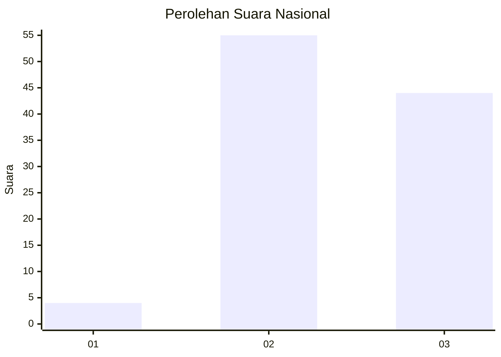
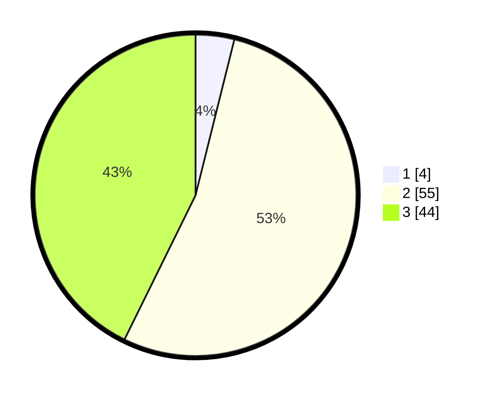

# Hasil

## Grafik

## Tabel

| No. | Nama Paslon    | Suara | Suara (raw) | Persentase |
|:--- |:-------------- | -----:| -----------:| ----------:|
| 1   | ANIES MUHAIMIN | 4     | [4][p-1]    | 3,88       |
| 2   | PRABOWO GIBRAN | 55    | [55][p-2]   | 53,40      |
| 3   | GANJAR MAHFUD  | 44    | [44][p-3]   | 42,72      |

[p-1]: https://github.com/gigit-pemilu/pemilu-2024/blob/main/pilpres/hitung-suara/sub/51-bali/sub/05-klungkung/sub/03-klungkung/sub/1009-semarapura-kauh/sub/008-tps/sub/paslon-1.txt
[p-2]: https://github.com/gigit-pemilu/pemilu-2024/blob/main/pilpres/hitung-suara/sub/51-bali/sub/05-klungkung/sub/03-klungkung/sub/1009-semarapura-kauh/sub/008-tps/sub/paslon-2.txt
[p-3]: https://github.com/gigit-pemilu/pemilu-2024/blob/main/pilpres/hitung-suara/sub/51-bali/sub/05-klungkung/sub/03-klungkung/sub/1009-semarapura-kauh/sub/008-tps/sub/paslon-3.txt

## Foto C Plano

https://sirekap-obj-formc.kpu.go.id/8fe4/pemilu/ppwp/51/05/03/10/09/5105031009008-20240216-141625--03193090-7908-457c-b96a-3b2581bf3945.jpg

https://sirekap-obj-formc.kpu.go.id/8fe4/pemilu/ppwp/51/05/03/10/09/5105031009008-20240216-141626--4e692f6d-cc37-4878-b97f-f8f1b4f7f3ce.jpg

https://sirekap-obj-formc.kpu.go.id/8fe4/pemilu/ppwp/51/05/03/10/09/5105031009008-20240216-141626--40e0474f-8e01-43a8-9a3e-d3c1a71b5ade.jpg

## Metadata

| Key        | Value               |
| ---------- | ------------------- |
| Time Stamp | 2024-02-17 16:00:02 |

## DATA PEMILIH TETAP

Jumlah pemilih dalam DPT: **130**.
 * L: **64**.
 * P: **66**.

## DATA PENGGUNA HAK PILIH

Jumlah pengguna hak pilih dalam DPT: **101**.
 * L: **50**.
 * P: **51**.

Jumlah pengguna hak pilih dalam DPTb: **4**.
 * L: **3**.
 * P: **1**.

Jumlah pengguna hak pilih dalam DPK: **0**.
 * L: **0**.
 * P: **0**.

Jumlah pengguna hak pilih: **105**.
 * L: **53**.
 * P: **52**.

## JUMLAH SUARA SAH DAN TIDAK SAH

JUMLAH SELURUH SUARA SAH: **103**.

JUMLAH SUARA TIDAK SAH: **2**.

JUMLAH SELURUH SUARA SAH DAN SUARA TIDAK SAH: **105**.

