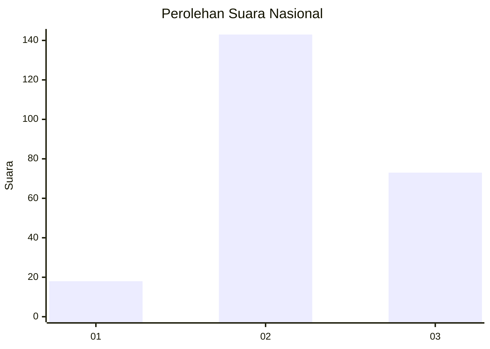
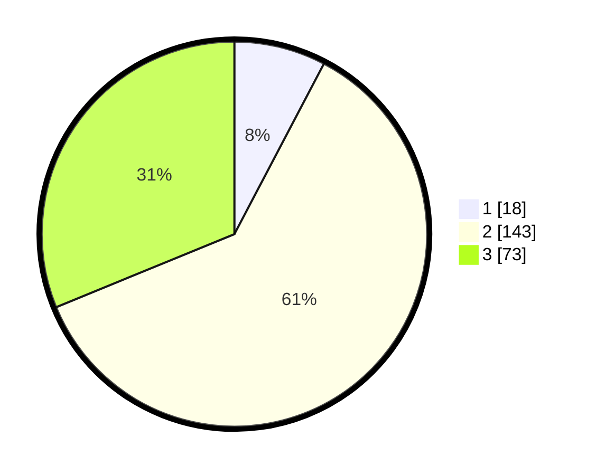

# Hasil

## Grafik

## Tabel

| No. | Nama Paslon    | Suara | Suara (raw) | Persentase |
|:--- |:-------------- | -----:| -----------:| ----------:|
| 1   | ANIES MUHAIMIN | 18    | [18][p-1]   | 7,69       |
| 2   | PRABOWO GIBRAN | 143   | [143][p-2]  | 61,11      |
| 3   | GANJAR MAHFUD  | 73    | [73][p-3]   | 31,20      |

[p-1]: https://github.com/gigit-pemilu/pemilu-2024/blob/main/pilpres/hitung-suara/sub/51-bali/sub/05-klungkung/sub/03-klungkung/sub/1010-semarapura-tengah/sub/001-tps/sub/paslon-1.txt
[p-2]: https://github.com/gigit-pemilu/pemilu-2024/blob/main/pilpres/hitung-suara/sub/51-bali/sub/05-klungkung/sub/03-klungkung/sub/1010-semarapura-tengah/sub/001-tps/sub/paslon-2.txt
[p-3]: https://github.com/gigit-pemilu/pemilu-2024/blob/main/pilpres/hitung-suara/sub/51-bali/sub/05-klungkung/sub/03-klungkung/sub/1010-semarapura-tengah/sub/001-tps/sub/paslon-3.txt

## Foto C Plano

https://sirekap-obj-formc.kpu.go.id/b0a7/pemilu/ppwp/51/05/03/10/10/5105031010001-20240214-194421--732d6aa5-bc02-4800-96ae-2cd52a24850a.jpg

https://sirekap-obj-formc.kpu.go.id/b0a7/pemilu/ppwp/51/05/03/10/10/5105031010001-20240214-194449--d301f36d-2e64-443d-b4cb-347d057ffd1b.jpg

https://sirekap-obj-formc.kpu.go.id/b0a7/pemilu/ppwp/51/05/03/10/10/5105031010001-20240216-021028--2e461a0a-7e92-4dd2-97b4-6b7442f20023.jpg

## Metadata

| Key        | Value               |
| ---------- | ------------------- |
| Time Stamp | 2024-02-16 02:30:27 |

## DATA PEMILIH TETAP

Jumlah pemilih dalam DPT: **282**.
 * L: **139**.
 * P: **143**.

## DATA PENGGUNA HAK PILIH

Jumlah pengguna hak pilih dalam DPT: **226**.
 * L: **113**.
 * P: **113**.

Jumlah pengguna hak pilih dalam DPTb: **8**.
 * L: **5**.
 * P: **3**.

Jumlah pengguna hak pilih dalam DPK: **2**.
 * L: **1**.
 * P: **1**.

Jumlah pengguna hak pilih: **236**.
 * L: **119**.
 * P: **117**.

## JUMLAH SUARA SAH DAN TIDAK SAH

JUMLAH SELURUH SUARA SAH: **234**.

JUMLAH SUARA TIDAK SAH: **2**.

JUMLAH SELURUH SUARA SAH DAN SUARA TIDAK SAH: **236**.

