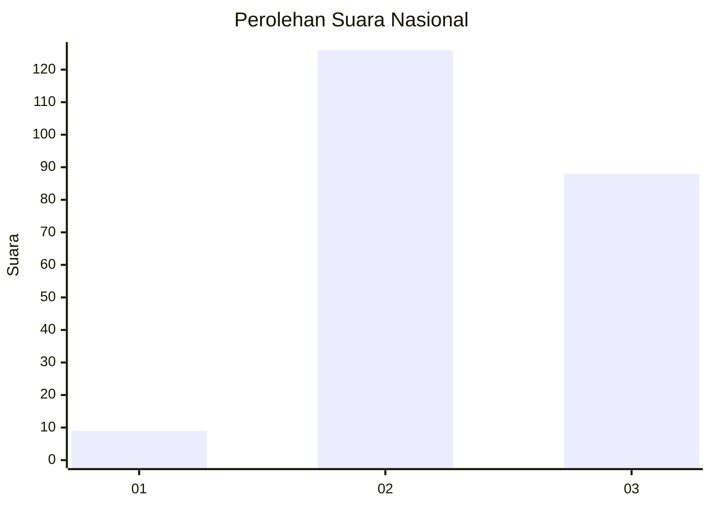
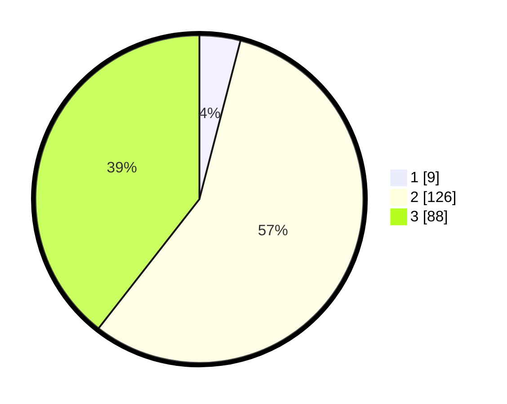

# Hasil

## Grafik

## Tabel

| No. | Nama Paslon    | Suara | Suara (raw) | Persentase |
|:--- |:-------------- | -----:| -----------:| ----------:|
| 1   | ANIES MUHAIMIN | 9     | [9][p-1]    | 4,04       |
| 2   | PRABOWO GIBRAN | 126   | [126][p-2]  | 56,50      |
| 3   | GANJAR MAHFUD  | 88    | [88][p-3]   | 39,46      |

[p-1]: https://github.com/gigit-pemilu/pemilu-2024/blob/main/pilpres/hitung-suara/sub/51-bali/sub/05-klungkung/sub/03-klungkung/sub/1010-semarapura-tengah/sub/002-tps/sub/paslon-1.txt
[p-2]: https://github.com/gigit-pemilu/pemilu-2024/blob/main/pilpres/hitung-suara/sub/51-bali/sub/05-klungkung/sub/03-klungkung/sub/1010-semarapura-tengah/sub/002-tps/sub/paslon-2.txt
[p-3]: https://github.com/gigit-pemilu/pemilu-2024/blob/main/pilpres/hitung-suara/sub/51-bali/sub/05-klungkung/sub/03-klungkung/sub/1010-semarapura-tengah/sub/002-tps/sub/paslon-3.txt

## Foto C Plano

https://sirekap-obj-formc.kpu.go.id/1602/pemilu/ppwp/51/05/03/10/10/5105031010002-20240214-210646--bc5db58c-749f-43fb-9513-5559dfe667f1.jpg

https://sirekap-obj-formc.kpu.go.id/1602/pemilu/ppwp/51/05/03/10/10/5105031010002-20240214-210940--941326bd-c904-4ba8-9761-2466bf846ef0.jpg

https://sirekap-obj-formc.kpu.go.id/1602/pemilu/ppwp/51/05/03/10/10/5105031010002-20240214-211111--805c3894-4bbf-415b-bde7-0d27ee438c72.jpg

## Metadata

| Key        | Value               |
| ---------- | ------------------- |
| Time Stamp | 2024-02-15 09:00:24 |

