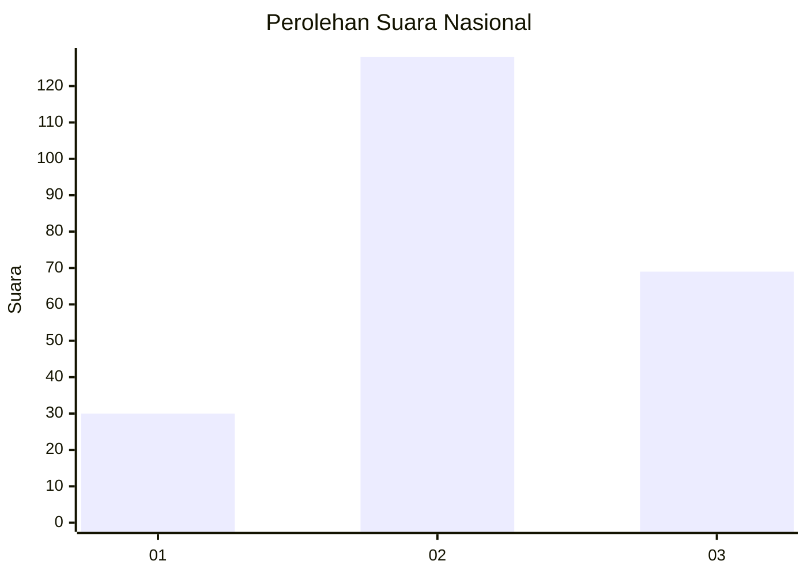
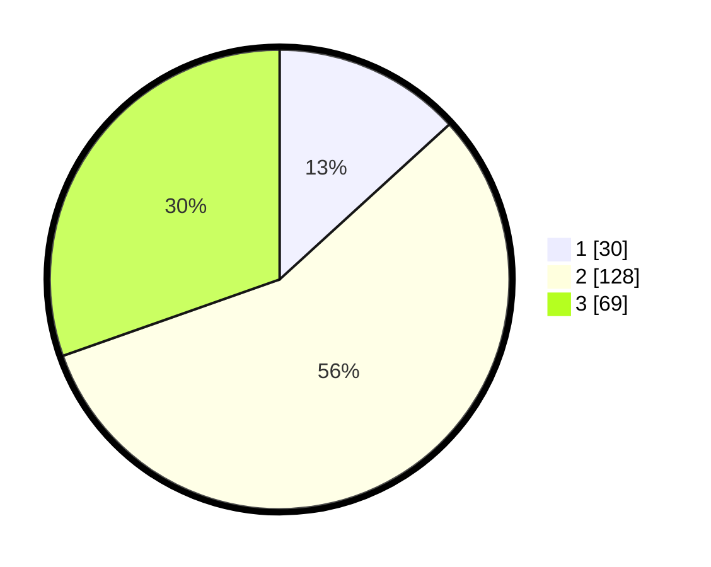

# Hasil

## Grafik

## Tabel

| No. | Nama Paslon    | Suara | Suara (raw) | Persentase |
|:--- |:-------------- | -----:| -----------:| ----------:|
| 1   | ANIES MUHAIMIN | 30    | [30][p-1]   | 13,22      |
| 2   | PRABOWO GIBRAN | 128   | [128][p-2]  | 56,39      |
| 3   | GANJAR MAHFUD  | 69    | [69][p-3]   | 30,40      |

[p-1]: https://github.com/gigit-pemilu/pemilu-2024/blob/main/pilpres/hitung-suara/sub/51-bali/sub/05-klungkung/sub/03-klungkung/sub/1010-semarapura-tengah/sub/006-tps/sub/paslon-1.txt
[p-2]: https://github.com/gigit-pemilu/pemilu-2024/blob/main/pilpres/hitung-suara/sub/51-bali/sub/05-klungkung/sub/03-klungkung/sub/1010-semarapura-tengah/sub/006-tps/sub/paslon-2.txt
[p-3]: https://github.com/gigit-pemilu/pemilu-2024/blob/main/pilpres/hitung-suara/sub/51-bali/sub/05-klungkung/sub/03-klungkung/sub/1010-semarapura-tengah/sub/006-tps/sub/paslon-3.txt

## Foto C Plano

https://sirekap-obj-formc.kpu.go.id/a690/pemilu/ppwp/51/05/03/10/10/5105031010006-20240214-235707--4987b8fa-2520-498e-977b-46f357414223.jpg

https://sirekap-obj-formc.kpu.go.id/a690/pemilu/ppwp/51/05/03/10/10/5105031010006-20240214-235459--0375e5df-7558-4ac7-8024-94290627fdc2.jpg

https://sirekap-obj-formc.kpu.go.id/a690/pemilu/ppwp/51/05/03/10/10/5105031010006-20240214-235711--34556f9b-1156-4558-865d-e8ec3127924f.jpg

## Metadata

| Key        | Value               |
| ---------- | ------------------- |
| Time Stamp | 2024-02-15 15:00:29 |

