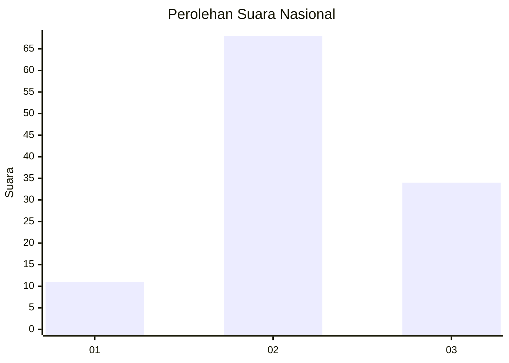
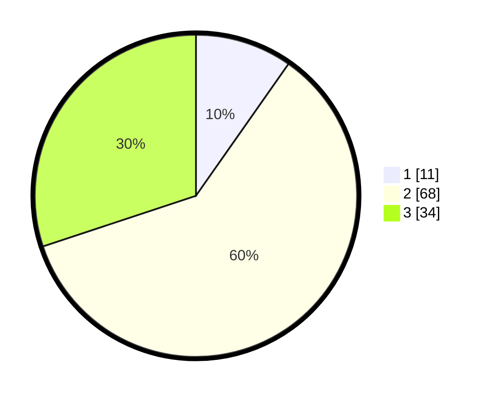

# Hasil

## Grafik

## Tabel

| No. | Nama Paslon    | Suara | Suara (raw) | Persentase |
|:--- |:-------------- | -----:| -----------:| ----------:|
| 1   | ANIES MUHAIMIN | 11    | [11][p-1]   | 9,73       |
| 2   | PRABOWO GIBRAN | 68    | [68][p-2]   | 60,18      |
| 3   | GANJAR MAHFUD  | 34    | [34][p-3]   | 30,09      |

[p-1]: https://github.com/gigit-pemilu/pemilu-2024/blob/main/pilpres/hitung-suara/sub/51-bali/sub/05-klungkung/sub/03-klungkung/sub/1010-semarapura-tengah/sub/007-tps/sub/paslon-1.txt
[p-2]: https://github.com/gigit-pemilu/pemilu-2024/blob/main/pilpres/hitung-suara/sub/51-bali/sub/05-klungkung/sub/03-klungkung/sub/1010-semarapura-tengah/sub/007-tps/sub/paslon-2.txt
[p-3]: https://github.com/gigit-pemilu/pemilu-2024/blob/main/pilpres/hitung-suara/sub/51-bali/sub/05-klungkung/sub/03-klungkung/sub/1010-semarapura-tengah/sub/007-tps/sub/paslon-3.txt

## Foto C Plano

https://sirekap-obj-formc.kpu.go.id/ce28/pemilu/ppwp/51/05/03/10/10/5105031010007-20240216-134757--3ffb47a7-3153-4f0b-bee8-a05f709a08cb.jpg

https://sirekap-obj-formc.kpu.go.id/ce28/pemilu/ppwp/51/05/03/10/10/5105031010007-20240216-134758--830d2ed3-5c2e-4a53-a089-aa6712695564.jpg

https://sirekap-obj-formc.kpu.go.id/ce28/pemilu/ppwp/51/05/03/10/10/5105031010007-20240216-134758--7677e2f6-52e0-404c-947f-b4d79bbf23c1.jpg

## Metadata

| Key        | Value               |
| ---------- | ------------------- |
| Time Stamp | 2024-02-19 11:00:00 |

## DATA PEMILIH TETAP

Jumlah pemilih dalam DPT: **150**.
 * L: **74**.
 * P: **76**.

## DATA PENGGUNA HAK PILIH

Jumlah pengguna hak pilih dalam DPT: **115**.
 * L: **55**.
 * P: **60**.

Jumlah pengguna hak pilih dalam DPTb: **7**.
 * L: **3**.
 * P: **4**.

Jumlah pengguna hak pilih dalam DPK: **122**.
 * L: **58**.
 * P: **64**.

Jumlah pengguna hak pilih: **122**.
 * L: **58**.
 * P: **64**.

## JUMLAH SUARA SAH DAN TIDAK SAH

JUMLAH SELURUH SUARA SAH: **113**.

JUMLAH SUARA TIDAK SAH: **9**.

JUMLAH SELURUH SUARA SAH DAN SUARA TIDAK SAH: **122**.

