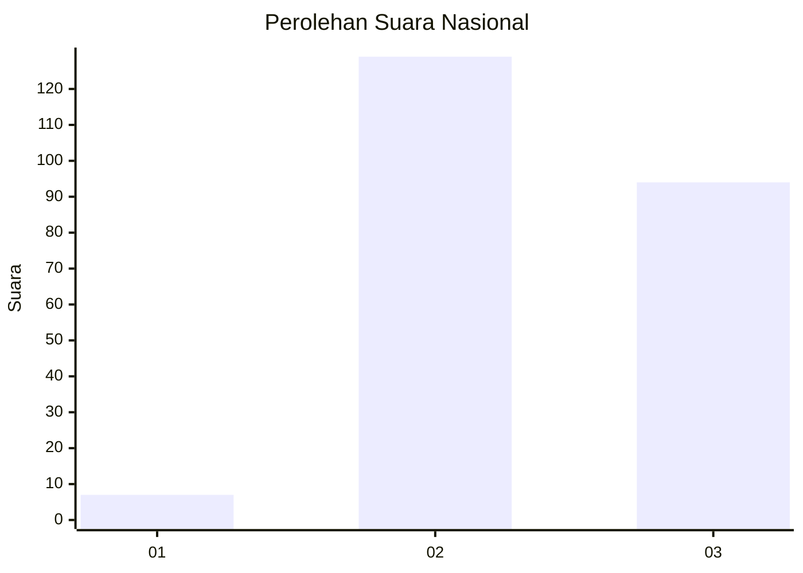
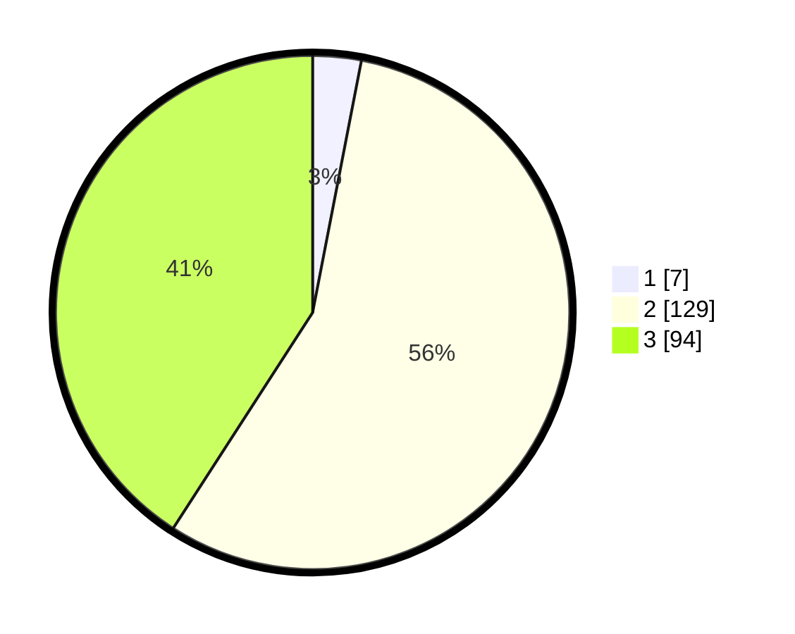

# Hasil

## Grafik

## Tabel

| No. | Nama Paslon    | Suara | Suara (raw) | Persentase |
|:--- |:-------------- | -----:| -----------:| ----------:|
| 1   | ANIES MUHAIMIN | 7     | [7][p-1]    | 3,04       |
| 2   | PRABOWO GIBRAN | 129   | [129][p-2]  | 56,09      |
| 3   | GANJAR MAHFUD  | 94    | [94][p-3]   | 40,87      |

[p-1]: https://github.com/gigit-pemilu/pemilu-2024/blob/main/pilpres/hitung-suara/sub/51-bali/sub/05-klungkung/sub/03-klungkung/sub/1010-semarapura-tengah/sub/010-tps/sub/paslon-1.txt
[p-2]: https://github.com/gigit-pemilu/pemilu-2024/blob/main/pilpres/hitung-suara/sub/51-bali/sub/05-klungkung/sub/03-klungkung/sub/1010-semarapura-tengah/sub/010-tps/sub/paslon-2.txt
[p-3]: https://github.com/gigit-pemilu/pemilu-2024/blob/main/pilpres/hitung-suara/sub/51-bali/sub/05-klungkung/sub/03-klungkung/sub/1010-semarapura-tengah/sub/010-tps/sub/paslon-3.txt

## Foto C Plano

https://sirekap-obj-formc.kpu.go.id/e446/pemilu/ppwp/51/05/03/10/10/5105031010010-20240216-155411--7d379a64-29d5-482f-a4d0-a9a2a528c073.jpg

https://sirekap-obj-formc.kpu.go.id/e446/pemilu/ppwp/51/05/03/10/10/5105031010010-20240216-155413--809d97b0-e272-4723-b85c-55bcf0a12389.jpg

https://sirekap-obj-formc.kpu.go.id/e446/pemilu/ppwp/51/05/03/10/10/5105031010010-20240216-155412--776a1d5b-d969-4b33-9721-8481e31eeda6.jpg

## Metadata

| Key        | Value               |
| ---------- | ------------------- |
| Time Stamp | 2024-02-22 12:00:00 |

## DATA PEMILIH TETAP

Jumlah pemilih dalam DPT: **284**.
 * L: **129**.
 * P: **155**.

## DATA PENGGUNA HAK PILIH

Jumlah pengguna hak pilih dalam DPT: **218**.
 * L: **102**.
 * P: **116**.

Jumlah pengguna hak pilih dalam DPTb: **11**.
 * L: **9**.
 * P: **2**.

Jumlah pengguna hak pilih dalam DPK: **5**.
 * L: **2**.
 * P: **3**.

Jumlah pengguna hak pilih: **234**.
 * L: **113**.
 * P: **121**.

## JUMLAH SUARA SAH DAN TIDAK SAH

JUMLAH SELURUH SUARA SAH: **230**.

JUMLAH SUARA TIDAK SAH: **4**.

JUMLAH SELURUH SUARA SAH DAN SUARA TIDAK SAH: **234**.

