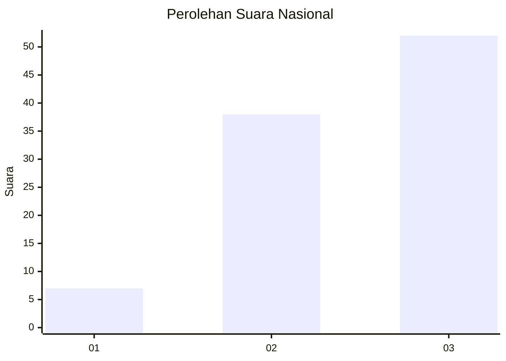
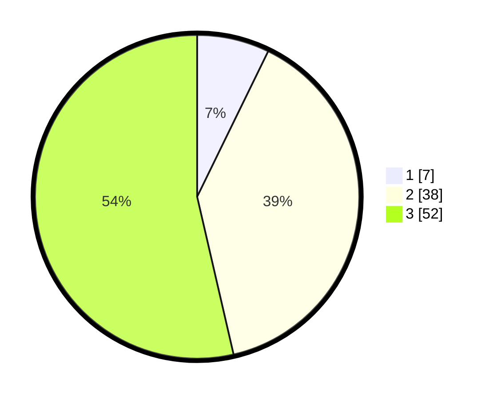

# Hasil

## Grafik

## Tabel

| No. | Nama Paslon    | Suara | Suara (raw) | Persentase |
|:--- |:-------------- | -----:| -----------:| ----------:|
| 1   | ANIES MUHAIMIN | 7     | [7][p-1]    | 7,22       |
| 2   | PRABOWO GIBRAN | 38    | [38][p-2]   | 39,18      |
| 3   | GANJAR MAHFUD  | 52    | [52][p-3]   | 53,61      |

[p-1]: https://github.com/gigit-pemilu/pemilu-2024/blob/main/pilpres/hitung-suara/sub/51-bali/sub/05-klungkung/sub/03-klungkung/sub/1010-semarapura-tengah/sub/012-tps/sub/paslon-1.txt
[p-2]: https://github.com/gigit-pemilu/pemilu-2024/blob/main/pilpres/hitung-suara/sub/51-bali/sub/05-klungkung/sub/03-klungkung/sub/1010-semarapura-tengah/sub/012-tps/sub/paslon-2.txt
[p-3]: https://github.com/gigit-pemilu/pemilu-2024/blob/main/pilpres/hitung-suara/sub/51-bali/sub/05-klungkung/sub/03-klungkung/sub/1010-semarapura-tengah/sub/012-tps/sub/paslon-3.txt

## Foto C Plano

https://sirekap-obj-formc.kpu.go.id/e2c2/pemilu/ppwp/51/05/03/10/10/5105031010012-20240214-224111--c7e640f7-68b2-4db1-a9ab-7c7ea8908c0b.jpg

https://sirekap-obj-formc.kpu.go.id/e2c2/pemilu/ppwp/51/05/03/10/10/5105031010012-20240216-162209--9def7e01-96b3-4874-8ad4-8a802a7f436b.jpg

## Metadata

| Key        | Value               |
| ---------- | ------------------- |
| Time Stamp | 2024-02-24 22:31:28 |

