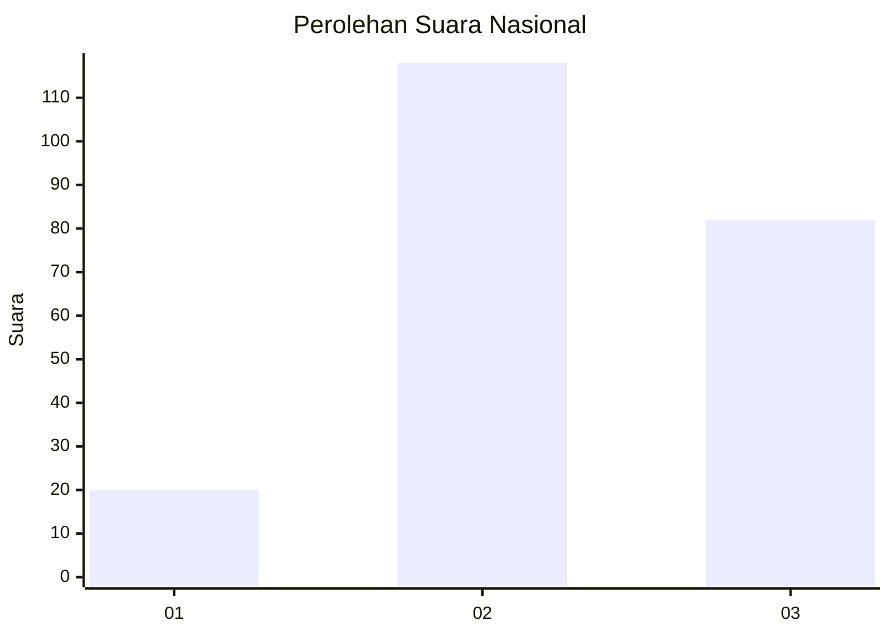
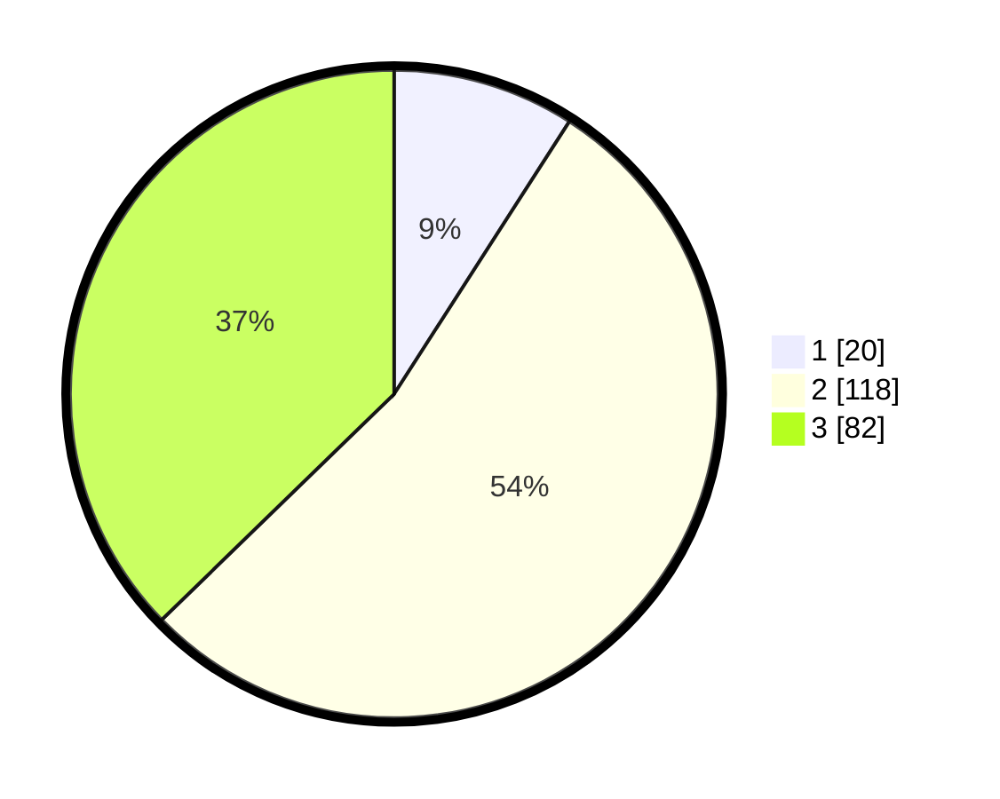

# Hasil

## Grafik

## Tabel

| No. | Nama Paslon    | Suara | Suara (raw) | Persentase |
|:--- |:-------------- | -----:| -----------:| ----------:|
| 1   | ANIES MUHAIMIN | 20    | [20][p-1]   | 9,09       |
| 2   | PRABOWO GIBRAN | 118   | [118][p-2]  | 53,64      |
| 3   | GANJAR MAHFUD  | 82    | [82][p-3]   | 37,27      |

[p-1]: https://github.com/gigit-pemilu/pemilu-2024/blob/main/pilpres/hitung-suara/sub/51-bali/sub/05-klungkung/sub/03-klungkung/sub/1011-semarapura-kangin/sub/002-tps/sub/paslon-1.txt
[p-2]: https://github.com/gigit-pemilu/pemilu-2024/blob/main/pilpres/hitung-suara/sub/51-bali/sub/05-klungkung/sub/03-klungkung/sub/1011-semarapura-kangin/sub/002-tps/sub/paslon-2.txt
[p-3]: https://github.com/gigit-pemilu/pemilu-2024/blob/main/pilpres/hitung-suara/sub/51-bali/sub/05-klungkung/sub/03-klungkung/sub/1011-semarapura-kangin/sub/002-tps/sub/paslon-3.txt

## Foto C Plano

https://sirekap-obj-formc.kpu.go.id/b613/pemilu/ppwp/51/05/03/10/11/5105031011002-20240215-174323--d6e0a25c-e30c-4284-885b-1e607fca0b07.jpg

https://sirekap-obj-formc.kpu.go.id/b613/pemilu/ppwp/51/05/03/10/11/5105031011002-20240215-175446--1a79ee53-d235-419c-9868-cf0d13537fe6.jpg

https://sirekap-obj-formc.kpu.go.id/b613/pemilu/ppwp/51/05/03/10/11/5105031011002-20240216-013955--4f68d51a-9462-418c-b103-6ac016a97ce1.jpg

## Metadata

| Key        | Value               |
| ---------- | ------------------- |
| Time Stamp | 2024-02-16 10:00:28 |

