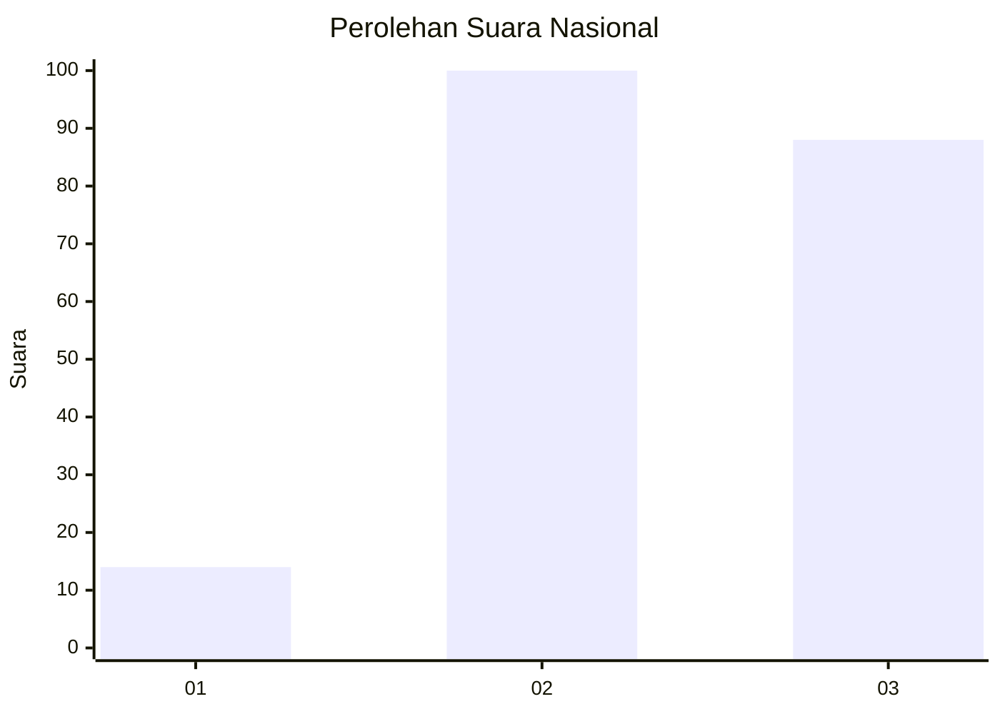
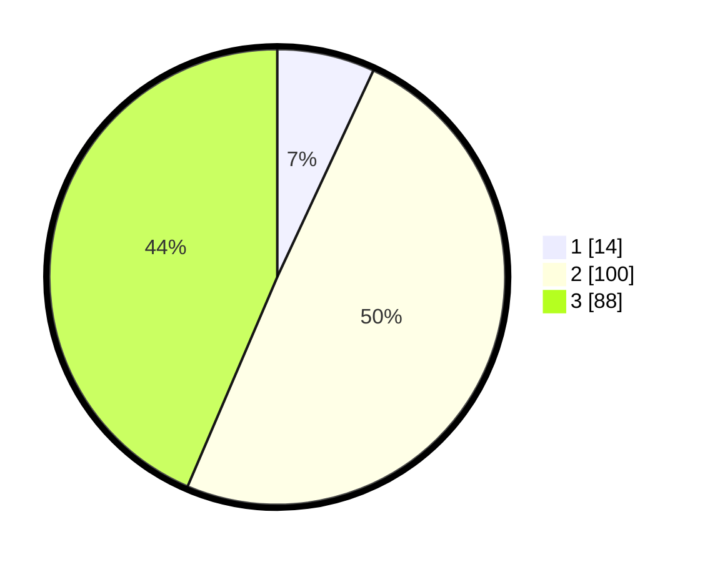

# Hasil

## Grafik

## Tabel

| No. | Nama Paslon    | Suara | Suara (raw) | Persentase |
|:--- |:-------------- | -----:| -----------:| ----------:|
| 1   | ANIES MUHAIMIN | 14    | [14][p-1]   | 6,93       |
| 2   | PRABOWO GIBRAN | 100   | [100][p-2]  | 49,50      |
| 3   | GANJAR MAHFUD  | 88    | [88][p-3]   | 43,56      |

[p-1]: https://github.com/gigit-pemilu/pemilu-2024/blob/main/pilpres/hitung-suara/sub/51-bali/sub/05-klungkung/sub/03-klungkung/sub/1011-semarapura-kangin/sub/005-tps/sub/paslon-1.txt
[p-2]: https://github.com/gigit-pemilu/pemilu-2024/blob/main/pilpres/hitung-suara/sub/51-bali/sub/05-klungkung/sub/03-klungkung/sub/1011-semarapura-kangin/sub/005-tps/sub/paslon-2.txt
[p-3]: https://github.com/gigit-pemilu/pemilu-2024/blob/main/pilpres/hitung-suara/sub/51-bali/sub/05-klungkung/sub/03-klungkung/sub/1011-semarapura-kangin/sub/005-tps/sub/paslon-3.txt

## Foto C Plano

https://sirekap-obj-formc.kpu.go.id/1019/pemilu/ppwp/51/05/03/10/11/5105031011005-20240215-191559--05624bee-01cf-4546-857a-cde885530935.jpg

https://sirekap-obj-formc.kpu.go.id/1019/pemilu/ppwp/51/05/03/10/11/5105031011005-20240215-191556--522a0e11-14ca-4668-9f8d-2045e89ec465.jpg

https://sirekap-obj-formc.kpu.go.id/1019/pemilu/ppwp/51/05/03/10/11/5105031011005-20240215-191548--b800b9ea-e8e0-4eb4-a60d-529c412450a3.jpg

## Metadata

| Key        | Value               |
| ---------- | ------------------- |
| Time Stamp | 2024-02-17 13:37:34 |

