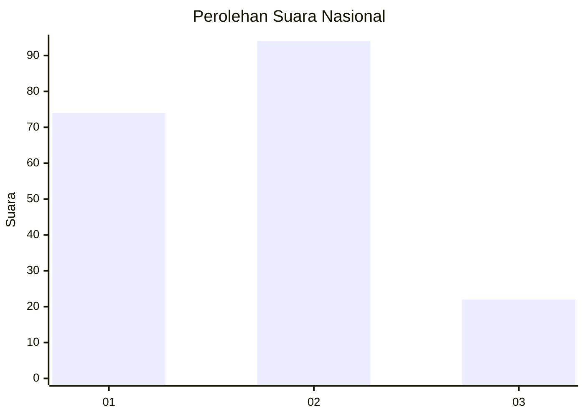
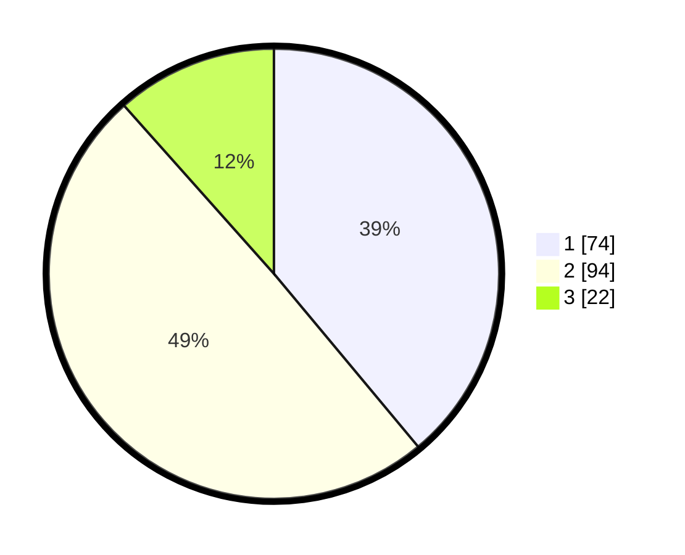

# Hasil

## Grafik

## Tabel

| No. | Nama Paslon    | Suara | Suara (raw) | Persentase |
|:--- |:-------------- | -----:| -----------:| ----------:|
| 1   | ANIES MUHAIMIN | 74    | [74][p-1]   | 38,95      |
| 2   | PRABOWO GIBRAN | 94    | [94][p-2]   | 49,47      |
| 3   | GANJAR MAHFUD  | 22    | [22][p-3]   | 11,58      |

[p-1]: https://github.com/gigit-pemilu/pemilu-2024/blob/main/pilpres/hitung-suara/sub/51-bali/sub/05-klungkung/sub/03-klungkung/sub/1011-semarapura-kangin/sub/010-tps/sub/paslon-1.txt
[p-2]: https://github.com/gigit-pemilu/pemilu-2024/blob/main/pilpres/hitung-suara/sub/51-bali/sub/05-klungkung/sub/03-klungkung/sub/1011-semarapura-kangin/sub/010-tps/sub/paslon-2.txt
[p-3]: https://github.com/gigit-pemilu/pemilu-2024/blob/main/pilpres/hitung-suara/sub/51-bali/sub/05-klungkung/sub/03-klungkung/sub/1011-semarapura-kangin/sub/010-tps/sub/paslon-3.txt

## Foto C Plano

https://sirekap-obj-formc.kpu.go.id/84d1/pemilu/ppwp/51/05/03/10/11/5105031011010-20240216-143630--41aeb302-2aea-49f1-8394-f5171f7fc5ed.jpg

https://sirekap-obj-formc.kpu.go.id/84d1/pemilu/ppwp/51/05/03/10/11/5105031011010-20240216-143631--38902c12-921c-48fc-be80-6054807ab897.jpg

https://sirekap-obj-formc.kpu.go.id/84d1/pemilu/ppwp/51/05/03/10/11/5105031011010-20240216-143631--8cce9eed-4ff6-4be4-865d-f4486ddb97fb.jpg

## Metadata

| Key        | Value               |
| ---------- | ------------------- |
| Time Stamp | 2024-02-21 18:00:00 |

## DATA PEMILIH TETAP

Jumlah pemilih dalam DPT: **240**.
 * L: **119**.
 * P: **121**.

## DATA PENGGUNA HAK PILIH

Jumlah pengguna hak pilih dalam DPT: **178**.
 * L: **88**.
 * P: **90**.

Jumlah pengguna hak pilih dalam DPTb: **0**.
 * L: **0**.
 * P: **0**.

Jumlah pengguna hak pilih dalam DPK: **14**.
 * L: **10**.
 * P: **4**.

Jumlah pengguna hak pilih: **192**.
 * L: **98**.
 * P: **94**.

## JUMLAH SUARA SAH DAN TIDAK SAH

JUMLAH SELURUH SUARA SAH: **190**.

JUMLAH SUARA TIDAK SAH: **2**.

JUMLAH SELURUH SUARA SAH DAN SUARA TIDAK SAH: **192**.

