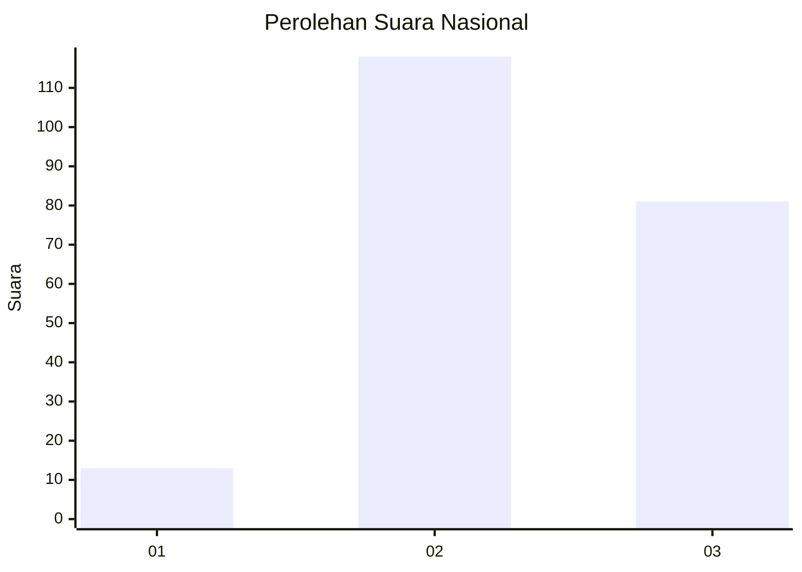
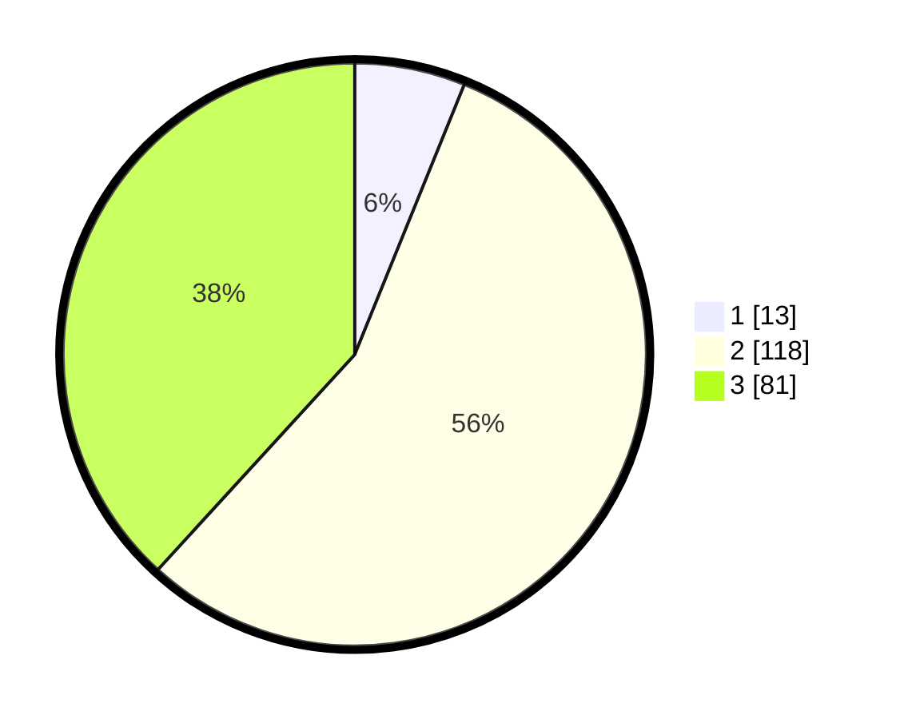

# Hasil

## Grafik

## Tabel

| No. | Nama Paslon    | Suara | Suara (raw) | Persentase |
|:--- |:-------------- | -----:| -----------:| ----------:|
| 1   | ANIES MUHAIMIN | 13    | [13][p-1]   | 6,13       |
| 2   | PRABOWO GIBRAN | 118   | [118][p-2]  | 55,66      |
| 3   | GANJAR MAHFUD  | 81    | [81][p-3]   | 38,21      |

[p-1]: https://github.com/gigit-pemilu/pemilu-2024/blob/main/pilpres/hitung-suara/sub/51-bali/sub/05-klungkung/sub/03-klungkung/sub/1012-semarapura-klod-kangin/sub/001-tps/sub/paslon-1.txt
[p-2]: https://github.com/gigit-pemilu/pemilu-2024/blob/main/pilpres/hitung-suara/sub/51-bali/sub/05-klungkung/sub/03-klungkung/sub/1012-semarapura-klod-kangin/sub/001-tps/sub/paslon-2.txt
[p-3]: https://github.com/gigit-pemilu/pemilu-2024/blob/main/pilpres/hitung-suara/sub/51-bali/sub/05-klungkung/sub/03-klungkung/sub/1012-semarapura-klod-kangin/sub/001-tps/sub/paslon-3.txt

## Foto C Plano

https://sirekap-obj-formc.kpu.go.id/bd03/pemilu/ppwp/51/05/03/10/12/5105031012001-20240222-082237--f02be790-1415-4caa-90b3-bb9526d0c626.jpg

https://sirekap-obj-formc.kpu.go.id/bd03/pemilu/ppwp/51/05/03/10/12/5105031012001-20240222-082433--08dd1e0c-e85e-4839-a416-e362b9ae3b66.jpg

## Metadata

| Key        | Value               |
| ---------- | ------------------- |
| Time Stamp | 2024-02-24 22:31:28 |

