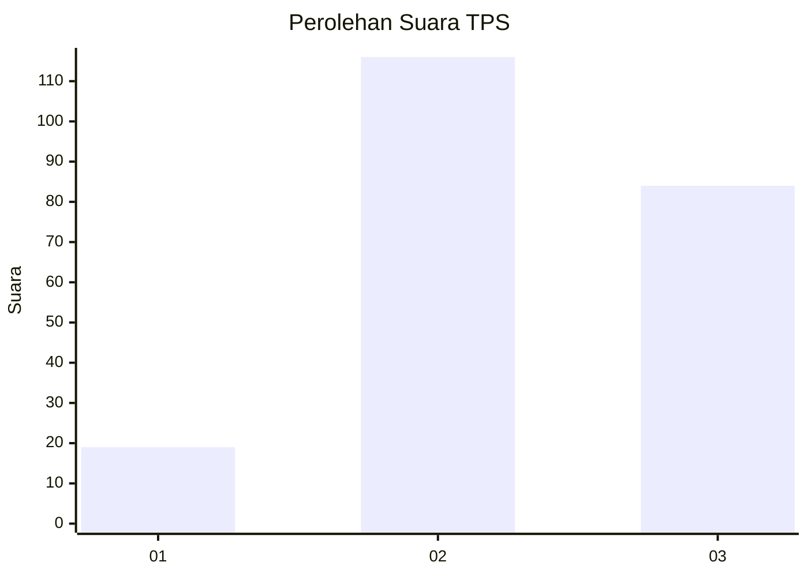
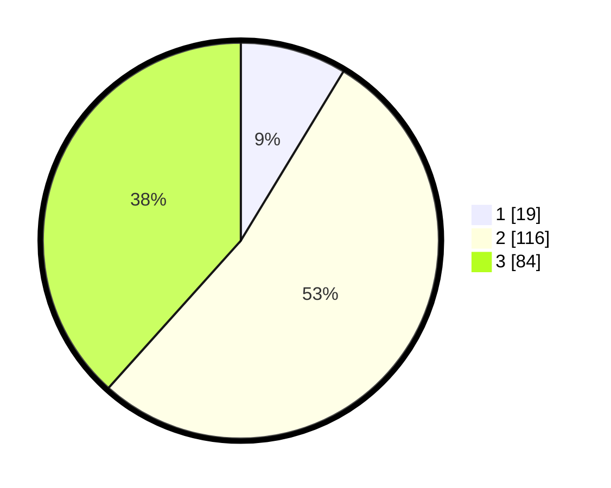

# Hasil

## Grafik

## Tabel

| No. | Nama Paslon    | Suara | Suara (raw) | Persentase |
|:--- |:-------------- | -----:| -----------:| ----------:|
| 1   | ANIES MUHAIMIN | 19    | [19][p-1]   | 8,68       |
| 2   | PRABOWO GIBRAN | 116   | [116][p-2]  | 52,97      |
| 3   | GANJAR MAHFUD  | 84    | [84][p-3]   | 38,36      |

[p-1]: https://github.com/gigit-pemilu/pemilu-2024-51-bali/blob/main/pilpres/hitung-suara/sub/51-bali/sub/05-klungkung/sub/03-klungkung/sub/1012-semarapura-klod-kangin/sub/003-tps/sub/paslon-1.txt
[p-2]: https://github.com/gigit-pemilu/pemilu-2024-51-bali/blob/main/pilpres/hitung-suara/sub/51-bali/sub/05-klungkung/sub/03-klungkung/sub/1012-semarapura-klod-kangin/sub/003-tps/sub/paslon-2.txt
[p-3]: https://github.com/gigit-pemilu/pemilu-2024-51-bali/blob/main/pilpres/hitung-suara/sub/51-bali/sub/05-klungkung/sub/03-klungkung/sub/1012-semarapura-klod-kangin/sub/003-tps/sub/paslon-3.txt

## Foto C Plano

https://sirekap-obj-formc.kpu.go.id/eb3e/pemilu/ppwp/51/05/03/10/12/5105031012003-20240214-194619--b48778ef-5845-4a30-9403-cdc80d1b3fae.jpg

https://sirekap-obj-formc.kpu.go.id/eb3e/pemilu/ppwp/51/05/03/10/12/5105031012003-20240214-194011--68da7f3f-91be-4b0a-8527-982e465b4bd4.jpg

https://sirekap-obj-formc.kpu.go.id/eb3e/pemilu/ppwp/51/05/03/10/12/5105031012003-20240214-195212--aee21cd3-c17d-47da-82dc-21d3d56e7bf9.jpg

## Metadata

| Key        | Value               |
| ---------- | ------------------- |
| Time Stamp | 2024-02-24 22:31:28 |

