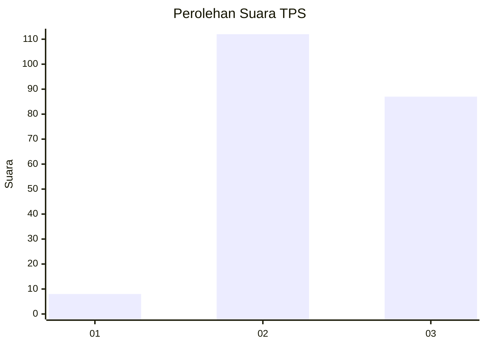
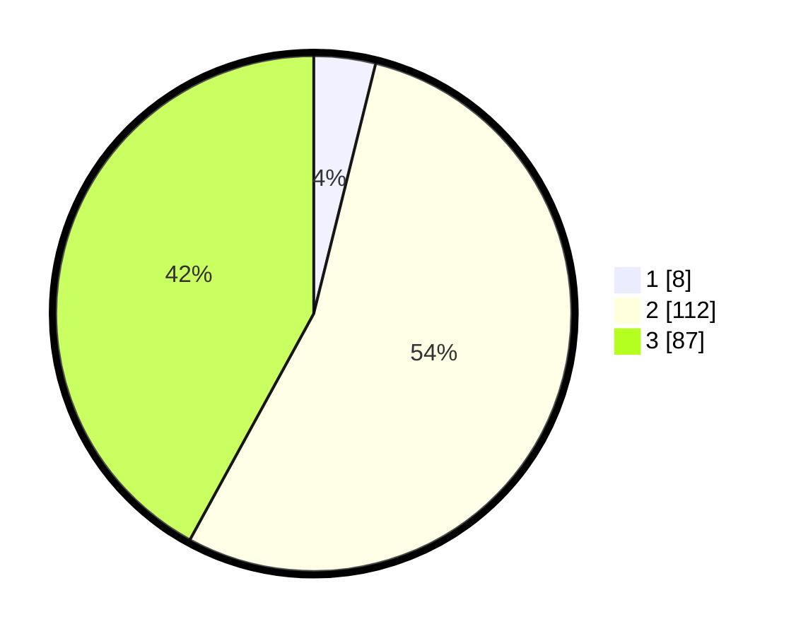

# Hasil

## Grafik

## Tabel

| No. | Nama Paslon    | Suara | Suara (raw) | Persentase |
|:--- |:-------------- | -----:| -----------:| ----------:|
| 1   | ANIES MUHAIMIN | 8     | [8][p-1]    | 3,86       |
| 2   | PRABOWO GIBRAN | 112   | [112][p-2]  | 54,11      |
| 3   | GANJAR MAHFUD  | 87    | [87][p-3]   | 42,03      |

[p-1]: https://github.com/gigit-pemilu/pemilu-2024-51-bali/blob/main/pilpres/hitung-suara/sub/51-bali/sub/05-klungkung/sub/03-klungkung/sub/1012-semarapura-klod-kangin/sub/007-tps/sub/paslon-1.txt
[p-2]: https://github.com/gigit-pemilu/pemilu-2024-51-bali/blob/main/pilpres/hitung-suara/sub/51-bali/sub/05-klungkung/sub/03-klungkung/sub/1012-semarapura-klod-kangin/sub/007-tps/sub/paslon-2.txt
[p-3]: https://github.com/gigit-pemilu/pemilu-2024-51-bali/blob/main/pilpres/hitung-suara/sub/51-bali/sub/05-klungkung/sub/03-klungkung/sub/1012-semarapura-klod-kangin/sub/007-tps/sub/paslon-3.txt

## Foto C Plano

https://sirekap-obj-formc.kpu.go.id/d00f/pemilu/ppwp/51/05/03/10/12/5105031012007-20240216-141527--17369353-f552-481e-8a0e-f3a16c05378d.jpg

https://sirekap-obj-formc.kpu.go.id/d00f/pemilu/ppwp/51/05/03/10/12/5105031012007-20240216-141528--810da1e7-23c7-4aa4-8ab0-0b6be0a96ad7.jpg

https://sirekap-obj-formc.kpu.go.id/d00f/pemilu/ppwp/51/05/03/10/12/5105031012007-20240216-141528--687fc122-0afa-4e9c-a813-ff08f1c8c9a7.jpg

## Metadata

| Key        | Value               |
| ---------- | ------------------- |
| Time Stamp | 2024-02-21 19:00:00 |

## DATA PEMILIH TETAP

Jumlah pemilih dalam DPT: **288**.
 * L: **138**.
 * P: **150**.

## DATA PENGGUNA HAK PILIH

Jumlah pengguna hak pilih dalam DPT: **209**.
 * L: **99**.
 * P: **110**.

Jumlah pengguna hak pilih dalam DPTb: **1**.
 * L: **0**.
 * P: **1**.

Jumlah pengguna hak pilih dalam DPK: **6**.
 * L: **3**.
 * P: **3**.

Jumlah pengguna hak pilih: **216**.
 * L: **102**.
 * P: **114**.

## JUMLAH SUARA SAH DAN TIDAK SAH

JUMLAH SELURUH SUARA SAH: **207**.

JUMLAH SUARA TIDAK SAH: **9**.

JUMLAH SELURUH SUARA SAH DAN SUARA TIDAK SAH: **216**.

