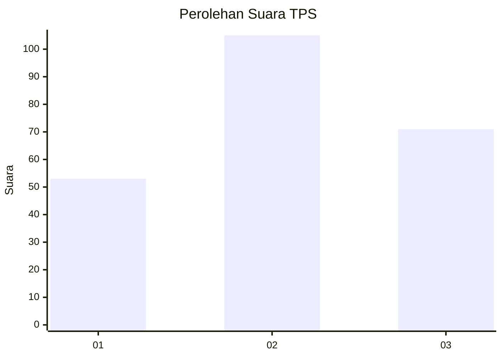
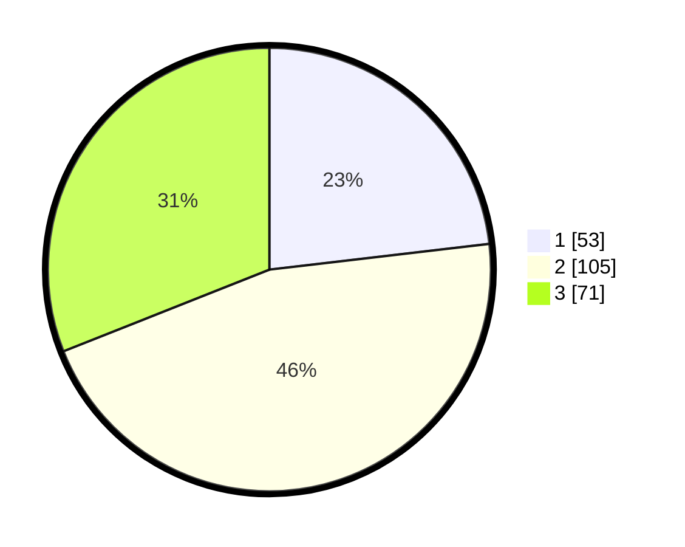

# Hasil

## Grafik

## Tabel

| No. | Nama Paslon    | Suara | Suara (raw) | Persentase |
|:--- |:-------------- | -----:| -----------:| ----------:|
| 1   | ANIES MUHAIMIN | 53    | [53][p-1]   | 23,14      |
| 2   | PRABOWO GIBRAN | 105   | [105][p-2]  | 45,85      |
| 3   | GANJAR MAHFUD  | 71    | [71][p-3]   | 31,00      |

[p-1]: https://github.com/gigit-pemilu/pemilu-2024-51-bali/blob/main/pilpres/hitung-suara/sub/51-bali/sub/05-klungkung/sub/03-klungkung/sub/1012-semarapura-klod-kangin/sub/011-tps/sub/paslon-1.txt
[p-2]: https://github.com/gigit-pemilu/pemilu-2024-51-bali/blob/main/pilpres/hitung-suara/sub/51-bali/sub/05-klungkung/sub/03-klungkung/sub/1012-semarapura-klod-kangin/sub/011-tps/sub/paslon-2.txt
[p-3]: https://github.com/gigit-pemilu/pemilu-2024-51-bali/blob/main/pilpres/hitung-suara/sub/51-bali/sub/05-klungkung/sub/03-klungkung/sub/1012-semarapura-klod-kangin/sub/011-tps/sub/paslon-3.txt

## Foto C Plano

https://sirekap-obj-formc.kpu.go.id/a55e/pemilu/ppwp/51/05/03/10/12/5105031012011-20240216-151632--6c5fe04f-dfd4-46b7-bf44-a7d8297ff77d.jpg

https://sirekap-obj-formc.kpu.go.id/a55e/pemilu/ppwp/51/05/03/10/12/5105031012011-20240216-151638--4b4356a5-0eeb-4769-b18d-da1a64856c32.jpg

https://sirekap-obj-formc.kpu.go.id/a55e/pemilu/ppwp/51/05/03/10/12/5105031012011-20240216-151637--8bf1abfc-1812-4afe-a61e-677522546794.jpg

## Metadata

| Key        | Value               |
| ---------- | ------------------- |
| Time Stamp | 2024-02-21 17:00:00 |

## DATA PEMILIH TETAP

Jumlah pemilih dalam DPT: **294**.
 * L: **42**.
 * P: **152**.

## DATA PENGGUNA HAK PILIH

Jumlah pengguna hak pilih dalam DPT: **231**.
 * L: **119**.
 * P: **112**.

Jumlah pengguna hak pilih dalam DPTb: **0**.
 * L: **0**.
 * P: **0**.

Jumlah pengguna hak pilih dalam DPK: **1**.
 * L: **0**.
 * P: **1**.

Jumlah pengguna hak pilih: **232**.
 * L: **119**.
 * P: **113**.

## JUMLAH SUARA SAH DAN TIDAK SAH

JUMLAH SELURUH SUARA SAH: **229**.

JUMLAH SUARA TIDAK SAH: **3**.

JUMLAH SELURUH SUARA SAH DAN SUARA TIDAK SAH: **232**.

