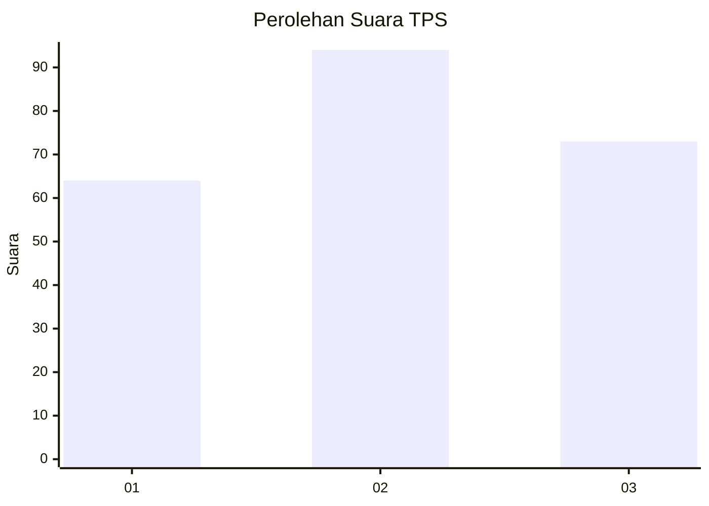
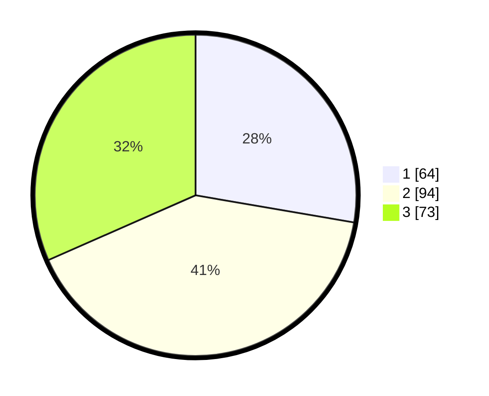

# Hasil

## Grafik

## Tabel

| No. | Nama Paslon    | Suara | Suara (raw) | Persentase |
|:--- |:-------------- | -----:| -----------:| ----------:|
| 1   | ANIES MUHAIMIN | 64    | [64][p-1]   | 27,71      |
| 2   | PRABOWO GIBRAN | 94    | [94][p-2]   | 40,69      |
| 3   | GANJAR MAHFUD  | 73    | [73][p-3]   | 31,60      |

[p-1]: https://github.com/gigit-pemilu/pemilu-2024-51-bali/blob/main/pilpres/hitung-suara/sub/51-bali/sub/05-klungkung/sub/03-klungkung/sub/1012-semarapura-klod-kangin/sub/013-tps/sub/paslon-1.txt
[p-2]: https://github.com/gigit-pemilu/pemilu-2024-51-bali/blob/main/pilpres/hitung-suara/sub/51-bali/sub/05-klungkung/sub/03-klungkung/sub/1012-semarapura-klod-kangin/sub/013-tps/sub/paslon-2.txt
[p-3]: https://github.com/gigit-pemilu/pemilu-2024-51-bali/blob/main/pilpres/hitung-suara/sub/51-bali/sub/05-klungkung/sub/03-klungkung/sub/1012-semarapura-klod-kangin/sub/013-tps/sub/paslon-3.txt

## Foto C Plano

https://sirekap-obj-formc.kpu.go.id/45b3/pemilu/ppwp/51/05/03/10/12/5105031012013-20240216-002923--2fa82bc8-174f-404a-8fbc-a93d9db42762.jpg

https://sirekap-obj-formc.kpu.go.id/45b3/pemilu/ppwp/51/05/03/10/12/5105031012013-20240216-002924--b1bcfb44-f657-45c4-b61a-9d9845d1c2b3.jpg

https://sirekap-obj-formc.kpu.go.id/45b3/pemilu/ppwp/51/05/03/10/12/5105031012013-20240216-002923--10fdcc4f-a66e-451e-8d22-69f3419f386a.jpg

## Metadata

| Key        | Value               |
| ---------- | ------------------- |
| Time Stamp | 2024-02-16 13:30:32 |

## DATA PEMILIH TETAP

Jumlah pemilih dalam DPT: **295**.
 * L: **151**.
 * P: **144**.

## DATA PENGGUNA HAK PILIH

Jumlah pengguna hak pilih dalam DPT: **295**.
 * L: **151**.
 * P: **144**.

Jumlah pengguna hak pilih dalam DPTb: **2**.
 * L: **1**.
 * P: **1**.

Jumlah pengguna hak pilih dalam DPK: **2**.
 * L: **1**.
 * P: **1**.

Jumlah pengguna hak pilih: **299**.
 * L: **153**.
 * P: **146**.

## JUMLAH SUARA SAH DAN TIDAK SAH

JUMLAH SELURUH SUARA SAH: **231**.

JUMLAH SUARA TIDAK SAH: **3**.

JUMLAH SELURUH SUARA SAH DAN SUARA TIDAK SAH: **234**.

