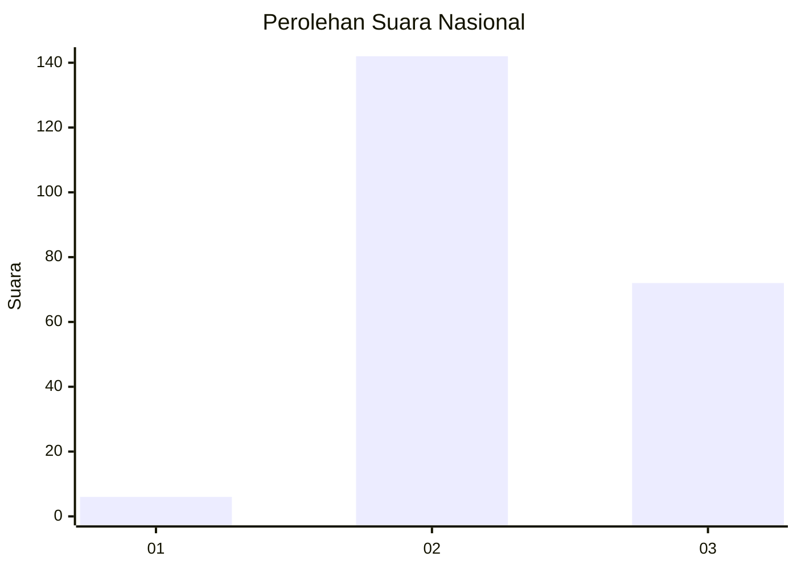
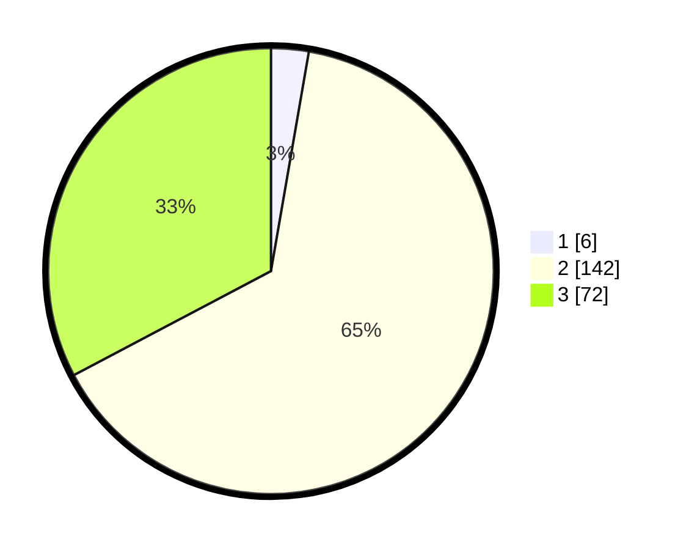

# Hasil

## Grafik

## Tabel

| No. | Nama Paslon    | Suara | Suara (raw) | Persentase |
|:--- |:-------------- | -----:| -----------:| ----------:|
| 1   | ANIES MUHAIMIN | 6     | [6][p-1]    | 2,73       |
| 2   | PRABOWO GIBRAN | 142   | [142][p-2]  | 64,55      |
| 3   | GANJAR MAHFUD  | 72    | [72][p-3]   | 32,73      |

[p-1]: https://github.com/gigit-pemilu/pemilu-2024/blob/main/pilpres/hitung-suara/sub/51-bali/sub/05-klungkung/sub/03-klungkung/sub/1013-semarapura-klod/sub/006-tps/sub/paslon-1.txt
[p-2]: https://github.com/gigit-pemilu/pemilu-2024/blob/main/pilpres/hitung-suara/sub/51-bali/sub/05-klungkung/sub/03-klungkung/sub/1013-semarapura-klod/sub/006-tps/sub/paslon-2.txt
[p-3]: https://github.com/gigit-pemilu/pemilu-2024/blob/main/pilpres/hitung-suara/sub/51-bali/sub/05-klungkung/sub/03-klungkung/sub/1013-semarapura-klod/sub/006-tps/sub/paslon-3.txt

## Foto C Plano

https://sirekap-obj-formc.kpu.go.id/b4fc/pemilu/ppwp/51/05/03/10/13/5105031013006-20240216-130014--a8e49b92-8471-43e8-8814-511549cac837.jpg

https://sirekap-obj-formc.kpu.go.id/b4fc/pemilu/ppwp/51/05/03/10/13/5105031013006-20240216-130021--0a958228-f720-4054-8efd-757af02d8971.jpg

https://sirekap-obj-formc.kpu.go.id/b4fc/pemilu/ppwp/51/05/03/10/13/5105031013006-20240216-130016--a52ed903-49ba-47ac-852d-e3af448393df.jpg

## Metadata

| Key        | Value               |
| ---------- | ------------------- |
| Time Stamp | 2024-02-16 13:30:32 |

## DATA PEMILIH TETAP

Jumlah pemilih dalam DPT: **283**.
 * L: **130**.
 * P: **153**.

## DATA PENGGUNA HAK PILIH

Jumlah pengguna hak pilih dalam DPT: **217**.
 * L: **101**.
 * P: **116**.

Jumlah pengguna hak pilih dalam DPTb: **4**.
 * L: **2**.
 * P: **2**.

Jumlah pengguna hak pilih dalam DPK: **1**.
 * L: **0**.
 * P: **1**.

Jumlah pengguna hak pilih: **222**.
 * L: **103**.
 * P: **119**.

## JUMLAH SUARA SAH DAN TIDAK SAH

JUMLAH SELURUH SUARA SAH: **220**.

JUMLAH SUARA TIDAK SAH: **2**.

JUMLAH SELURUH SUARA SAH DAN SUARA TIDAK SAH: **222**.

