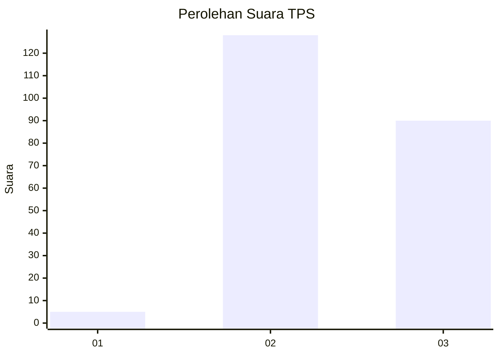
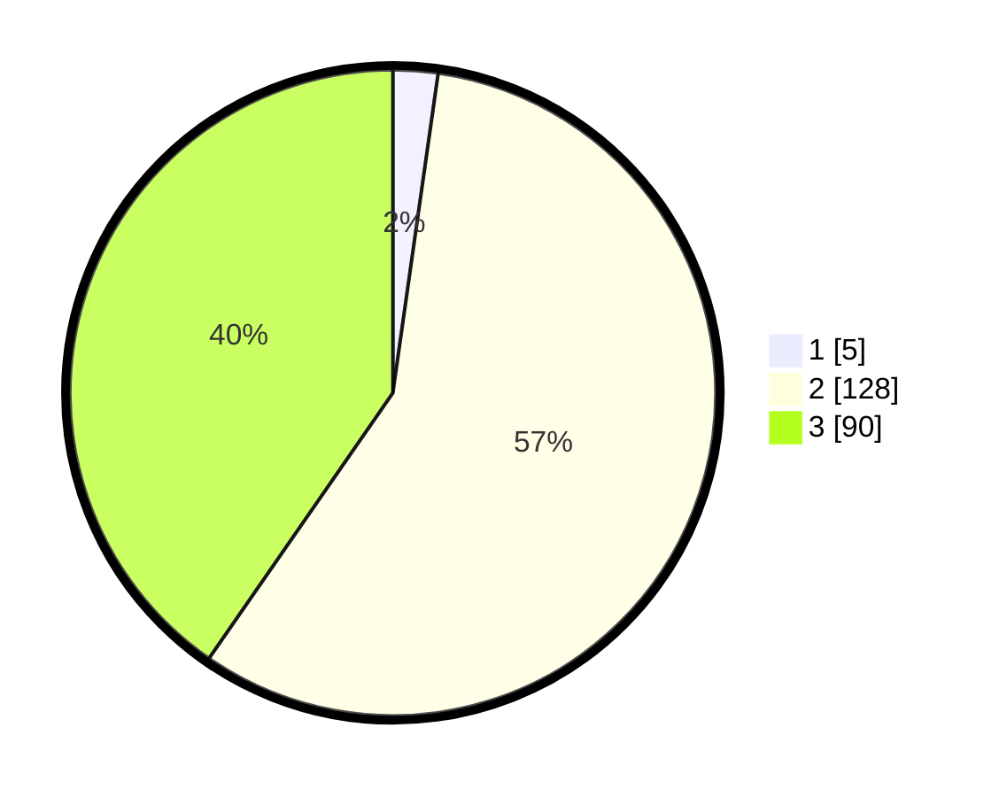

# Hasil

## Grafik

## Tabel

| No. | Nama Paslon    | Suara | Suara (raw) | Persentase |
|:--- |:-------------- | -----:| -----------:| ----------:|
| 1   | ANIES MUHAIMIN | 5     | [5][p-1]    | 2,24       |
| 2   | PRABOWO GIBRAN | 128   | [128][p-2]  | 57,40      |
| 3   | GANJAR MAHFUD  | 90    | [90][p-3]   | 40,36      |

[p-1]: https://github.com/gigit-pemilu/pemilu-2024-51-bali/blob/main/pilpres/hitung-suara/sub/51-bali/sub/05-klungkung/sub/03-klungkung/sub/1013-semarapura-klod/sub/010-tps/sub/paslon-1.txt
[p-2]: https://github.com/gigit-pemilu/pemilu-2024-51-bali/blob/main/pilpres/hitung-suara/sub/51-bali/sub/05-klungkung/sub/03-klungkung/sub/1013-semarapura-klod/sub/010-tps/sub/paslon-2.txt
[p-3]: https://github.com/gigit-pemilu/pemilu-2024-51-bali/blob/main/pilpres/hitung-suara/sub/51-bali/sub/05-klungkung/sub/03-klungkung/sub/1013-semarapura-klod/sub/010-tps/sub/paslon-3.txt

## Foto C Plano

https://sirekap-obj-formc.kpu.go.id/773c/pemilu/ppwp/51/05/03/10/13/5105031013010-20240214-212519--0dd61cc1-2281-47d3-a48e-943c3f4adc22.jpg

https://sirekap-obj-formc.kpu.go.id/773c/pemilu/ppwp/51/05/03/10/13/5105031013010-20240214-213016--36302328-d0cb-4337-bb27-d413658aa1c3.jpg

https://sirekap-obj-formc.kpu.go.id/773c/pemilu/ppwp/51/05/03/10/13/5105031013010-20240214-213228--4ce0bb60-e69d-42ec-a6f0-58535c2a38df.jpg

## Metadata

| Key        | Value               |
| ---------- | ------------------- |
| Time Stamp | 2024-02-15 15:00:29 |

