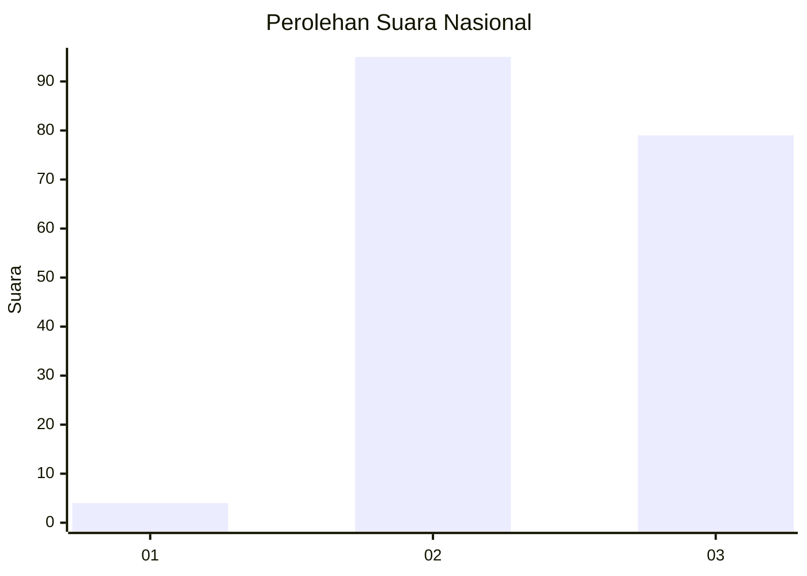
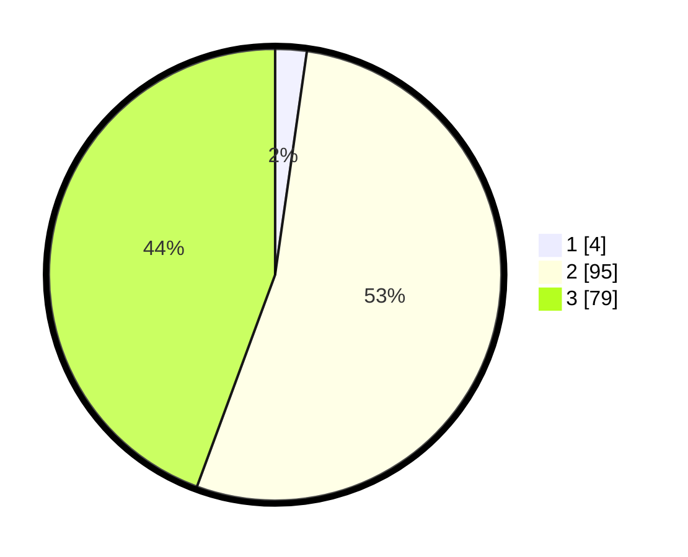

# Hasil

## Grafik

## Tabel

| No. | Nama Paslon    | Suara | Suara (raw) | Persentase |
|:--- |:-------------- | -----:| -----------:| ----------:|
| 1   | ANIES MUHAIMIN | 4     | [4][p-1]    | 2,25       |
| 2   | PRABOWO GIBRAN | 95    | [95][p-2]   | 53,37      |
| 3   | GANJAR MAHFUD  | 79    | [79][p-3]   | 44,38      |

[p-1]: https://github.com/gigit-pemilu/pemilu-2024/blob/main/pilpres/hitung-suara/sub/51-bali/sub/05-klungkung/sub/03-klungkung/sub/1013-semarapura-klod/sub/012-tps/sub/paslon-1.txt
[p-2]: https://github.com/gigit-pemilu/pemilu-2024/blob/main/pilpres/hitung-suara/sub/51-bali/sub/05-klungkung/sub/03-klungkung/sub/1013-semarapura-klod/sub/012-tps/sub/paslon-2.txt
[p-3]: https://github.com/gigit-pemilu/pemilu-2024/blob/main/pilpres/hitung-suara/sub/51-bali/sub/05-klungkung/sub/03-klungkung/sub/1013-semarapura-klod/sub/012-tps/sub/paslon-3.txt

## Foto C Plano

https://sirekap-obj-formc.kpu.go.id/13cc/pemilu/ppwp/51/05/03/10/13/5105031013012-20240214-225315--2d992c95-5300-4e8d-b3be-7c6a9926750b.jpg

https://sirekap-obj-formc.kpu.go.id/13cc/pemilu/ppwp/51/05/03/10/13/5105031013012-20240214-225638--3345b43a-e646-45e8-ba54-944b4330cad0.jpg

https://sirekap-obj-formc.kpu.go.id/13cc/pemilu/ppwp/51/05/03/10/13/5105031013012-20240214-225845--29af6fa5-aad7-4f85-97e6-468a94fdda05.jpg

## Metadata

| Key        | Value               |
| ---------- | ------------------- |
| Time Stamp | 2024-02-15 15:00:29 |

