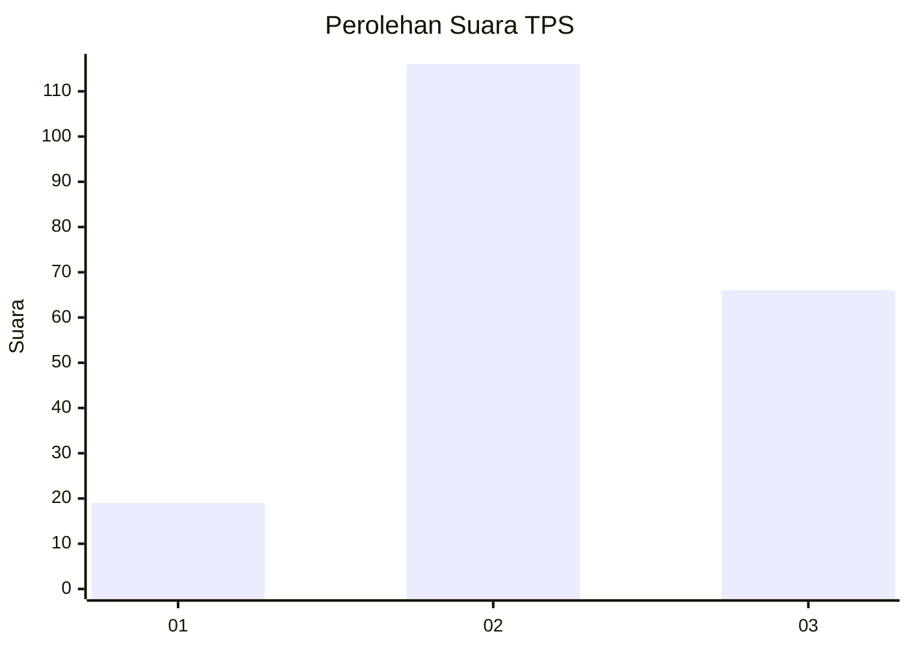
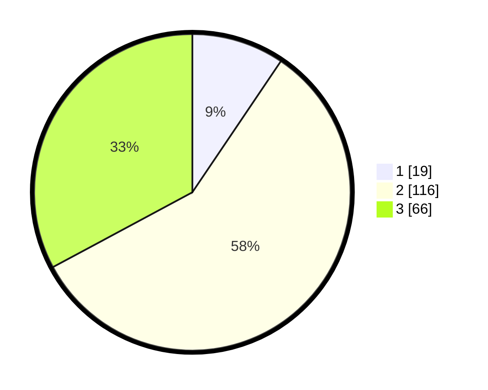

# Hasil

## Grafik

## Tabel

| No. | Nama Paslon    | Suara | Suara (raw) | Persentase |
|:--- |:-------------- | -----:| -----------:| ----------:|
| 1   | ANIES MUHAIMIN | 19    | [19][p-1]   | 9,45       |
| 2   | PRABOWO GIBRAN | 116   | [116][p-2]  | 57,71      |
| 3   | GANJAR MAHFUD  | 66    | [66][p-3]   | 32,84      |

[p-1]: https://github.com/gigit-pemilu/pemilu-2024-51-bali/blob/main/pilpres/hitung-suara/sub/51-bali/sub/05-klungkung/sub/03-klungkung/sub/1013-semarapura-klod/sub/016-tps/sub/paslon-1.txt
[p-2]: https://github.com/gigit-pemilu/pemilu-2024-51-bali/blob/main/pilpres/hitung-suara/sub/51-bali/sub/05-klungkung/sub/03-klungkung/sub/1013-semarapura-klod/sub/016-tps/sub/paslon-2.txt
[p-3]: https://github.com/gigit-pemilu/pemilu-2024-51-bali/blob/main/pilpres/hitung-suara/sub/51-bali/sub/05-klungkung/sub/03-klungkung/sub/1013-semarapura-klod/sub/016-tps/sub/paslon-3.txt

## Foto C Plano

https://sirekap-obj-formc.kpu.go.id/db22/pemilu/ppwp/51/05/03/10/13/5105031013016-20240216-144020--ba461c71-b05e-4e95-9053-f515b4de1896.jpg

https://sirekap-obj-formc.kpu.go.id/db22/pemilu/ppwp/51/05/03/10/13/5105031013016-20240216-144021--4711bd9c-0507-40ae-80ad-9e936a48469c.jpg

https://sirekap-obj-formc.kpu.go.id/db22/pemilu/ppwp/51/05/03/10/13/5105031013016-20240216-144021--bd9daf5e-ac57-464d-be60-93f1671bc7d0.jpg

## Metadata

| Key        | Value               |
| ---------- | ------------------- |
| Time Stamp | 2024-02-21 15:00:00 |

## DATA PEMILIH TETAP

Jumlah pemilih dalam DPT: **0**.
 * L: **0**.
 * P: **0**.

## DATA PENGGUNA HAK PILIH

Jumlah pengguna hak pilih dalam DPT: **168**.
 * L: **80**.
 * P: **88**.

Jumlah pengguna hak pilih dalam DPTb: **9**.
 * L: **5**.
 * P: **4**.

Jumlah pengguna hak pilih dalam DPK: **27**.
 * L: **14**.
 * P: **13**.

Jumlah pengguna hak pilih: **204**.
 * L: **99**.
 * P: **105**.

## JUMLAH SUARA SAH DAN TIDAK SAH

JUMLAH SELURUH SUARA SAH: **201**.

JUMLAH SUARA TIDAK SAH: **3**.

JUMLAH SELURUH SUARA SAH DAN SUARA TIDAK SAH: **204**.

