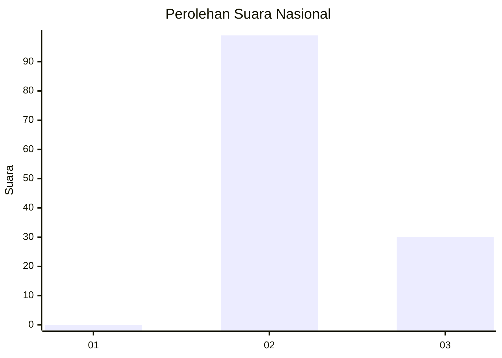
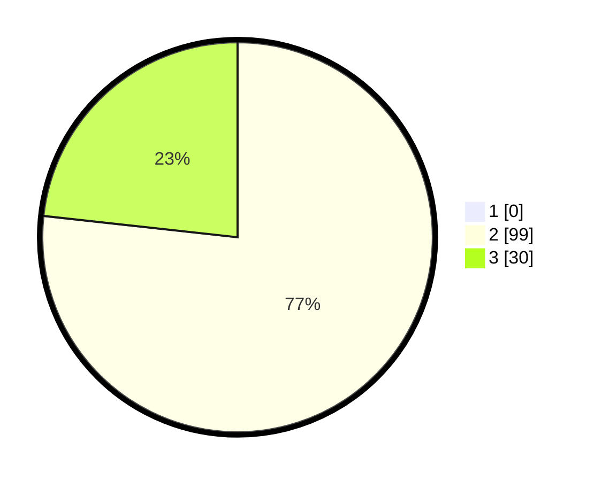

# Hasil

## Grafik

## Tabel

| No. | Nama Paslon    | Suara | Suara (raw) | Persentase |
|:--- |:-------------- | -----:| -----------:| ----------:|
| 1   | ANIES MUHAIMIN | 0     | [0][p-1]    | 0,00       |
| 2   | PRABOWO GIBRAN | 99    | [99][p-2]   | 76,74      |
| 3   | GANJAR MAHFUD  | 30    | [30][p-3]   | 23,26      |

[p-1]: https://github.com/gigit-pemilu/pemilu-2024/blob/main/pilpres/hitung-suara/sub/51-bali/sub/05-klungkung/sub/03-klungkung/sub/1013-semarapura-klod/sub/901-tps/sub/paslon-1.txt
[p-2]: https://github.com/gigit-pemilu/pemilu-2024/blob/main/pilpres/hitung-suara/sub/51-bali/sub/05-klungkung/sub/03-klungkung/sub/1013-semarapura-klod/sub/901-tps/sub/paslon-2.txt
[p-3]: https://github.com/gigit-pemilu/pemilu-2024/blob/main/pilpres/hitung-suara/sub/51-bali/sub/05-klungkung/sub/03-klungkung/sub/1013-semarapura-klod/sub/901-tps/sub/paslon-3.txt

## Foto C Plano

https://sirekap-obj-formc.kpu.go.id/86db/pemilu/ppwp/51/05/03/10/13/5105031013901-20240214-131455--967113d3-6948-4523-beec-6f6003e944d3.jpg

https://sirekap-obj-formc.kpu.go.id/86db/pemilu/ppwp/51/05/03/10/13/5105031013901-20240214-131537--83e9e596-e444-491f-bcd2-52b8b4db33d9.jpg

https://sirekap-obj-formc.kpu.go.id/86db/pemilu/ppwp/51/05/03/10/13/5105031013901-20240214-131639--6a2b268d-cc32-466e-b094-42ec05c5b4a5.jpg

## Metadata

| Key        | Value               |
| ---------- | ------------------- |
| Time Stamp | 2024-02-15 09:00:24 |

## DATA PEMILIH TETAP

Jumlah pemilih dalam DPT: **133**.
 * L: **130**.
 * P: **3**.

## DATA PENGGUNA HAK PILIH

Jumlah pengguna hak pilih dalam DPT: **79**.
 * L: **76**.
 * P: **3**.

Jumlah pengguna hak pilih dalam DPTb: **50**.
 * L: **44**.
 * P: **6**.

Jumlah pengguna hak pilih dalam DPK: **0**.
 * L: **0**.
 * P: **0**.

Jumlah pengguna hak pilih: **129**.
 * L: **120**.
 * P: **9**.

## JUMLAH SUARA SAH DAN TIDAK SAH

JUMLAH SELURUH SUARA SAH: **129**.

JUMLAH SUARA TIDAK SAH: **0**.

JUMLAH SELURUH SUARA SAH DAN SUARA TIDAK SAH: **129**.

