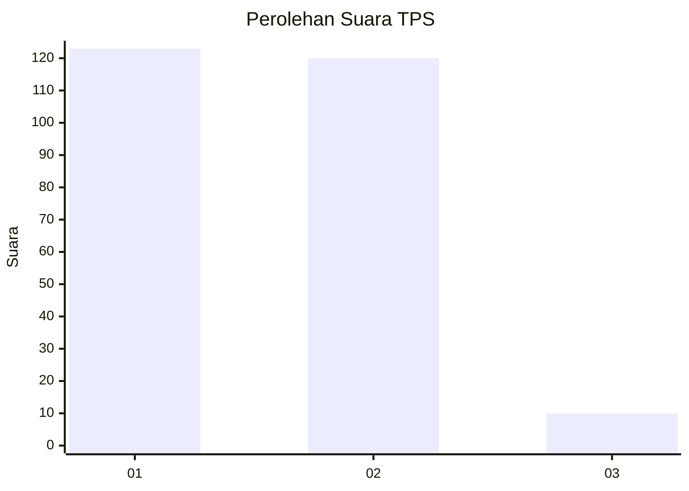
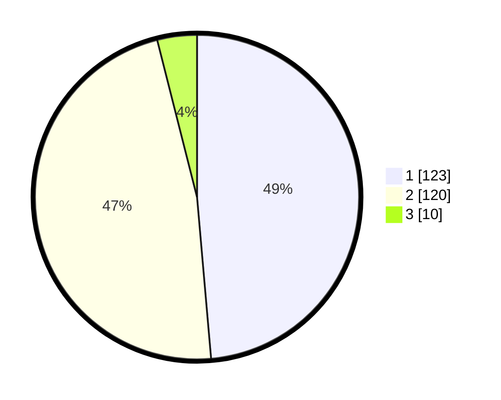

# Hasil

## Grafik

## Tabel

| No. | Nama Paslon    | Suara | Suara (raw) | Persentase |
|:--- |:-------------- | -----:| -----------:| ----------:|
| 1   | ANIES MUHAIMIN | 123   | [123][p-1]  | 48,62      |
| 2   | PRABOWO GIBRAN | 120   | [120][p-2]  | 47,43      |
| 3   | GANJAR MAHFUD  | 10    | [10][p-3]   | 3,95       |

[p-1]: https://github.com/gigit-pemilu/pemilu-2024-51-bali/blob/main/pilpres/hitung-suara/sub/51-bali/sub/05-klungkung/sub/03-klungkung/sub/2004-kampung-gelgel/sub/002-tps/sub/paslon-1.txt
[p-2]: https://github.com/gigit-pemilu/pemilu-2024-51-bali/blob/main/pilpres/hitung-suara/sub/51-bali/sub/05-klungkung/sub/03-klungkung/sub/2004-kampung-gelgel/sub/002-tps/sub/paslon-2.txt
[p-3]: https://github.com/gigit-pemilu/pemilu-2024-51-bali/blob/main/pilpres/hitung-suara/sub/51-bali/sub/05-klungkung/sub/03-klungkung/sub/2004-kampung-gelgel/sub/002-tps/sub/paslon-3.txt

## Foto C Plano

https://sirekap-obj-formc.kpu.go.id/721c/pemilu/ppwp/51/05/03/20/04/5105032004002-20240214-210611--60f50c03-1363-4a1c-91db-779808721ce7.jpg

https://sirekap-obj-formc.kpu.go.id/721c/pemilu/ppwp/51/05/03/20/04/5105032004002-20240214-210619--6223c3cf-e687-490b-8c6d-c7831f37dd57.jpg

https://sirekap-obj-formc.kpu.go.id/721c/pemilu/ppwp/51/05/03/20/04/5105032004002-20240214-210626--be2dfde6-7bf7-4260-8f93-805bf2aa7a3c.jpg

## Metadata

| Key        | Value               |
| ---------- | ------------------- |
| Time Stamp | 2024-02-15 00:41:44 |

## DATA PEMILIH TETAP

Jumlah pemilih dalam DPT: **288**.
 * L: **144**.
 * P: **144**.

## DATA PENGGUNA HAK PILIH

Jumlah pengguna hak pilih dalam DPT: **257**.
 * L: **129**.
 * P: **128**.

Jumlah pengguna hak pilih dalam DPTb: **0**.
 * L: **0**.
 * P: **0**.

Jumlah pengguna hak pilih dalam DPK: **1**.
 * L: **0**.
 * P: **1**.

Jumlah pengguna hak pilih: **258**.
 * L: **129**.
 * P: **129**.

## JUMLAH SUARA SAH DAN TIDAK SAH

JUMLAH SELURUH SUARA SAH: **253**.

JUMLAH SUARA TIDAK SAH: **5**.

JUMLAH SELURUH SUARA SAH DAN SUARA TIDAK SAH: **258**.

