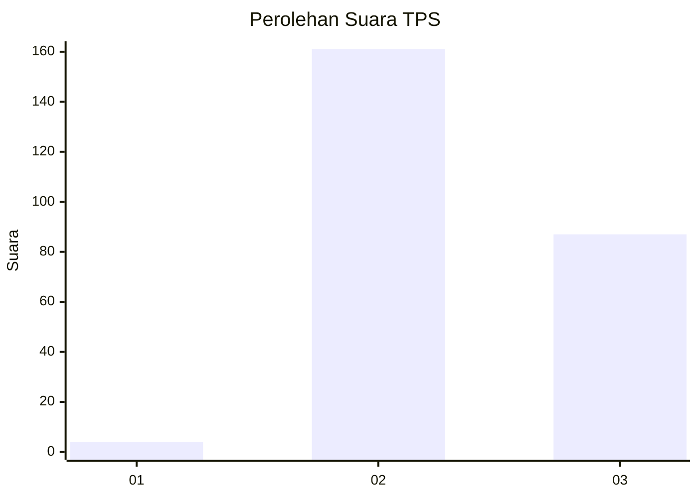
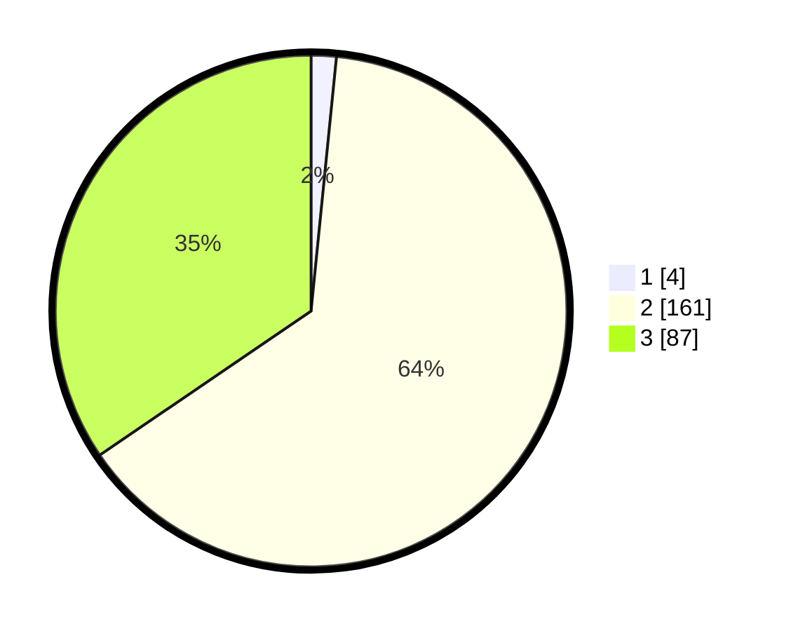

# Hasil

## Grafik

## Tabel

| No. | Nama Paslon    | Suara | Suara (raw) | Persentase |
|:--- |:-------------- | -----:| -----------:| ----------:|
| 1   | ANIES MUHAIMIN | 4     | [4][p-1]    | 1,59       |
| 2   | PRABOWO GIBRAN | 161   | [161][p-2]  | 63,89      |
| 3   | GANJAR MAHFUD  | 87    | [87][p-3]   | 34,52      |

[p-1]: https://github.com/gigit-pemilu/pemilu-2024-51-bali/blob/main/pilpres/hitung-suara/sub/51-bali/sub/05-klungkung/sub/03-klungkung/sub/2006-tangkas/sub/004-tps/sub/paslon-1.txt
[p-2]: https://github.com/gigit-pemilu/pemilu-2024-51-bali/blob/main/pilpres/hitung-suara/sub/51-bali/sub/05-klungkung/sub/03-klungkung/sub/2006-tangkas/sub/004-tps/sub/paslon-2.txt
[p-3]: https://github.com/gigit-pemilu/pemilu-2024-51-bali/blob/main/pilpres/hitung-suara/sub/51-bali/sub/05-klungkung/sub/03-klungkung/sub/2006-tangkas/sub/004-tps/sub/paslon-3.txt

## Foto C Plano

https://sirekap-obj-formc.kpu.go.id/ae3e/pemilu/ppwp/51/05/03/20/06/5105032006004-20240216-132123--19d2c3f3-670e-4616-aa2a-14100da2ed1e.jpg

https://sirekap-obj-formc.kpu.go.id/ae3e/pemilu/ppwp/51/05/03/20/06/5105032006004-20240216-132124--bf5b742a-402f-4aa7-963f-9f229cccc55e.jpg

https://sirekap-obj-formc.kpu.go.id/ae3e/pemilu/ppwp/51/05/03/20/06/5105032006004-20240216-132123--2974c334-49aa-4b73-821a-75fc6151b49a.jpg

## Metadata

| Key        | Value               |
| ---------- | ------------------- |
| Time Stamp | 2024-02-17 16:36:25 |

## DATA PEMILIH TETAP

Jumlah pemilih dalam DPT: **291**.
 * L: **138**.
 * P: **153**.

## DATA PENGGUNA HAK PILIH

Jumlah pengguna hak pilih dalam DPT: **260**.
 * L: **119**.
 * P: **141**.

Jumlah pengguna hak pilih dalam DPTb: **3**.
 * L: **1**.
 * P: **2**.

Jumlah pengguna hak pilih dalam DPK: **1**.
 * L: **0**.
 * P: **1**.

Jumlah pengguna hak pilih: **264**.
 * L: **120**.
 * P: **144**.

## JUMLAH SUARA SAH DAN TIDAK SAH

JUMLAH SELURUH SUARA SAH: **252**.

JUMLAH SUARA TIDAK SAH: **12**.

JUMLAH SELURUH SUARA SAH DAN SUARA TIDAK SAH: **264**.

