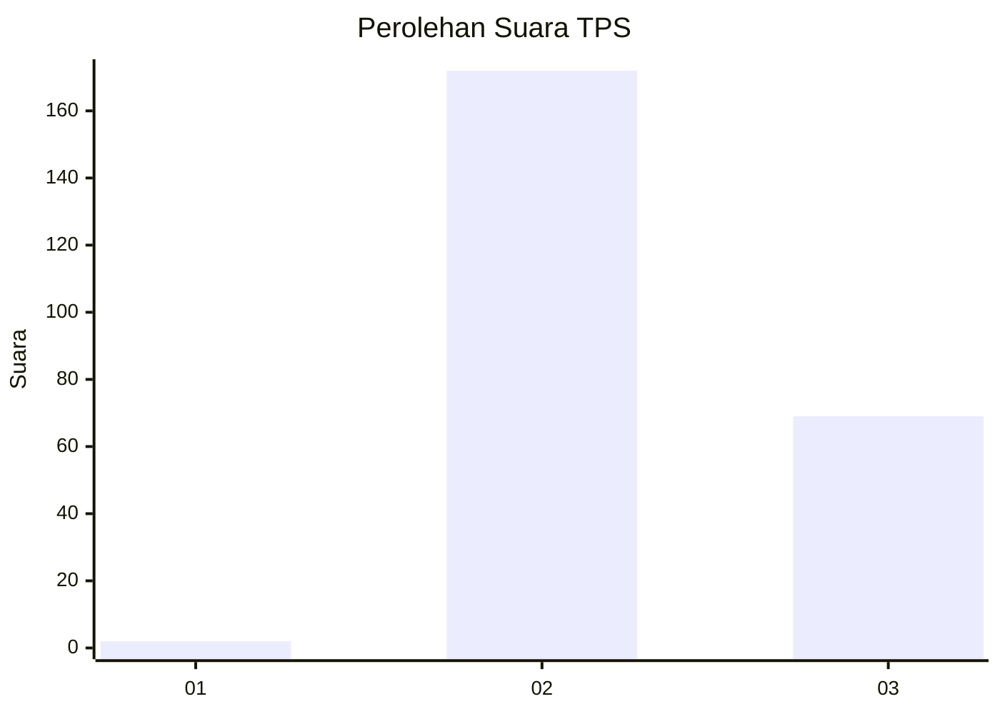
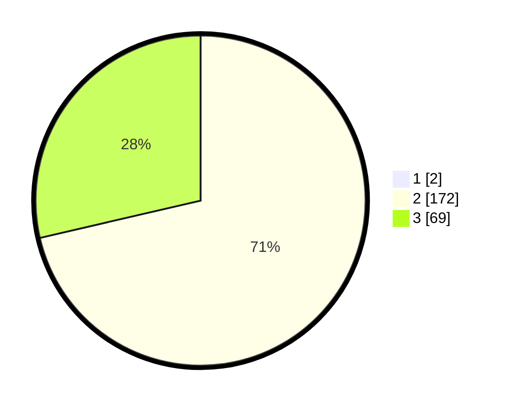

# Hasil

## Grafik

## Tabel

| No. | Nama Paslon    | Suara | Suara (raw) | Persentase |
|:--- |:-------------- | -----:| -----------:| ----------:|
| 1   | ANIES MUHAIMIN | 2     | [2][p-1]    | 0,82       |
| 2   | PRABOWO GIBRAN | 172   | [172][p-2]  | 70,78      |
| 3   | GANJAR MAHFUD  | 69    | [69][p-3]   | 28,40      |

[p-1]: https://github.com/gigit-pemilu/pemilu-2024-51-bali/blob/main/pilpres/hitung-suara/sub/51-bali/sub/05-klungkung/sub/03-klungkung/sub/2006-tangkas/sub/008-tps/sub/paslon-1.txt
[p-2]: https://github.com/gigit-pemilu/pemilu-2024-51-bali/blob/main/pilpres/hitung-suara/sub/51-bali/sub/05-klungkung/sub/03-klungkung/sub/2006-tangkas/sub/008-tps/sub/paslon-2.txt
[p-3]: https://github.com/gigit-pemilu/pemilu-2024-51-bali/blob/main/pilpres/hitung-suara/sub/51-bali/sub/05-klungkung/sub/03-klungkung/sub/2006-tangkas/sub/008-tps/sub/paslon-3.txt

## Foto C Plano

https://sirekap-obj-formc.kpu.go.id/59c4/pemilu/ppwp/51/05/03/20/06/5105032006008-20240214-141034--bfbddf67-15d4-4fb8-ae7d-6b68f0c22e32.jpg

https://sirekap-obj-formc.kpu.go.id/59c4/pemilu/ppwp/51/05/03/20/06/5105032006008-20240214-141220--9c0042b8-539f-49f0-ba59-85e3a6f1eb7c.jpg

https://sirekap-obj-formc.kpu.go.id/59c4/pemilu/ppwp/51/05/03/20/06/5105032006008-20240214-141336--b2baa50d-df16-4956-a9ee-c2f6eb9a9763.jpg

## Metadata

| Key        | Value               |
| ---------- | ------------------- |
| Time Stamp | 2024-02-17 09:30:03 |

