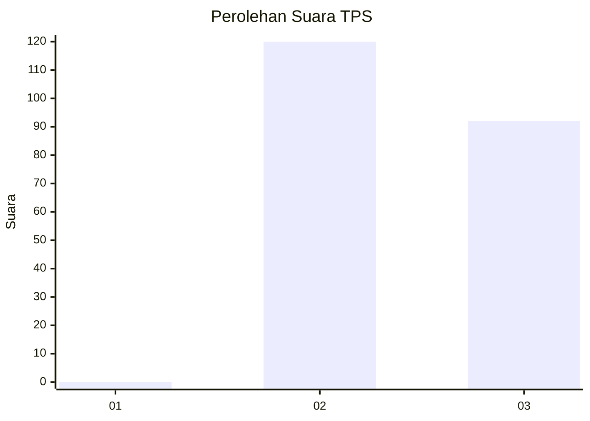
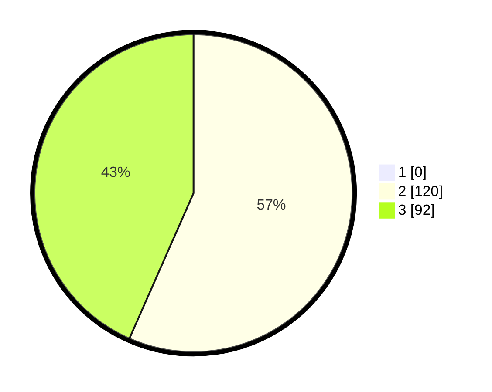

# Hasil

## Grafik

## Tabel

| No. | Nama Paslon    | Suara | Suara (raw) | Persentase |
|:--- |:-------------- | -----:| -----------:| ----------:|
| 1   | ANIES MUHAIMIN | 0     | [0][p-1]    | 0,00       |
| 2   | PRABOWO GIBRAN | 120   | [120][p-2]  | 56,60      |
| 3   | GANJAR MAHFUD  | 92    | [92][p-3]   | 43,40      |

[p-1]: https://github.com/gigit-pemilu/pemilu-2024-51-bali/blob/main/pilpres/hitung-suara/sub/51-bali/sub/05-klungkung/sub/03-klungkung/sub/2014-akah/sub/001-tps/sub/paslon-1.txt
[p-2]: https://github.com/gigit-pemilu/pemilu-2024-51-bali/blob/main/pilpres/hitung-suara/sub/51-bali/sub/05-klungkung/sub/03-klungkung/sub/2014-akah/sub/001-tps/sub/paslon-2.txt
[p-3]: https://github.com/gigit-pemilu/pemilu-2024-51-bali/blob/main/pilpres/hitung-suara/sub/51-bali/sub/05-klungkung/sub/03-klungkung/sub/2014-akah/sub/001-tps/sub/paslon-3.txt

## Foto C Plano

https://sirekap-obj-formc.kpu.go.id/2799/pemilu/ppwp/51/05/03/20/14/5105032014001-20240214-204123--8171250d-5df6-4419-b7dc-f59158d7b81a.jpg

https://sirekap-obj-formc.kpu.go.id/2799/pemilu/ppwp/51/05/03/20/14/5105032014001-20240214-201114--e41ae4a6-9b0b-4a03-b7af-4bb0befb782d.jpg

https://sirekap-obj-formc.kpu.go.id/2799/pemilu/ppwp/51/05/03/20/14/5105032014001-20240214-201335--830ee1c2-d69f-4460-b5b4-2332ebe1be08.jpg

## Metadata

| Key        | Value               |
| ---------- | ------------------- |
| Time Stamp | 2024-02-15 00:41:44 |

