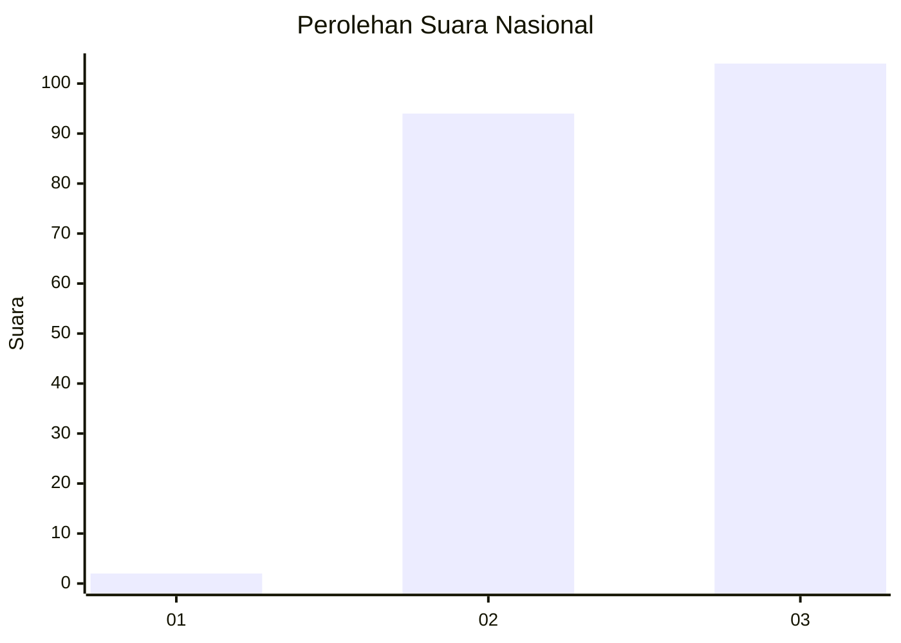
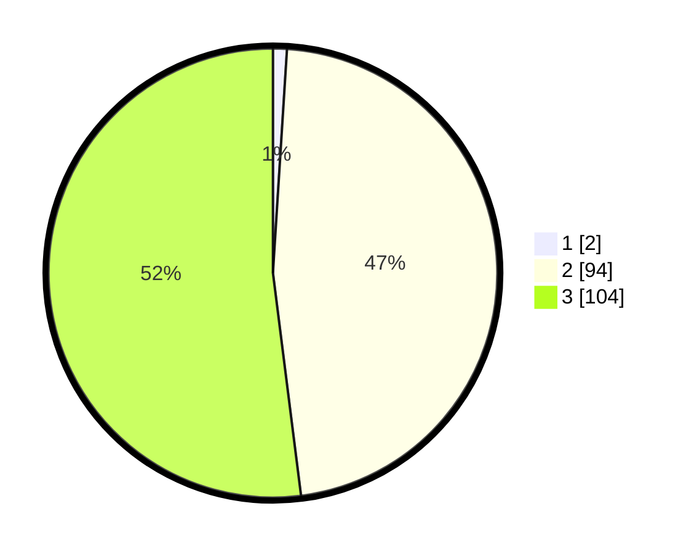

# Hasil

## Grafik

## Tabel

| No. | Nama Paslon    | Suara | Suara (raw) | Persentase |
|:--- |:-------------- | -----:| -----------:| ----------:|
| 1   | ANIES MUHAIMIN | 2     | [2][p-1]    | 1,00       |
| 2   | PRABOWO GIBRAN | 94    | [94][p-2]   | 47,00      |
| 3   | GANJAR MAHFUD  | 104   | [104][p-3]  | 52,00      |

[p-1]: https://github.com/gigit-pemilu/pemilu-2024/blob/main/pilpres/hitung-suara/sub/51-bali/sub/05-klungkung/sub/03-klungkung/sub/2015-manduang/sub/003-tps/sub/paslon-1.txt
[p-2]: https://github.com/gigit-pemilu/pemilu-2024/blob/main/pilpres/hitung-suara/sub/51-bali/sub/05-klungkung/sub/03-klungkung/sub/2015-manduang/sub/003-tps/sub/paslon-2.txt
[p-3]: https://github.com/gigit-pemilu/pemilu-2024/blob/main/pilpres/hitung-suara/sub/51-bali/sub/05-klungkung/sub/03-klungkung/sub/2015-manduang/sub/003-tps/sub/paslon-3.txt

## Foto C Plano

https://sirekap-obj-formc.kpu.go.id/1a44/pemilu/ppwp/51/05/03/20/15/5105032015003-20240216-140247--aa443ff3-d90d-4fa4-849f-287382d53c2c.jpg

https://sirekap-obj-formc.kpu.go.id/1a44/pemilu/ppwp/51/05/03/20/15/5105032015003-20240216-140249--011f8076-93d0-45e6-9e6b-fbb44b19ceb1.jpg

https://sirekap-obj-formc.kpu.go.id/1a44/pemilu/ppwp/51/05/03/20/15/5105032015003-20240216-140248--e1576464-ad9b-4f5d-8177-c6e501e2e611.jpg

## Metadata

| Key        | Value               |
| ---------- | ------------------- |
| Time Stamp | 2024-02-17 09:30:03 |

## DATA PEMILIH TETAP

Jumlah pemilih dalam DPT: **247**.
 * L: **118**.
 * P: **129**.

## DATA PENGGUNA HAK PILIH

Jumlah pengguna hak pilih dalam DPT: **202**.
 * L: **98**.
 * P: **104**.

Jumlah pengguna hak pilih dalam DPTb: **0**.
 * L: **0**.
 * P: **0**.

Jumlah pengguna hak pilih dalam DPK: **2**.
 * L: **1**.
 * P: **1**.

Jumlah pengguna hak pilih: **204**.
 * L: **99**.
 * P: **105**.

## JUMLAH SUARA SAH DAN TIDAK SAH

JUMLAH SELURUH SUARA SAH: **200**.

JUMLAH SUARA TIDAK SAH: **4**.

JUMLAH SELURUH SUARA SAH DAN SUARA TIDAK SAH: **204**.

