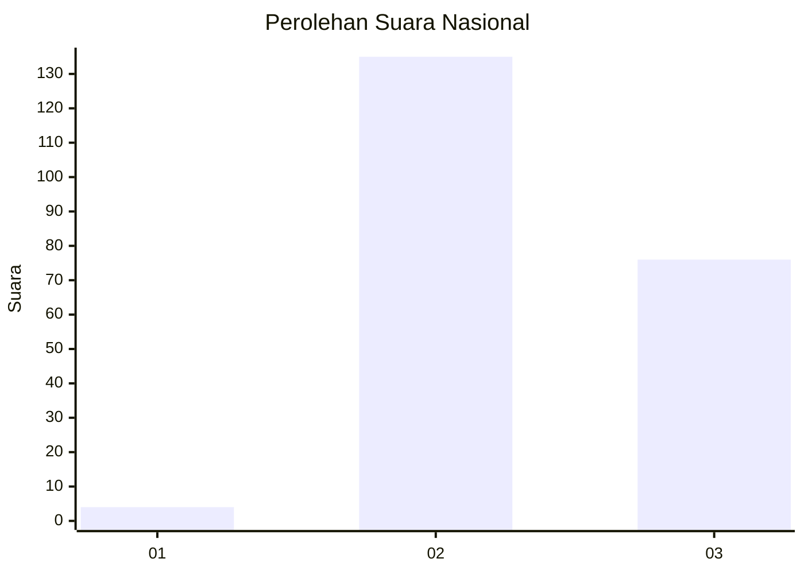
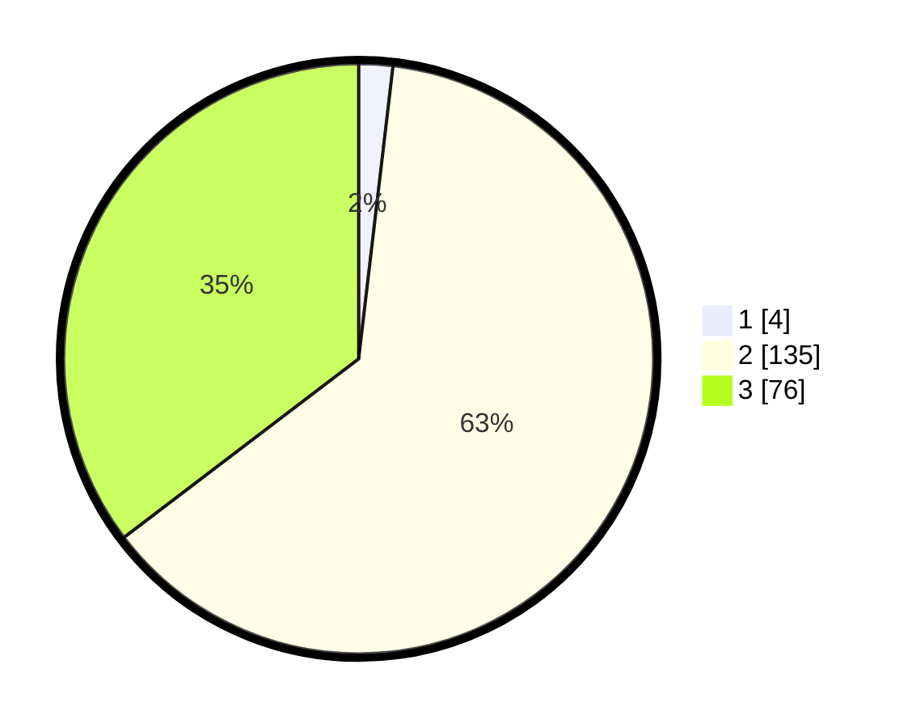

# Hasil

## Grafik

## Tabel

| No. | Nama Paslon    | Suara | Suara (raw) | Persentase |
|:--- |:-------------- | -----:| -----------:| ----------:|
| 1   | ANIES MUHAIMIN | 4     | [4][p-1]    | 1,86       |
| 2   | PRABOWO GIBRAN | 135   | [135][p-2]  | 62,79      |
| 3   | GANJAR MAHFUD  | 76    | [76][p-3]   | 35,35      |

[p-1]: https://github.com/gigit-pemilu/pemilu-2024/blob/main/pilpres/hitung-suara/sub/51-bali/sub/05-klungkung/sub/03-klungkung/sub/2015-manduang/sub/005-tps/sub/paslon-1.txt
[p-2]: https://github.com/gigit-pemilu/pemilu-2024/blob/main/pilpres/hitung-suara/sub/51-bali/sub/05-klungkung/sub/03-klungkung/sub/2015-manduang/sub/005-tps/sub/paslon-2.txt
[p-3]: https://github.com/gigit-pemilu/pemilu-2024/blob/main/pilpres/hitung-suara/sub/51-bali/sub/05-klungkung/sub/03-klungkung/sub/2015-manduang/sub/005-tps/sub/paslon-3.txt

## Foto C Plano

https://sirekap-obj-formc.kpu.go.id/3a08/pemilu/ppwp/51/05/03/20/15/5105032015005-20240214-132348--cd1d7441-5c79-4819-8e0e-b3ebc6e5da3a.jpg

https://sirekap-obj-formc.kpu.go.id/3a08/pemilu/ppwp/51/05/03/20/15/5105032015005-20240214-132429--97563735-362c-4292-a5e0-6c267c0d1021.jpg

https://sirekap-obj-formc.kpu.go.id/3a08/pemilu/ppwp/51/05/03/20/15/5105032015005-20240214-132512--e010002c-b523-42dd-bd15-8b036a49cec6.jpg

## Metadata

| Key        | Value               |
| ---------- | ------------------- |
| Time Stamp | 2024-02-15 15:00:29 |

