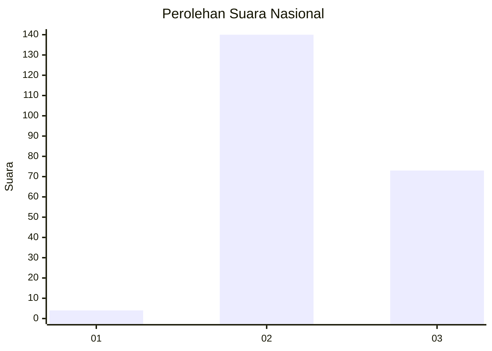
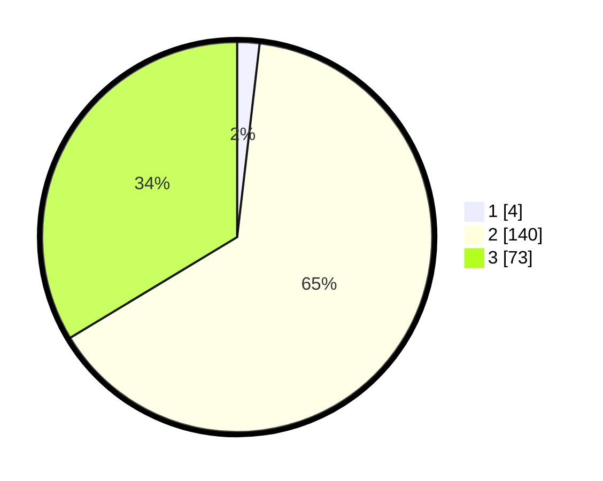

# Hasil

## Grafik

## Tabel

| No. | Nama Paslon    | Suara | Suara (raw) | Persentase |
|:--- |:-------------- | -----:| -----------:| ----------:|
| 1   | ANIES MUHAIMIN | 4     | [4][p-1]    | 1,84       |
| 2   | PRABOWO GIBRAN | 140   | [140][p-2]  | 64,52      |
| 3   | GANJAR MAHFUD  | 73    | [73][p-3]   | 33,64      |

[p-1]: https://github.com/gigit-pemilu/pemilu-2024/blob/main/pilpres/hitung-suara/sub/51-bali/sub/05-klungkung/sub/03-klungkung/sub/2015-manduang/sub/006-tps/sub/paslon-1.txt
[p-2]: https://github.com/gigit-pemilu/pemilu-2024/blob/main/pilpres/hitung-suara/sub/51-bali/sub/05-klungkung/sub/03-klungkung/sub/2015-manduang/sub/006-tps/sub/paslon-2.txt
[p-3]: https://github.com/gigit-pemilu/pemilu-2024/blob/main/pilpres/hitung-suara/sub/51-bali/sub/05-klungkung/sub/03-klungkung/sub/2015-manduang/sub/006-tps/sub/paslon-3.txt

## Foto C Plano

https://sirekap-obj-formc.kpu.go.id/a49b/pemilu/ppwp/51/05/03/20/15/5105032015006-20240214-141036--ace9d6ee-5618-4e32-96fe-8449a9f359db.jpg

https://sirekap-obj-formc.kpu.go.id/a49b/pemilu/ppwp/51/05/03/20/15/5105032015006-20240214-141205--1227ceeb-934a-452b-bc38-2ec4a42217e7.jpg

https://sirekap-obj-formc.kpu.go.id/a49b/pemilu/ppwp/51/05/03/20/15/5105032015006-20240214-141234--71663aec-b160-4e74-8e26-eea5c6d7b255.jpg

## Metadata

| Key        | Value               |
| ---------- | ------------------- |
| Time Stamp | 2024-02-17 09:30:03 |

## DATA PEMILIH TETAP

Jumlah pemilih dalam DPT: **260**.
 * L: **158**.
 * P: **102**.

## DATA PENGGUNA HAK PILIH

Jumlah pengguna hak pilih dalam DPT: **228**.
 * L: **113**.
 * P: **115**.

Jumlah pengguna hak pilih dalam DPTb: **2**.
 * L: **0**.
 * P: **2**.

Jumlah pengguna hak pilih dalam DPK: **0**.
 * L: **0**.
 * P: **0**.

Jumlah pengguna hak pilih: **230**.
 * L: **113**.
 * P: **117**.

## JUMLAH SUARA SAH DAN TIDAK SAH

JUMLAH SELURUH SUARA SAH: **217**.

JUMLAH SUARA TIDAK SAH: **13**.

JUMLAH SELURUH SUARA SAH DAN SUARA TIDAK SAH: **230**.

