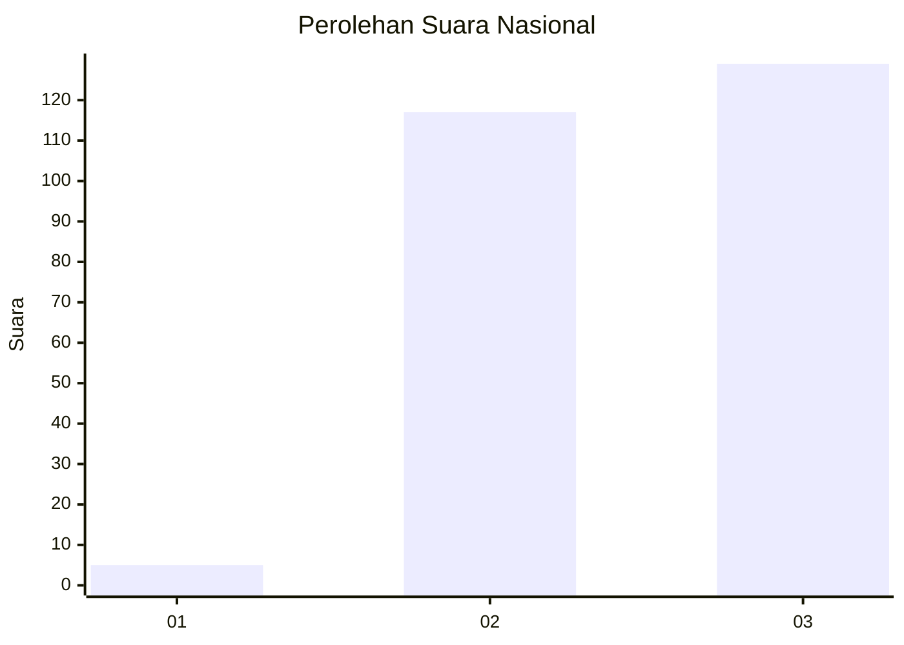
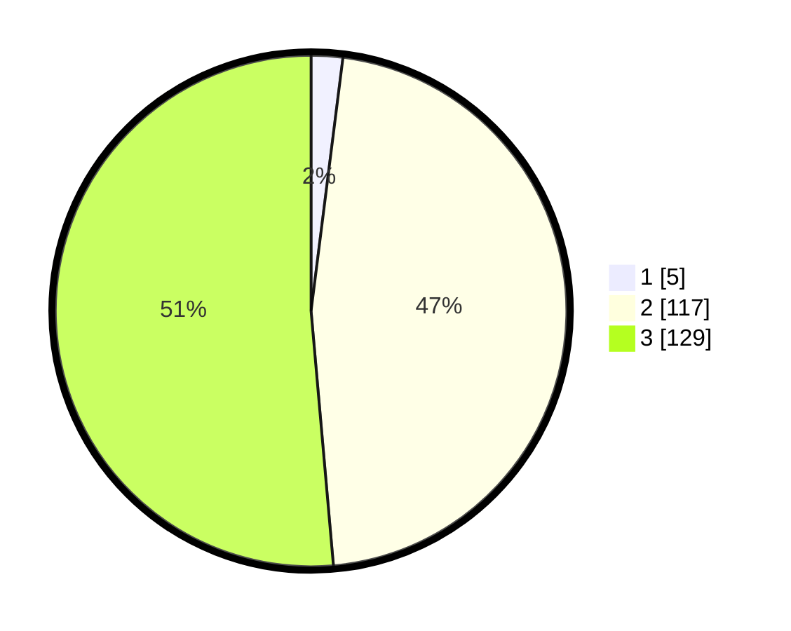

# Hasil

## Grafik

## Tabel

| No. | Nama Paslon    | Suara | Suara (raw) | Persentase |
|:--- |:-------------- | -----:| -----------:| ----------:|
| 1   | ANIES MUHAIMIN | 5     | [5][p-1]    | 1,99       |
| 2   | PRABOWO GIBRAN | 117   | [117][p-2]  | 46,61      |
| 3   | GANJAR MAHFUD  | 129   | [129][p-3]  | 51,39      |

[p-1]: https://github.com/gigit-pemilu/pemilu-2024/blob/main/pilpres/hitung-suara/sub/51-bali/sub/05-klungkung/sub/03-klungkung/sub/2016-selat/sub/007-tps/sub/paslon-1.txt
[p-2]: https://github.com/gigit-pemilu/pemilu-2024/blob/main/pilpres/hitung-suara/sub/51-bali/sub/05-klungkung/sub/03-klungkung/sub/2016-selat/sub/007-tps/sub/paslon-2.txt
[p-3]: https://github.com/gigit-pemilu/pemilu-2024/blob/main/pilpres/hitung-suara/sub/51-bali/sub/05-klungkung/sub/03-klungkung/sub/2016-selat/sub/007-tps/sub/paslon-3.txt

## Foto C Plano

https://sirekap-obj-formc.kpu.go.id/1f07/pemilu/ppwp/51/05/03/20/16/5105032016007-20240215-203319--f8164d4d-b18a-47e8-9f5d-4c7492cfdc97.jpg

https://sirekap-obj-formc.kpu.go.id/1f07/pemilu/ppwp/51/05/03/20/16/5105032016007-20240215-203817--f712c004-6ed2-480c-9549-073e63a2a966.jpg

https://sirekap-obj-formc.kpu.go.id/1f07/pemilu/ppwp/51/05/03/20/16/5105032016007-20240215-203930--aeac8d2c-1eff-4987-ab95-670c2d4ce7a2.jpg

## Metadata

| Key        | Value               |
| ---------- | ------------------- |
| Time Stamp | 2024-02-17 13:37:34 |

