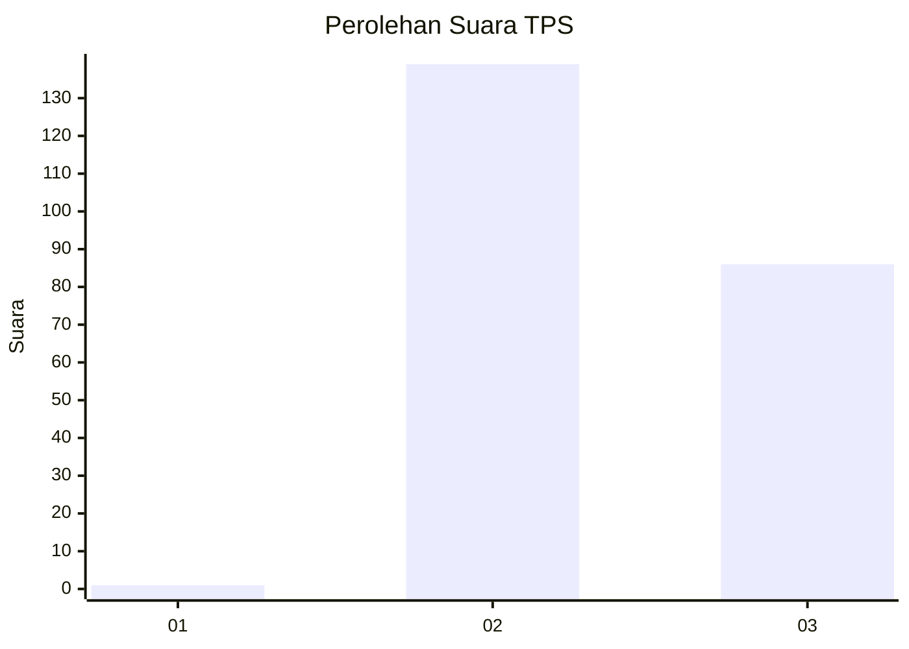
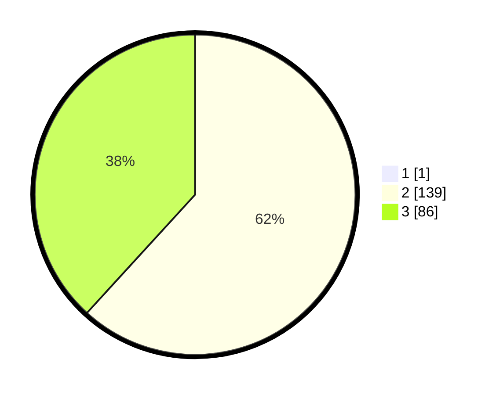

# Hasil

## Grafik

## Tabel

| No. | Nama Paslon    | Suara | Suara (raw) | Persentase |
|:--- |:-------------- | -----:| -----------:| ----------:|
| 1   | ANIES MUHAIMIN | 1     | [1][p-1]    | 0,44       |
| 2   | PRABOWO GIBRAN | 139   | [139][p-2]  | 61,50      |
| 3   | GANJAR MAHFUD  | 86    | [86][p-3]   | 38,05      |

[p-1]: https://github.com/gigit-pemilu/pemilu-2024-51-bali/blob/main/pilpres/hitung-suara/sub/51-bali/sub/05-klungkung/sub/03-klungkung/sub/2017-tegak/sub/008-tps/sub/paslon-1.txt
[p-2]: https://github.com/gigit-pemilu/pemilu-2024-51-bali/blob/main/pilpres/hitung-suara/sub/51-bali/sub/05-klungkung/sub/03-klungkung/sub/2017-tegak/sub/008-tps/sub/paslon-2.txt
[p-3]: https://github.com/gigit-pemilu/pemilu-2024-51-bali/blob/main/pilpres/hitung-suara/sub/51-bali/sub/05-klungkung/sub/03-klungkung/sub/2017-tegak/sub/008-tps/sub/paslon-3.txt

## Foto C Plano

https://sirekap-obj-formc.kpu.go.id/2f29/pemilu/ppwp/51/05/03/20/17/5105032017008-20240215-003111--84da04e4-5a36-41ce-b20b-f5cfa4a94574.jpg

https://sirekap-obj-formc.kpu.go.id/2f29/pemilu/ppwp/51/05/03/20/17/5105032017008-20240215-003223--9638a1bd-b031-4be7-801a-0272fe25b637.jpg

https://sirekap-obj-formc.kpu.go.id/2f29/pemilu/ppwp/51/05/03/20/17/5105032017008-20240215-003328--593cf39f-1b57-401b-bb93-75b94ec7bf98.jpg

## Metadata

| Key        | Value               |
| ---------- | ------------------- |
| Time Stamp | 2024-02-15 15:00:29 |

