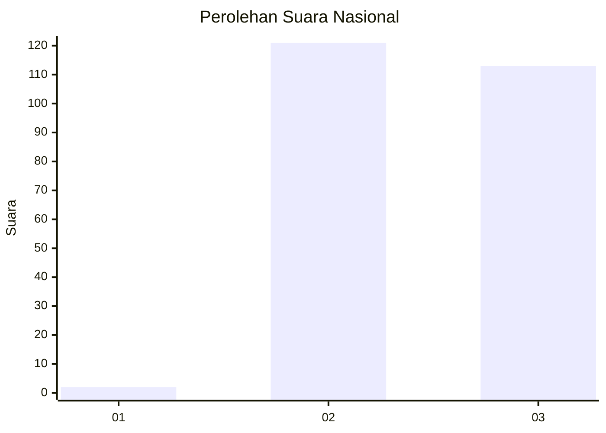
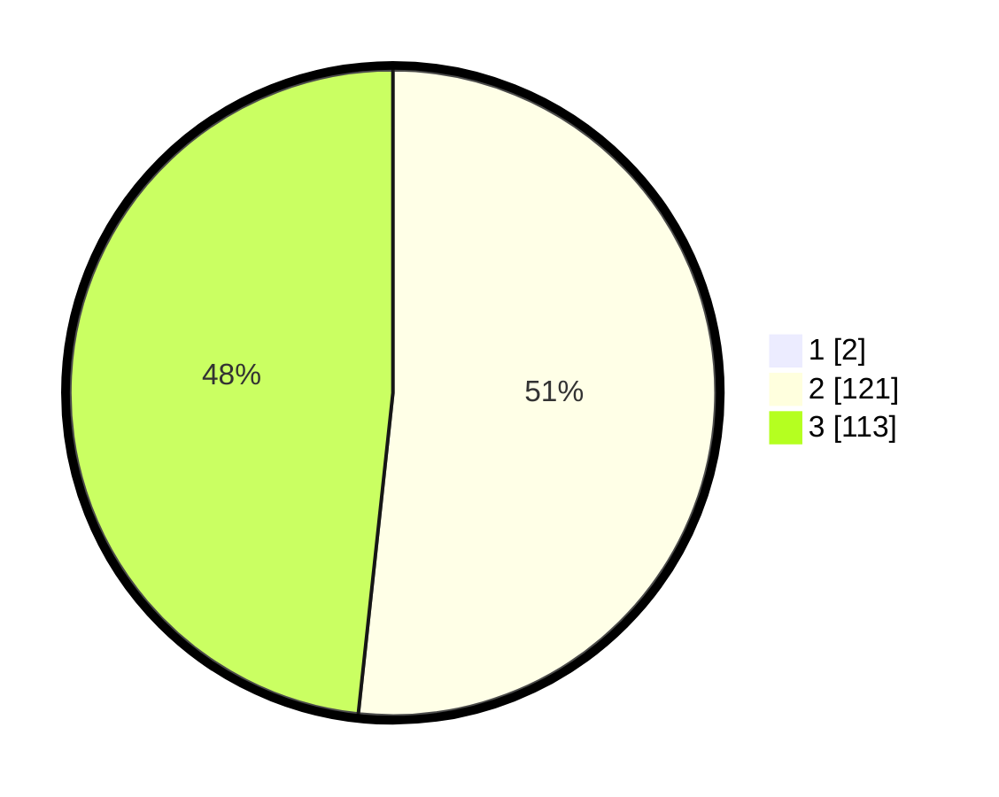

# Hasil

## Grafik

## Tabel

| No. | Nama Paslon    | Suara | Suara (raw) | Persentase |
|:--- |:-------------- | -----:| -----------:| ----------:|
| 1   | ANIES MUHAIMIN | 2     | [2][p-1]    | 0,85       |
| 2   | PRABOWO GIBRAN | 121   | [121][p-2]  | 51,27      |
| 3   | GANJAR MAHFUD  | 113   | [113][p-3]  | 47,88      |

[p-1]: https://github.com/gigit-pemilu/pemilu-2024/blob/main/pilpres/hitung-suara/sub/51-bali/sub/05-klungkung/sub/04-dawan/sub/2001-paksebali/sub/008-tps/sub/paslon-1.txt
[p-2]: https://github.com/gigit-pemilu/pemilu-2024/blob/main/pilpres/hitung-suara/sub/51-bali/sub/05-klungkung/sub/04-dawan/sub/2001-paksebali/sub/008-tps/sub/paslon-2.txt
[p-3]: https://github.com/gigit-pemilu/pemilu-2024/blob/main/pilpres/hitung-suara/sub/51-bali/sub/05-klungkung/sub/04-dawan/sub/2001-paksebali/sub/008-tps/sub/paslon-3.txt

## Foto C Plano

https://sirekap-obj-formc.kpu.go.id/9270/pemilu/ppwp/51/05/04/20/01/5105042001008-20240214-155815--b618769f-b175-4288-9be7-d0bfdf48c268.jpg

https://sirekap-obj-formc.kpu.go.id/9270/pemilu/ppwp/51/05/04/20/01/5105042001008-20240214-160120--72448a4a-8f59-4940-8d60-aed523367e4a.jpg

## Metadata

| Key        | Value               |
| ---------- | ------------------- |
| Time Stamp | 2024-02-19 06:16:00 |

