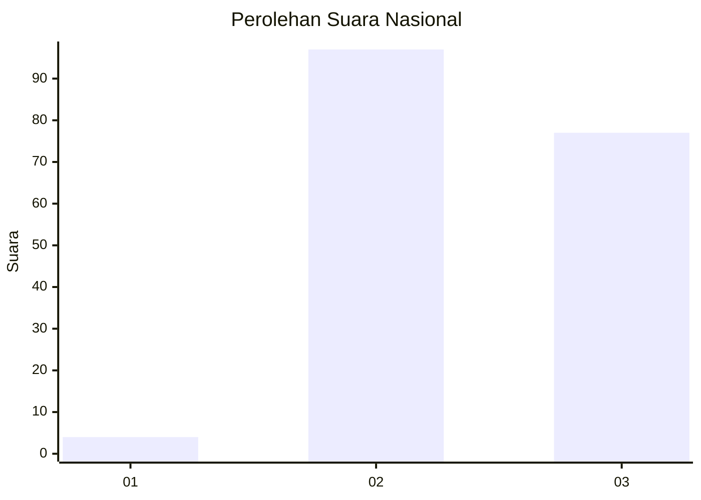
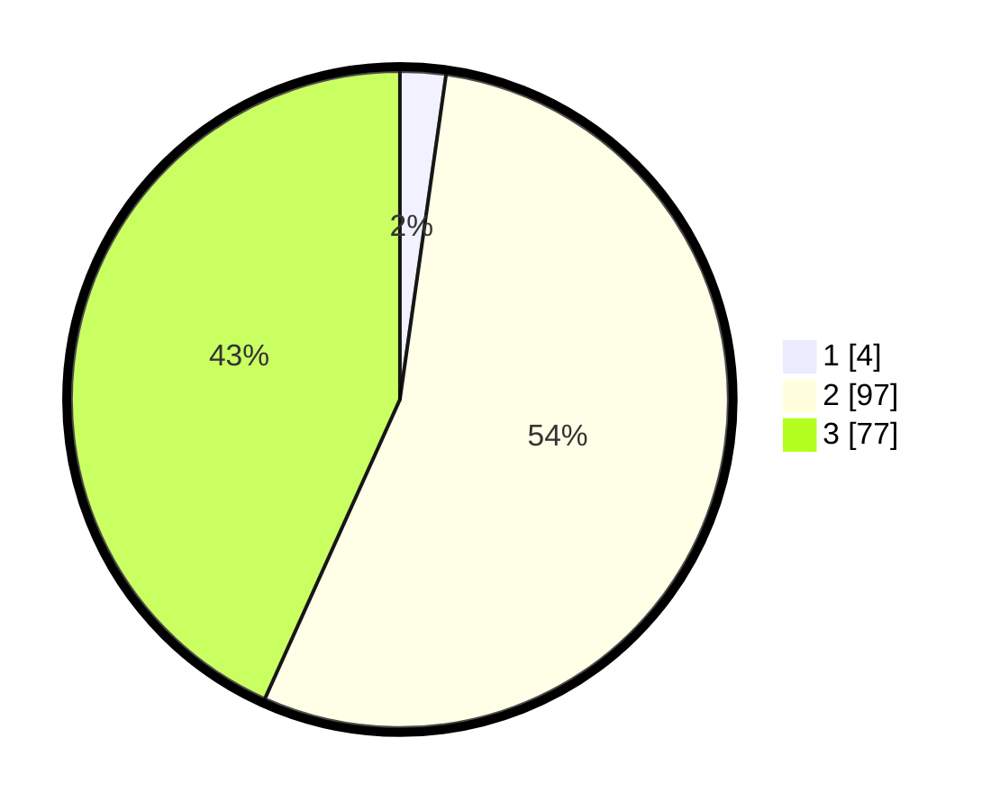

# Hasil

## Grafik

## Tabel

| No. | Nama Paslon    | Suara | Suara (raw) | Persentase |
|:--- |:-------------- | -----:| -----------:| ----------:|
| 1   | ANIES MUHAIMIN | 4     | [4][p-1]    | 2,25       |
| 2   | PRABOWO GIBRAN | 97    | [97][p-2]   | 54,49      |
| 3   | GANJAR MAHFUD  | 77    | [77][p-3]   | 43,26      |

[p-1]: https://github.com/gigit-pemilu/pemilu-2024/blob/main/pilpres/hitung-suara/sub/51-bali/sub/05-klungkung/sub/04-dawan/sub/2001-paksebali/sub/012-tps/sub/paslon-1.txt
[p-2]: https://github.com/gigit-pemilu/pemilu-2024/blob/main/pilpres/hitung-suara/sub/51-bali/sub/05-klungkung/sub/04-dawan/sub/2001-paksebali/sub/012-tps/sub/paslon-2.txt
[p-3]: https://github.com/gigit-pemilu/pemilu-2024/blob/main/pilpres/hitung-suara/sub/51-bali/sub/05-klungkung/sub/04-dawan/sub/2001-paksebali/sub/012-tps/sub/paslon-3.txt

## Foto C Plano

https://sirekap-obj-formc.kpu.go.id/8b5e/pemilu/ppwp/51/05/04/20/01/5105042001012-20240216-023915--8f9b2902-aacf-4331-94d9-b9195600dda5.jpg

https://sirekap-obj-formc.kpu.go.id/8b5e/pemilu/ppwp/51/05/04/20/01/5105042001012-20240216-025222--94a72a7b-712b-4681-a892-131b7109935b.jpg

https://sirekap-obj-formc.kpu.go.id/8b5e/pemilu/ppwp/51/05/04/20/01/5105042001012-20240216-023918--ab7d246e-12d4-4307-bac7-4cbbf25186f7.jpg

## Metadata

| Key        | Value               |
| ---------- | ------------------- |
| Time Stamp | 2024-02-16 21:01:00 |

## DATA PEMILIH TETAP

Jumlah pemilih dalam DPT: **232**.
 * L: **119**.
 * P: **113**.

## DATA PENGGUNA HAK PILIH

Jumlah pengguna hak pilih dalam DPT: **194**.
 * L: **96**.
 * P: **98**.

Jumlah pengguna hak pilih dalam DPTb: **0**.
 * L: **0**.
 * P: **0**.

Jumlah pengguna hak pilih dalam DPK: **0**.
 * L: **0**.
 * P: **0**.

Jumlah pengguna hak pilih: **194**.
 * L: **96**.
 * P: **98**.

## JUMLAH SUARA SAH DAN TIDAK SAH

JUMLAH SELURUH SUARA SAH: **178**.

JUMLAH SUARA TIDAK SAH: **16**.

JUMLAH SELURUH SUARA SAH DAN SUARA TIDAK SAH: **194**.

