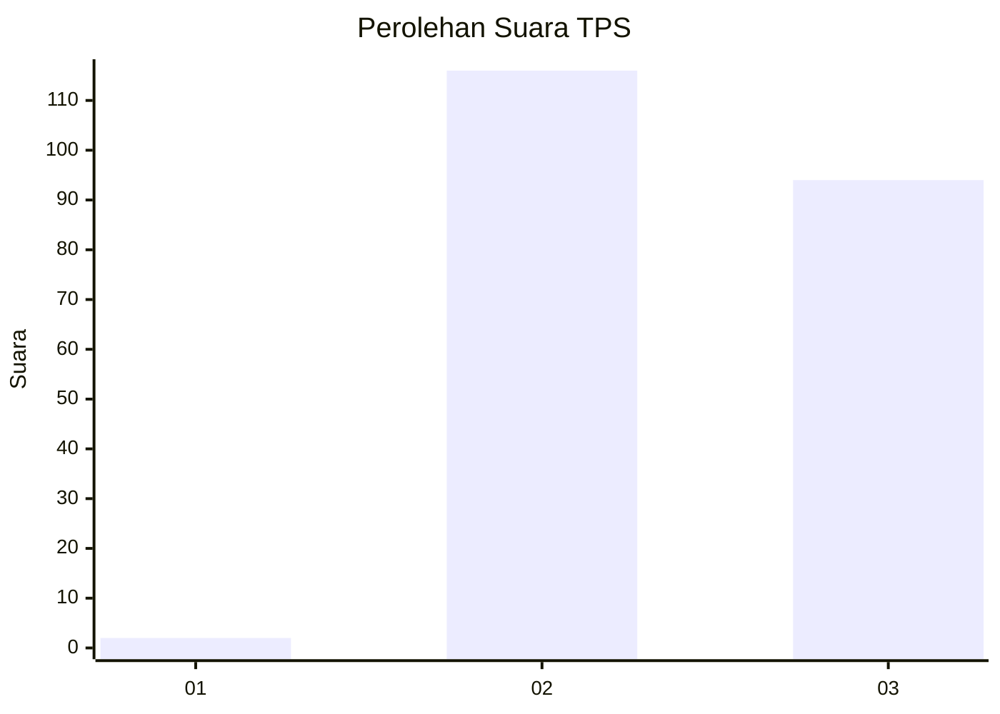
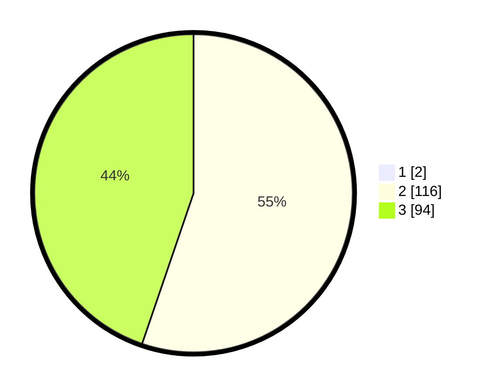

# Hasil

## Grafik

## Tabel

| No. | Nama Paslon    | Suara | Suara (raw) | Persentase |
|:--- |:-------------- | -----:| -----------:| ----------:|
| 1   | ANIES MUHAIMIN | 2     | [2][p-1]    | 0,94       |
| 2   | PRABOWO GIBRAN | 116   | [116][p-2]  | 54,72      |
| 3   | GANJAR MAHFUD  | 94    | [94][p-3]   | 44,34      |

[p-1]: https://github.com/gigit-pemilu/pemilu-2024-51-bali/blob/main/pilpres/hitung-suara/sub/51-bali/sub/05-klungkung/sub/04-dawan/sub/2002-sampalan-tengah/sub/001-tps/sub/paslon-1.txt
[p-2]: https://github.com/gigit-pemilu/pemilu-2024-51-bali/blob/main/pilpres/hitung-suara/sub/51-bali/sub/05-klungkung/sub/04-dawan/sub/2002-sampalan-tengah/sub/001-tps/sub/paslon-2.txt
[p-3]: https://github.com/gigit-pemilu/pemilu-2024-51-bali/blob/main/pilpres/hitung-suara/sub/51-bali/sub/05-klungkung/sub/04-dawan/sub/2002-sampalan-tengah/sub/001-tps/sub/paslon-3.txt

## Foto C Plano

https://sirekap-obj-formc.kpu.go.id/3092/pemilu/ppwp/51/05/04/20/02/5105042002001-20240215-104033--7bc7054c-95c0-40b7-b465-f65312ca28e9.jpg

https://sirekap-obj-formc.kpu.go.id/3092/pemilu/ppwp/51/05/04/20/02/5105042002001-20240214-132454--a7c3e224-dbbd-4f29-b3bb-7289678f6c4e.jpg

https://sirekap-obj-formc.kpu.go.id/3092/pemilu/ppwp/51/05/04/20/02/5105042002001-20240215-104047--d94cb3a2-177a-45c5-befc-32b5112c983e.jpg

## Metadata

| Key        | Value               |
| ---------- | ------------------- |
| Time Stamp | 2024-02-15 15:00:29 |

## DATA PEMILIH TETAP

Jumlah pemilih dalam DPT: **261**.
 * L: **125**.
 * P: **136**.

## DATA PENGGUNA HAK PILIH

Jumlah pengguna hak pilih dalam DPT: **227**.
 * L: **111**.
 * P: **116**.

Jumlah pengguna hak pilih dalam DPTb: **0**.
 * L: **0**.
 * P: **0**.

Jumlah pengguna hak pilih dalam DPK: **0**.
 * L: **0**.
 * P: **0**.

Jumlah pengguna hak pilih: **227**.
 * L: **111**.
 * P: **116**.

## JUMLAH SUARA SAH DAN TIDAK SAH

JUMLAH SELURUH SUARA SAH: **212**.

JUMLAH SUARA TIDAK SAH: **15**.

JUMLAH SELURUH SUARA SAH DAN SUARA TIDAK SAH: **227**.

