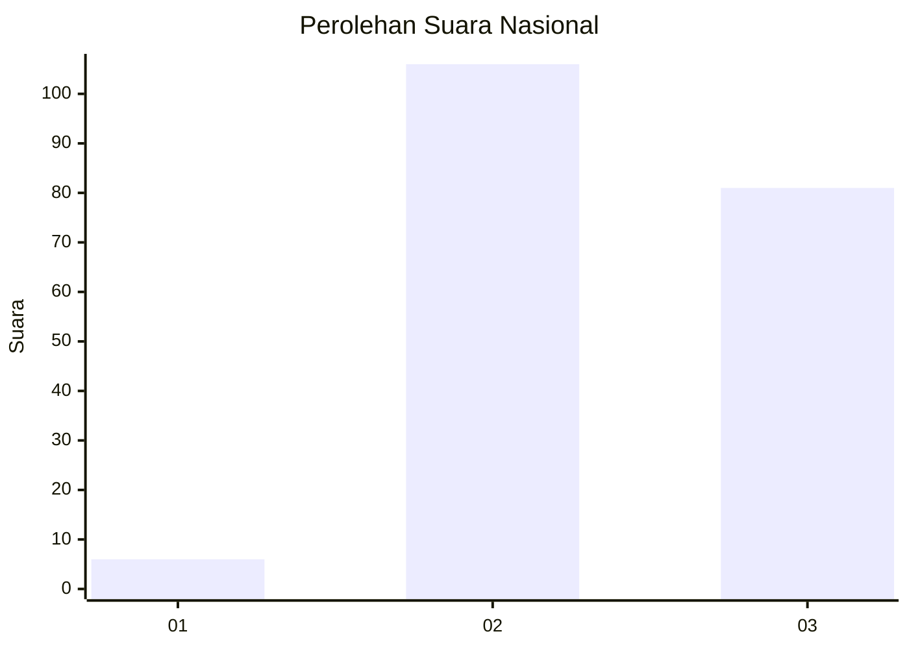
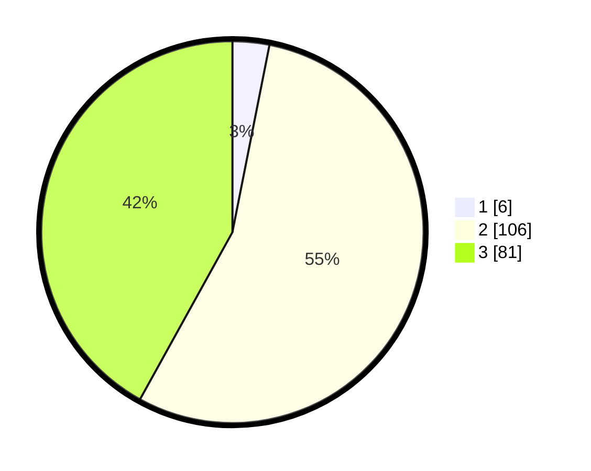

# Hasil

## Grafik

## Tabel

| No. | Nama Paslon    | Suara | Suara (raw) | Persentase |
|:--- |:-------------- | -----:| -----------:| ----------:|
| 1   | ANIES MUHAIMIN | 6     | [6][p-1]    | 3,11       |
| 2   | PRABOWO GIBRAN | 106   | [106][p-2]  | 54,92      |
| 3   | GANJAR MAHFUD  | 81    | [81][p-3]   | 41,97      |

[p-1]: https://github.com/gigit-pemilu/pemilu-2024/blob/main/pilpres/hitung-suara/sub/51-bali/sub/05-klungkung/sub/04-dawan/sub/2002-sampalan-tengah/sub/005-tps/sub/paslon-1.txt
[p-2]: https://github.com/gigit-pemilu/pemilu-2024/blob/main/pilpres/hitung-suara/sub/51-bali/sub/05-klungkung/sub/04-dawan/sub/2002-sampalan-tengah/sub/005-tps/sub/paslon-2.txt
[p-3]: https://github.com/gigit-pemilu/pemilu-2024/blob/main/pilpres/hitung-suara/sub/51-bali/sub/05-klungkung/sub/04-dawan/sub/2002-sampalan-tengah/sub/005-tps/sub/paslon-3.txt

## Foto C Plano

https://sirekap-obj-formc.kpu.go.id/27dc/pemilu/ppwp/51/05/04/20/02/5105042002005-20240214-132537--81b796da-5218-4090-ab6f-c8129d140a56.jpg

https://sirekap-obj-formc.kpu.go.id/27dc/pemilu/ppwp/51/05/04/20/02/5105042002005-20240214-132739--5979570a-ddf3-4bf1-8d5f-b5cff74d43f0.jpg

https://sirekap-obj-formc.kpu.go.id/27dc/pemilu/ppwp/51/05/04/20/02/5105042002005-20240214-132831--45759f7f-191e-4477-ae25-e908fd7bd40f.jpg

## Metadata

| Key        | Value               |
| ---------- | ------------------- |
| Time Stamp | 2024-02-15 09:00:24 |

## DATA PEMILIH TETAP

Jumlah pemilih dalam DPT: **243**.
 * L: **119**.
 * P: **124**.

## DATA PENGGUNA HAK PILIH

Jumlah pengguna hak pilih dalam DPT: **201**.
 * L: **100**.
 * P: **101**.

Jumlah pengguna hak pilih dalam DPTb: **1**.
 * L: **0**.
 * P: **1**.

Jumlah pengguna hak pilih dalam DPK: **0**.
 * L: **0**.
 * P: **0**.

Jumlah pengguna hak pilih: **202**.
 * L: **100**.
 * P: **102**.

## JUMLAH SUARA SAH DAN TIDAK SAH

JUMLAH SELURUH SUARA SAH: **193**.

JUMLAH SUARA TIDAK SAH: **9**.

JUMLAH SELURUH SUARA SAH DAN SUARA TIDAK SAH: **202**.

