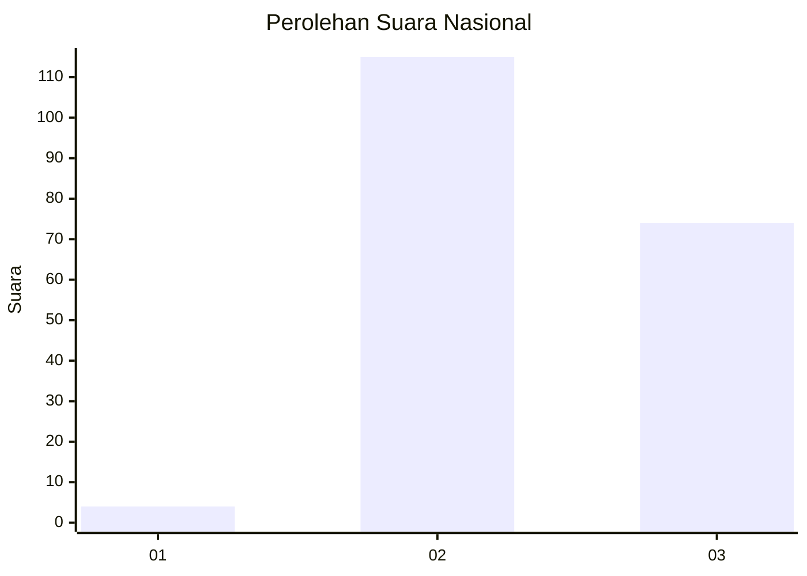
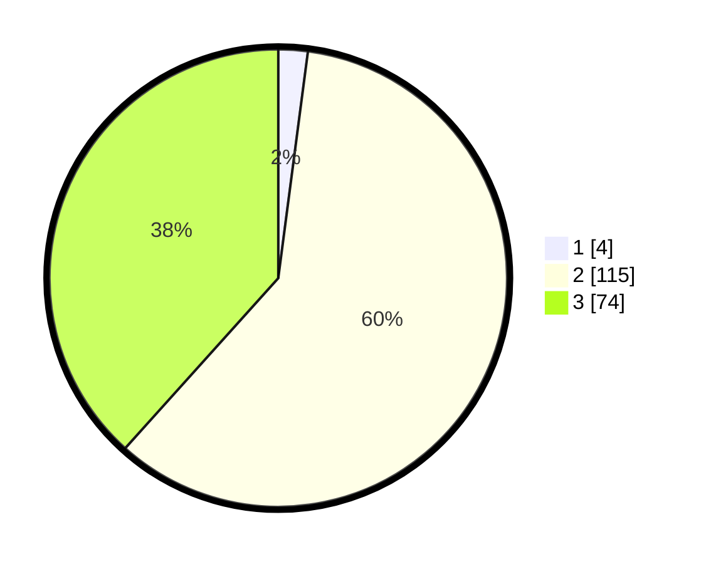

# Hasil

## Grafik

## Tabel

| No. | Nama Paslon    | Suara | Suara (raw) | Persentase |
|:--- |:-------------- | -----:| -----------:| ----------:|
| 1   | ANIES MUHAIMIN | 4     | [4][p-1]    | 2,07       |
| 2   | PRABOWO GIBRAN | 115   | [115][p-2]  | 59,59      |
| 3   | GANJAR MAHFUD  | 74    | [74][p-3]   | 38,34      |

[p-1]: https://github.com/gigit-pemilu/pemilu-2024/blob/main/pilpres/hitung-suara/sub/51-bali/sub/05-klungkung/sub/04-dawan/sub/2003-sampalan-klod/sub/004-tps/sub/paslon-1.txt
[p-2]: https://github.com/gigit-pemilu/pemilu-2024/blob/main/pilpres/hitung-suara/sub/51-bali/sub/05-klungkung/sub/04-dawan/sub/2003-sampalan-klod/sub/004-tps/sub/paslon-2.txt
[p-3]: https://github.com/gigit-pemilu/pemilu-2024/blob/main/pilpres/hitung-suara/sub/51-bali/sub/05-klungkung/sub/04-dawan/sub/2003-sampalan-klod/sub/004-tps/sub/paslon-3.txt

## Foto C Plano

https://sirekap-obj-formc.kpu.go.id/ee85/pemilu/ppwp/51/05/04/20/03/5105042003004-20240214-131005--3485232a-a03b-428e-91b0-e321348f5ac6.jpg

https://sirekap-obj-formc.kpu.go.id/ee85/pemilu/ppwp/51/05/04/20/03/5105042003004-20240214-132051--17347d17-c9bf-4ff6-a384-1118f2924428.jpg

## Metadata

| Key        | Value               |
| ---------- | ------------------- |
| Time Stamp | 2024-02-21 12:00:00 |

