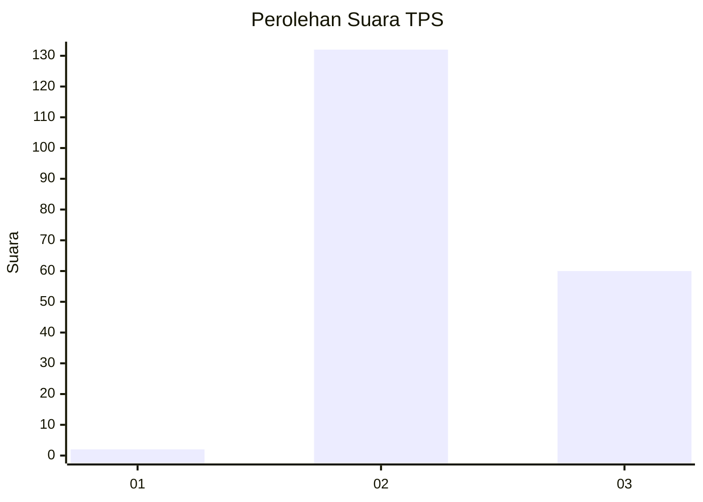
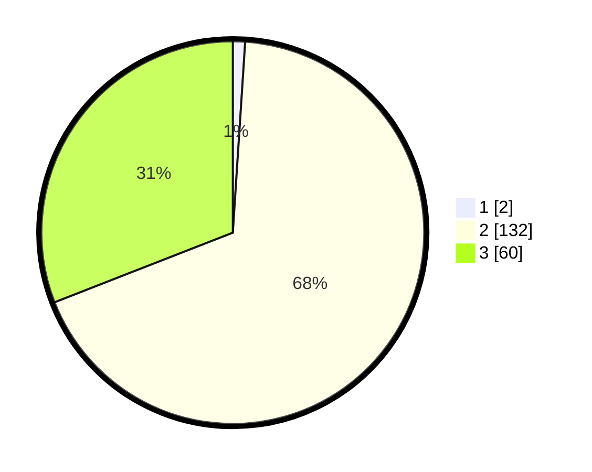

# Hasil

## Grafik

## Tabel

| No. | Nama Paslon    | Suara | Suara (raw) | Persentase |
|:--- |:-------------- | -----:| -----------:| ----------:|
| 1   | ANIES MUHAIMIN | 2     | [2][p-1]    | 1,03       |
| 2   | PRABOWO GIBRAN | 132   | [132][p-2]  | 68,04      |
| 3   | GANJAR MAHFUD  | 60    | [60][p-3]   | 30,93      |

[p-1]: https://github.com/gigit-pemilu/pemilu-2024-51-bali/blob/main/pilpres/hitung-suara/sub/51-bali/sub/05-klungkung/sub/04-dawan/sub/2003-sampalan-klod/sub/010-tps/sub/paslon-1.txt
[p-2]: https://github.com/gigit-pemilu/pemilu-2024-51-bali/blob/main/pilpres/hitung-suara/sub/51-bali/sub/05-klungkung/sub/04-dawan/sub/2003-sampalan-klod/sub/010-tps/sub/paslon-2.txt
[p-3]: https://github.com/gigit-pemilu/pemilu-2024-51-bali/blob/main/pilpres/hitung-suara/sub/51-bali/sub/05-klungkung/sub/04-dawan/sub/2003-sampalan-klod/sub/010-tps/sub/paslon-3.txt

## Foto C Plano

https://sirekap-obj-formc.kpu.go.id/77c1/pemilu/ppwp/51/05/04/20/03/5105042003010-20240214-190607--e3094fb4-0e88-4f61-9a9d-286e7f66a654.jpg

https://sirekap-obj-formc.kpu.go.id/77c1/pemilu/ppwp/51/05/04/20/03/5105042003010-20240214-133113--3bfdbbb1-bf4d-4104-b89d-e6232bc743e7.jpg

https://sirekap-obj-formc.kpu.go.id/77c1/pemilu/ppwp/51/05/04/20/03/5105042003010-20240214-213018--6452d327-0546-46c0-8412-57a3f935c098.jpg

## Metadata

| Key        | Value               |
| ---------- | ------------------- |
| Time Stamp | 2024-02-15 09:00:24 |

## DATA PEMILIH TETAP

Jumlah pemilih dalam DPT: **256**.
 * L: **125**.
 * P: **131**.

## DATA PENGGUNA HAK PILIH

Jumlah pengguna hak pilih dalam DPT: **199**.
 * L: **100**.
 * P: **99**.

Jumlah pengguna hak pilih dalam DPTb: **0**.
 * L: **0**.
 * P: **0**.

Jumlah pengguna hak pilih dalam DPK: **0**.
 * L: **1**.
 * P: **0**.

Jumlah pengguna hak pilih: **200**.
 * L: **101**.
 * P: **99**.

## JUMLAH SUARA SAH DAN TIDAK SAH

JUMLAH SELURUH SUARA SAH: **194**.

JUMLAH SUARA TIDAK SAH: **6**.

JUMLAH SELURUH SUARA SAH DAN SUARA TIDAK SAH: **200**.

