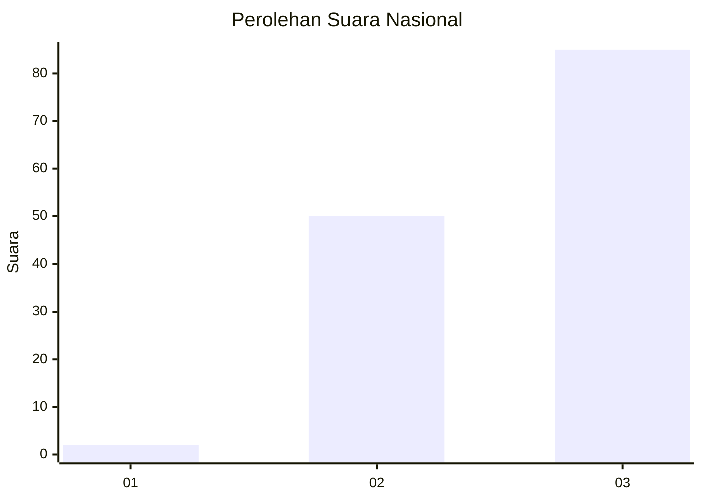
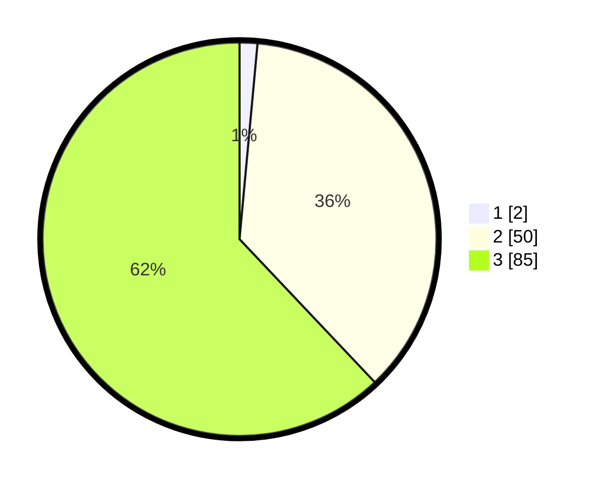

# Hasil

## Grafik

## Tabel

| No. | Nama Paslon    | Suara | Suara (raw) | Persentase |
|:--- |:-------------- | -----:| -----------:| ----------:|
| 1   | ANIES MUHAIMIN | 2     | [2][p-1]    | 1,46       |
| 2   | PRABOWO GIBRAN | 50    | [50][p-2]   | 36,50      |
| 3   | GANJAR MAHFUD  | 85    | [85][p-3]   | 62,04      |

[p-1]: https://github.com/gigit-pemilu/pemilu-2024/blob/main/pilpres/hitung-suara/sub/51-bali/sub/05-klungkung/sub/04-dawan/sub/2004-sulang/sub/004-tps/sub/paslon-1.txt
[p-2]: https://github.com/gigit-pemilu/pemilu-2024/blob/main/pilpres/hitung-suara/sub/51-bali/sub/05-klungkung/sub/04-dawan/sub/2004-sulang/sub/004-tps/sub/paslon-2.txt
[p-3]: https://github.com/gigit-pemilu/pemilu-2024/blob/main/pilpres/hitung-suara/sub/51-bali/sub/05-klungkung/sub/04-dawan/sub/2004-sulang/sub/004-tps/sub/paslon-3.txt

## Foto C Plano

https://sirekap-obj-formc.kpu.go.id/e138/pemilu/ppwp/51/05/04/20/04/5105042004004-20240217-203510--ec9ae110-2846-474e-ad40-fab1a42d3bf2.jpg

https://sirekap-obj-formc.kpu.go.id/e138/pemilu/ppwp/51/05/04/20/04/5105042004004-20240217-203511--739c8383-05b8-411e-883e-3163968d1d82.jpg

https://sirekap-obj-formc.kpu.go.id/e138/pemilu/ppwp/51/05/04/20/04/5105042004004-20240217-203510--814603e0-53c1-43fb-aee7-a292aaf3c3b0.jpg

## Metadata

| Key        | Value               |
| ---------- | ------------------- |
| Time Stamp | 2024-02-19 11:00:00 |

## DATA PEMILIH TETAP

Jumlah pemilih dalam DPT: **166**.
 * L: **83**.
 * P: **83**.

## DATA PENGGUNA HAK PILIH

Jumlah pengguna hak pilih dalam DPT: **139**.
 * L: **69**.
 * P: **70**.

Jumlah pengguna hak pilih dalam DPTb: **0**.
 * L: **0**.
 * P: **0**.

Jumlah pengguna hak pilih dalam DPK: **0**.
 * L: **0**.
 * P: **0**.

Jumlah pengguna hak pilih: **139**.
 * L: **69**.
 * P: **70**.

## JUMLAH SUARA SAH DAN TIDAK SAH

JUMLAH SELURUH SUARA SAH: **137**.

JUMLAH SUARA TIDAK SAH: **2**.

JUMLAH SELURUH SUARA SAH DAN SUARA TIDAK SAH: **139**.

