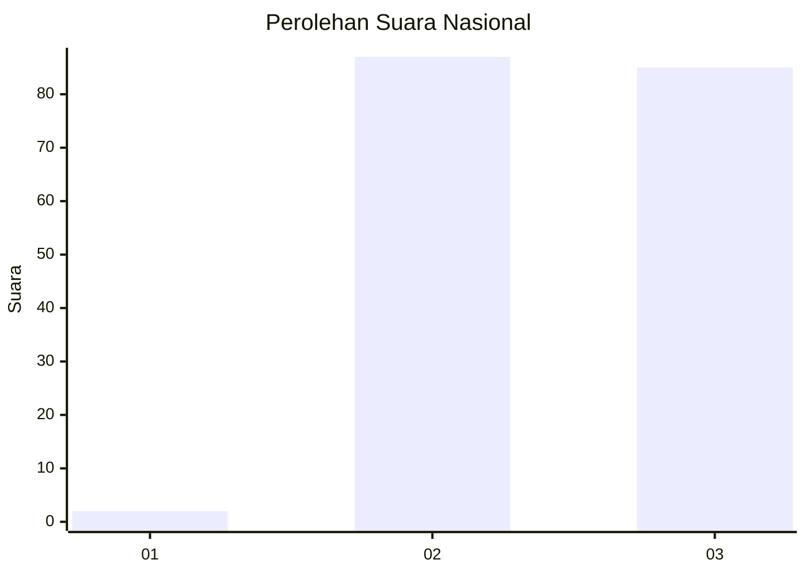
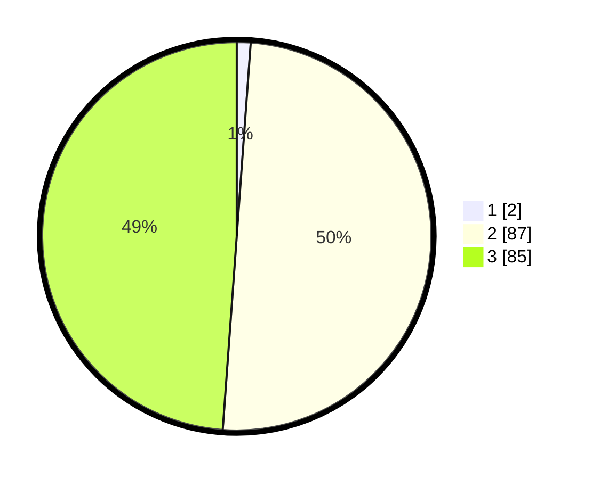

# Hasil

## Grafik

## Tabel

| No. | Nama Paslon    | Suara | Suara (raw) | Persentase |
|:--- |:-------------- | -----:| -----------:| ----------:|
| 1   | ANIES MUHAIMIN | 2     | [2][p-1]    | 1,15       |
| 2   | PRABOWO GIBRAN | 87    | [87][p-2]   | 50,00      |
| 3   | GANJAR MAHFUD  | 85    | [85][p-3]   | 48,85      |

[p-1]: https://github.com/gigit-pemilu/pemilu-2024/blob/main/pilpres/hitung-suara/sub/51-bali/sub/05-klungkung/sub/04-dawan/sub/2005-gunaksa/sub/001-tps/sub/paslon-1.txt
[p-2]: https://github.com/gigit-pemilu/pemilu-2024/blob/main/pilpres/hitung-suara/sub/51-bali/sub/05-klungkung/sub/04-dawan/sub/2005-gunaksa/sub/001-tps/sub/paslon-2.txt
[p-3]: https://github.com/gigit-pemilu/pemilu-2024/blob/main/pilpres/hitung-suara/sub/51-bali/sub/05-klungkung/sub/04-dawan/sub/2005-gunaksa/sub/001-tps/sub/paslon-3.txt

## Foto C Plano

https://sirekap-obj-formc.kpu.go.id/8d07/pemilu/ppwp/51/05/04/20/05/5105042005001-20240214-211152--793d6cbe-7341-4950-b6ed-ccfe750a0749.jpg

https://sirekap-obj-formc.kpu.go.id/8d07/pemilu/ppwp/51/05/04/20/05/5105042005001-20240214-211158--8cd9ed16-2a5e-4b34-bfe2-26831d354505.jpg

https://sirekap-obj-formc.kpu.go.id/8d07/pemilu/ppwp/51/05/04/20/05/5105042005001-20240214-211202--a9ac0685-d381-4ede-9f91-51a74f9f62ca.jpg

## Metadata

| Key        | Value               |
| ---------- | ------------------- |
| Time Stamp | 2024-02-15 09:00:24 |

## DATA PEMILIH TETAP

Jumlah pemilih dalam DPT: **231**.
 * L: **106**.
 * P: **125**.

## DATA PENGGUNA HAK PILIH

Jumlah pengguna hak pilih dalam DPT: **193**.
 * L: **91**.
 * P: **102**.

Jumlah pengguna hak pilih dalam DPTb: **0**.
 * L: **0**.
 * P: **0**.

Jumlah pengguna hak pilih dalam DPK: **0**.
 * L: **0**.
 * P: **0**.

Jumlah pengguna hak pilih: **193**.
 * L: **91**.
 * P: **102**.

## JUMLAH SUARA SAH DAN TIDAK SAH

JUMLAH SELURUH SUARA SAH: **174**.

JUMLAH SUARA TIDAK SAH: **19**.

JUMLAH SELURUH SUARA SAH DAN SUARA TIDAK SAH: **193**.

