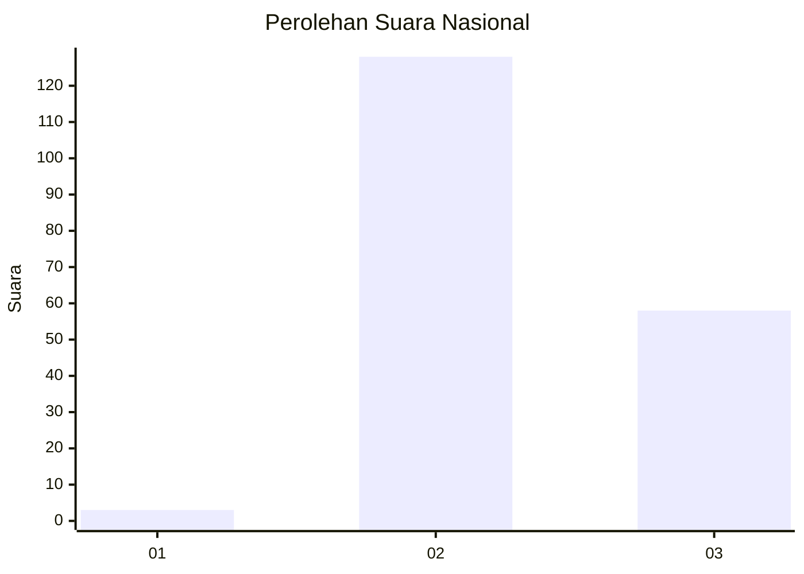
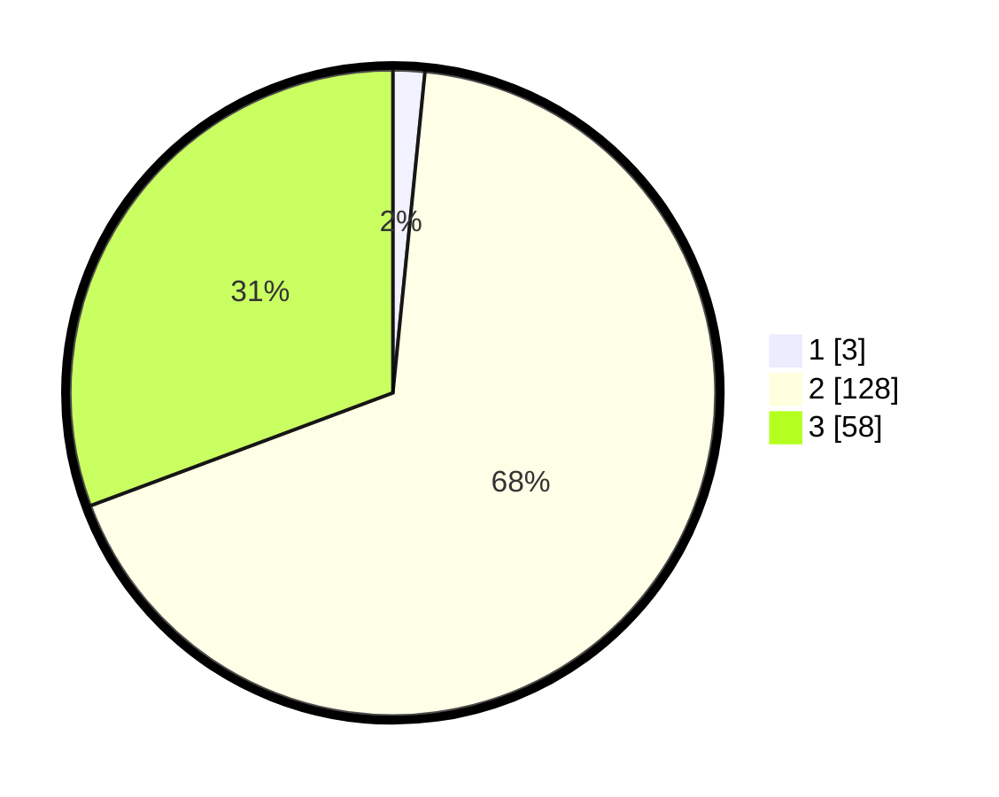

# Hasil

## Grafik

## Tabel

| No. | Nama Paslon    | Suara | Suara (raw) | Persentase |
|:--- |:-------------- | -----:| -----------:| ----------:|
| 1   | ANIES MUHAIMIN | 3     | [3][p-1]    | 1,59       |
| 2   | PRABOWO GIBRAN | 128   | [128][p-2]  | 67,72      |
| 3   | GANJAR MAHFUD  | 58    | [58][p-3]   | 30,69      |

[p-1]: https://github.com/gigit-pemilu/pemilu-2024/blob/main/pilpres/hitung-suara/sub/51-bali/sub/05-klungkung/sub/04-dawan/sub/2005-gunaksa/sub/003-tps/sub/paslon-1.txt
[p-2]: https://github.com/gigit-pemilu/pemilu-2024/blob/main/pilpres/hitung-suara/sub/51-bali/sub/05-klungkung/sub/04-dawan/sub/2005-gunaksa/sub/003-tps/sub/paslon-2.txt
[p-3]: https://github.com/gigit-pemilu/pemilu-2024/blob/main/pilpres/hitung-suara/sub/51-bali/sub/05-klungkung/sub/04-dawan/sub/2005-gunaksa/sub/003-tps/sub/paslon-3.txt

## Foto C Plano

https://sirekap-obj-formc.kpu.go.id/3b2d/pemilu/ppwp/51/05/04/20/05/5105042005003-20240214-210720--a694372c-1a58-4017-afc3-a5a53053db19.jpg

https://sirekap-obj-formc.kpu.go.id/3b2d/pemilu/ppwp/51/05/04/20/05/5105042005003-20240214-211112--0a7cbd49-5ae2-4784-bc0b-771b459cf96f.jpg

https://sirekap-obj-formc.kpu.go.id/3b2d/pemilu/ppwp/51/05/04/20/05/5105042005003-20240214-211329--9d2a20d6-d593-42b8-8dde-9371fea7e056.jpg

## Metadata

| Key        | Value               |
| ---------- | ------------------- |
| Time Stamp | 2024-02-15 09:00:24 |

