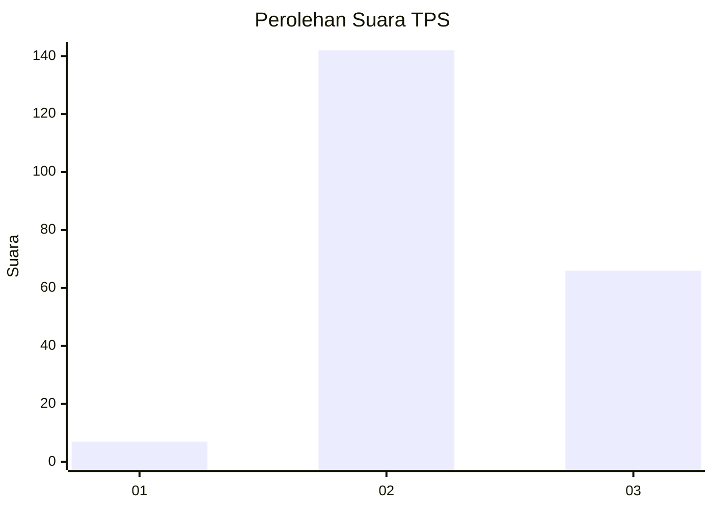
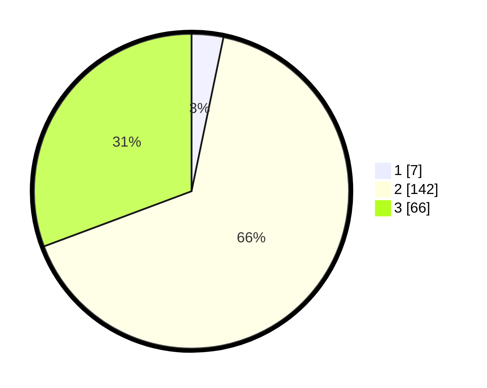

# Hasil

## Grafik

## Tabel

| No. | Nama Paslon    | Suara | Suara (raw) | Persentase |
|:--- |:-------------- | -----:| -----------:| ----------:|
| 1   | ANIES MUHAIMIN | 7     | [7][p-1]    | 3,26       |
| 2   | PRABOWO GIBRAN | 142   | [142][p-2]  | 66,05      |
| 3   | GANJAR MAHFUD  | 66    | [66][p-3]   | 30,70      |

[p-1]: https://github.com/gigit-pemilu/pemilu-2024-51-bali/blob/main/pilpres/hitung-suara/sub/51-bali/sub/05-klungkung/sub/04-dawan/sub/2005-gunaksa/sub/004-tps/sub/paslon-1.txt
[p-2]: https://github.com/gigit-pemilu/pemilu-2024-51-bali/blob/main/pilpres/hitung-suara/sub/51-bali/sub/05-klungkung/sub/04-dawan/sub/2005-gunaksa/sub/004-tps/sub/paslon-2.txt
[p-3]: https://github.com/gigit-pemilu/pemilu-2024-51-bali/blob/main/pilpres/hitung-suara/sub/51-bali/sub/05-klungkung/sub/04-dawan/sub/2005-gunaksa/sub/004-tps/sub/paslon-3.txt

## Foto C Plano

https://sirekap-obj-formc.kpu.go.id/9ca8/pemilu/ppwp/51/05/04/20/05/5105042005004-20240215-193527--62d05a5b-5c09-4f89-b05f-82101599ab10.jpg

https://sirekap-obj-formc.kpu.go.id/9ca8/pemilu/ppwp/51/05/04/20/05/5105042005004-20240215-193850--37e89667-bdc1-46c0-912d-184ed4da05e3.jpg

## Metadata

| Key        | Value               |
| ---------- | ------------------- |
| Time Stamp | 2024-02-24 22:31:28 |

