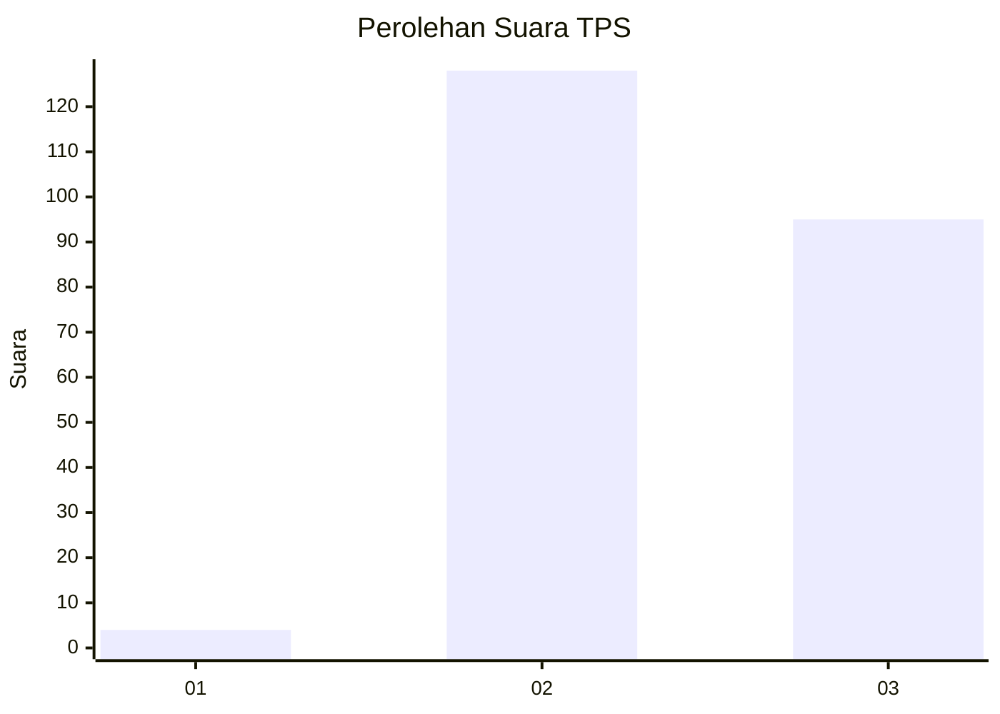
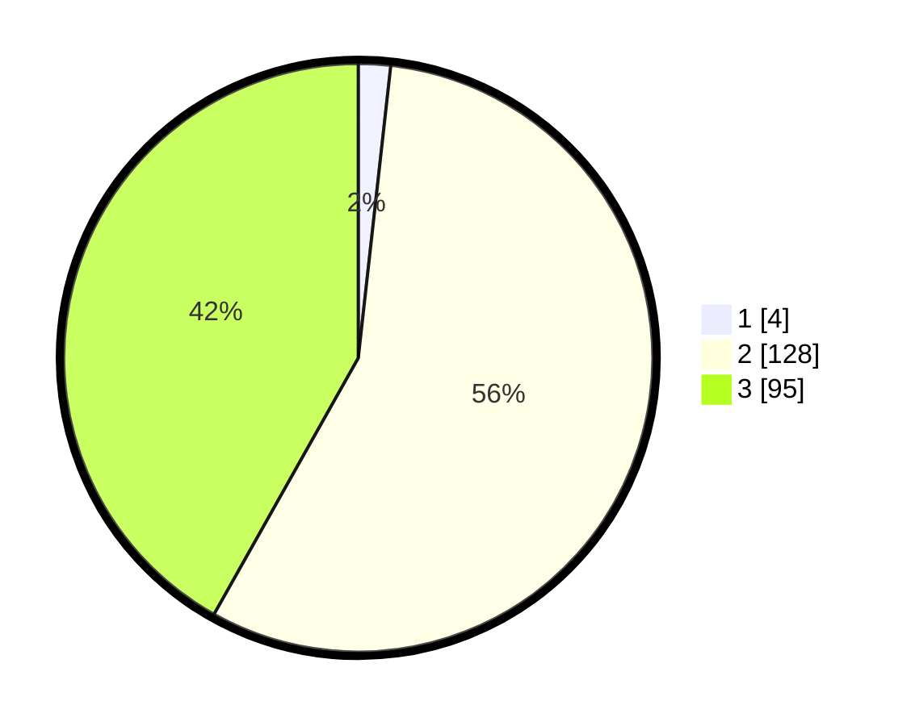

# Hasil

## Grafik

## Tabel

| No. | Nama Paslon    | Suara | Suara (raw) | Persentase |
|:--- |:-------------- | -----:| -----------:| ----------:|
| 1   | ANIES MUHAIMIN | 4     | [4][p-1]    | 1,76       |
| 2   | PRABOWO GIBRAN | 128   | [128][p-2]  | 56,39      |
| 3   | GANJAR MAHFUD  | 95    | [95][p-3]   | 41,85      |

[p-1]: https://github.com/gigit-pemilu/pemilu-2024-51-bali/blob/main/pilpres/hitung-suara/sub/51-bali/sub/05-klungkung/sub/04-dawan/sub/2005-gunaksa/sub/005-tps/sub/paslon-1.txt
[p-2]: https://github.com/gigit-pemilu/pemilu-2024-51-bali/blob/main/pilpres/hitung-suara/sub/51-bali/sub/05-klungkung/sub/04-dawan/sub/2005-gunaksa/sub/005-tps/sub/paslon-2.txt
[p-3]: https://github.com/gigit-pemilu/pemilu-2024-51-bali/blob/main/pilpres/hitung-suara/sub/51-bali/sub/05-klungkung/sub/04-dawan/sub/2005-gunaksa/sub/005-tps/sub/paslon-3.txt

## Foto C Plano

https://sirekap-obj-formc.kpu.go.id/ee22/pemilu/ppwp/51/05/04/20/05/5105042005005-20240214-232603--99840e2e-b189-41d6-a445-1ef927454ec5.jpg

https://sirekap-obj-formc.kpu.go.id/ee22/pemilu/ppwp/51/05/04/20/05/5105042005005-20240214-232637--576bcd6e-8610-48a5-a01b-a8269c5238a0.jpg

https://sirekap-obj-formc.kpu.go.id/ee22/pemilu/ppwp/51/05/04/20/05/5105042005005-20240214-234214--722ac804-ddd9-4b6e-9411-a95aeca72d8e.jpg

## Metadata

| Key        | Value               |
| ---------- | ------------------- |
| Time Stamp | 2024-02-16 09:30:28 |

