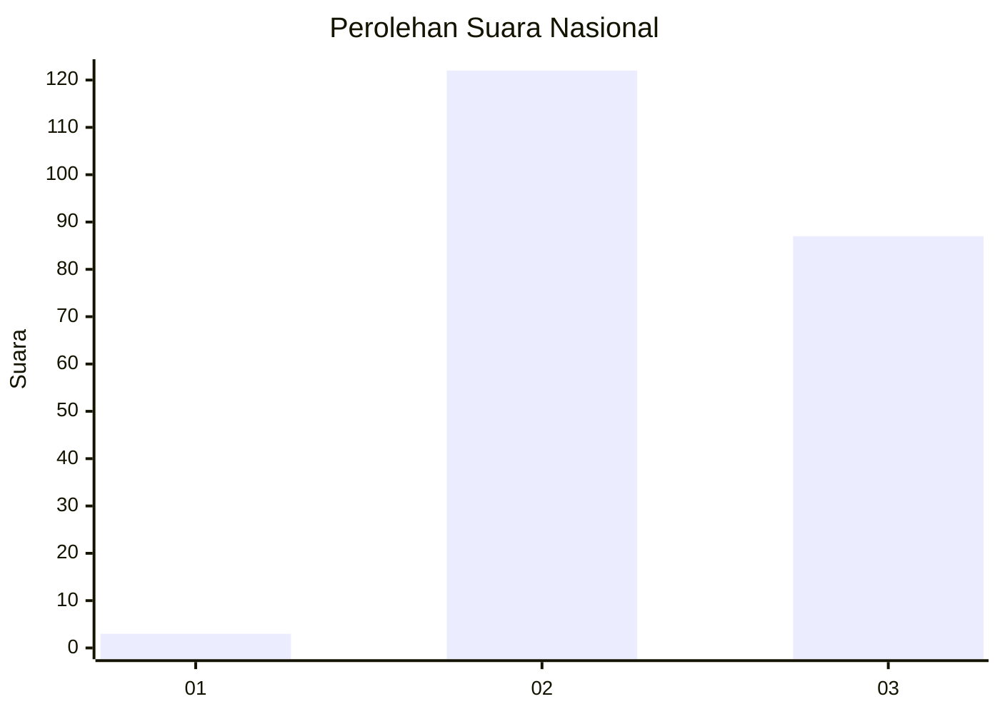
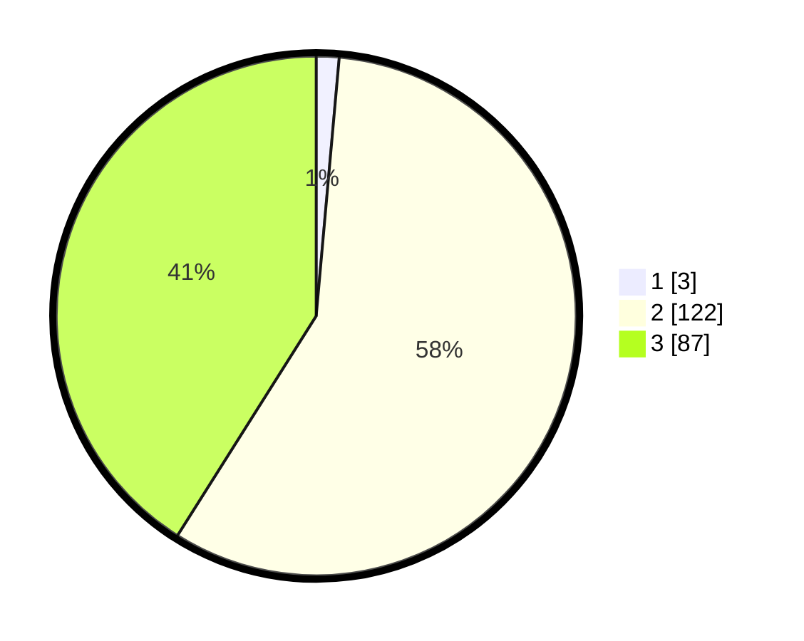

# Hasil

## Grafik

## Tabel

| No. | Nama Paslon    | Suara | Suara (raw) | Persentase |
|:--- |:-------------- | -----:| -----------:| ----------:|
| 1   | ANIES MUHAIMIN | 3     | [3][p-1]    | 1,42       |
| 2   | PRABOWO GIBRAN | 122   | [122][p-2]  | 57,55      |
| 3   | GANJAR MAHFUD  | 87    | [87][p-3]   | 41,04      |

[p-1]: https://github.com/gigit-pemilu/pemilu-2024/blob/main/pilpres/hitung-suara/sub/51-bali/sub/05-klungkung/sub/04-dawan/sub/2005-gunaksa/sub/006-tps/sub/paslon-1.txt
[p-2]: https://github.com/gigit-pemilu/pemilu-2024/blob/main/pilpres/hitung-suara/sub/51-bali/sub/05-klungkung/sub/04-dawan/sub/2005-gunaksa/sub/006-tps/sub/paslon-2.txt
[p-3]: https://github.com/gigit-pemilu/pemilu-2024/blob/main/pilpres/hitung-suara/sub/51-bali/sub/05-klungkung/sub/04-dawan/sub/2005-gunaksa/sub/006-tps/sub/paslon-3.txt

## Foto C Plano

https://sirekap-obj-formc.kpu.go.id/f527/pemilu/ppwp/51/05/04/20/05/5105042005006-20240214-235434--923c1b9f-f862-479b-b1e9-b46dba42912b.jpg

https://sirekap-obj-formc.kpu.go.id/f527/pemilu/ppwp/51/05/04/20/05/5105042005006-20240214-235256--74d0b0fc-8f34-4aab-81a3-faf3f34fd352.jpg

https://sirekap-obj-formc.kpu.go.id/f527/pemilu/ppwp/51/05/04/20/05/5105042005006-20240214-235303--acb8fd31-b25c-458f-ab7a-de0af839a93b.jpg

## Metadata

| Key        | Value               |
| ---------- | ------------------- |
| Time Stamp | 2024-02-16 09:30:28 |

## DATA PEMILIH TETAP

Jumlah pemilih dalam DPT: **842**.
 * L: **135**.
 * P: **127**.

## DATA PENGGUNA HAK PILIH

Jumlah pengguna hak pilih dalam DPT: **222**.
 * L: **112**.
 * P: **111**.

Jumlah pengguna hak pilih dalam DPTb: **0**.
 * L: **80**.
 * P: **0**.

Jumlah pengguna hak pilih dalam DPK: **2**.
 * L: **1**.
 * P: **1**.

Jumlah pengguna hak pilih: **225**.
 * L: **117**.
 * P: **112**.

## JUMLAH SUARA SAH DAN TIDAK SAH

JUMLAH SELURUH SUARA SAH: **212**.

JUMLAH SUARA TIDAK SAH: **13**.

JUMLAH SELURUH SUARA SAH DAN SUARA TIDAK SAH: **225**.

