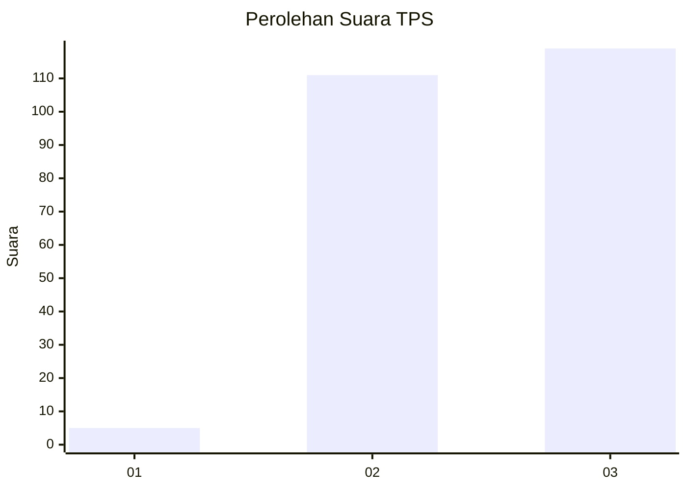
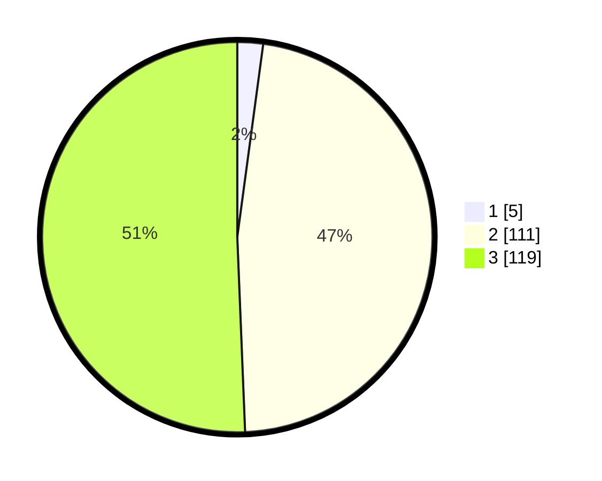

# Hasil

## Grafik

## Tabel

| No. | Nama Paslon    | Suara | Suara (raw) | Persentase |
|:--- |:-------------- | -----:| -----------:| ----------:|
| 1   | ANIES MUHAIMIN | 5     | [5][p-1]    | 2,13       |
| 2   | PRABOWO GIBRAN | 111   | [111][p-2]  | 47,23      |
| 3   | GANJAR MAHFUD  | 119   | [119][p-3]  | 50,64      |

[p-1]: https://github.com/gigit-pemilu/pemilu-2024-51-bali/blob/main/pilpres/hitung-suara/sub/51-bali/sub/05-klungkung/sub/04-dawan/sub/2005-gunaksa/sub/007-tps/sub/paslon-1.txt
[p-2]: https://github.com/gigit-pemilu/pemilu-2024-51-bali/blob/main/pilpres/hitung-suara/sub/51-bali/sub/05-klungkung/sub/04-dawan/sub/2005-gunaksa/sub/007-tps/sub/paslon-2.txt
[p-3]: https://github.com/gigit-pemilu/pemilu-2024-51-bali/blob/main/pilpres/hitung-suara/sub/51-bali/sub/05-klungkung/sub/04-dawan/sub/2005-gunaksa/sub/007-tps/sub/paslon-3.txt

## Foto C Plano

https://sirekap-obj-formc.kpu.go.id/4257/pemilu/ppwp/51/05/04/20/05/5105042005007-20240214-233701--968ea110-fa81-4f8f-9157-82da22cdc547.jpg

https://sirekap-obj-formc.kpu.go.id/4257/pemilu/ppwp/51/05/04/20/05/5105042005007-20240214-233746--dfcfa5f6-e184-4cca-838e-49ba63c4ac5f.jpg

https://sirekap-obj-formc.kpu.go.id/4257/pemilu/ppwp/51/05/04/20/05/5105042005007-20240214-233951--d1386af2-da10-443a-ad1f-f299c6b493bf.jpg

## Metadata

| Key        | Value               |
| ---------- | ------------------- |
| Time Stamp | 2024-02-15 15:00:29 |

## DATA PEMILIH TETAP

Jumlah pemilih dalam DPT: **250**.
 * L: **123**.
 * P: **127**.

## DATA PENGGUNA HAK PILIH

Jumlah pengguna hak pilih dalam DPT: **250**.
 * L: **123**.
 * P: **127**.

Jumlah pengguna hak pilih dalam DPTb: **0**.
 * L: **0**.
 * P: **0**.

Jumlah pengguna hak pilih dalam DPK: **0**.
 * L: **0**.
 * P: **0**.

Jumlah pengguna hak pilih: **250**.
 * L: **123**.
 * P: **127**.

## JUMLAH SUARA SAH DAN TIDAK SAH

JUMLAH SELURUH SUARA SAH: **235**.

JUMLAH SUARA TIDAK SAH: **15**.

JUMLAH SELURUH SUARA SAH DAN SUARA TIDAK SAH: **250**.

