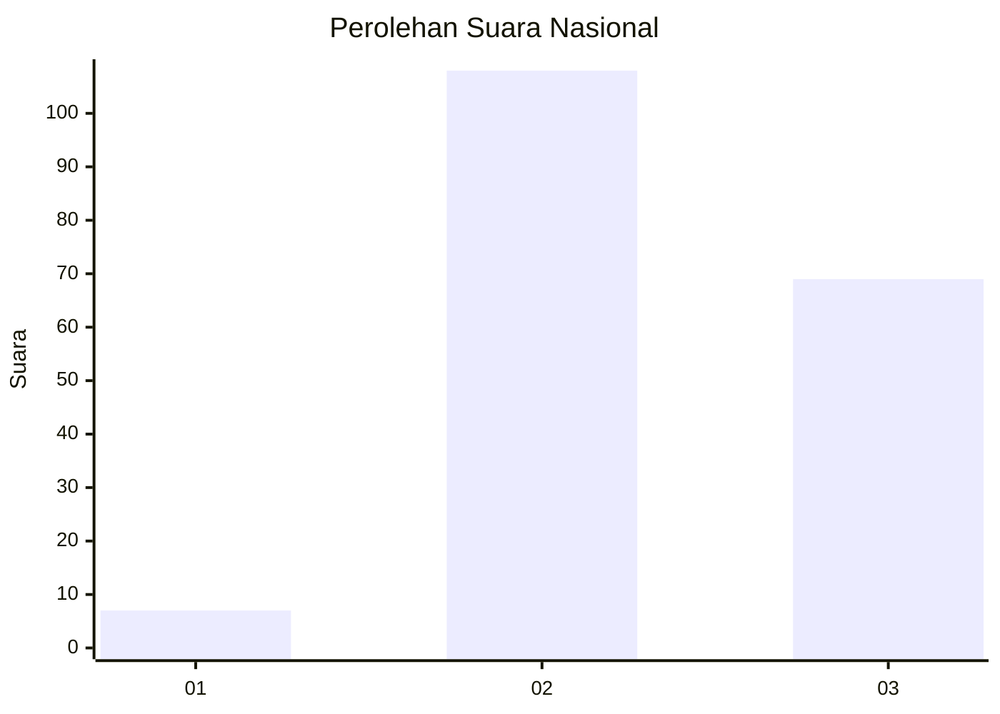
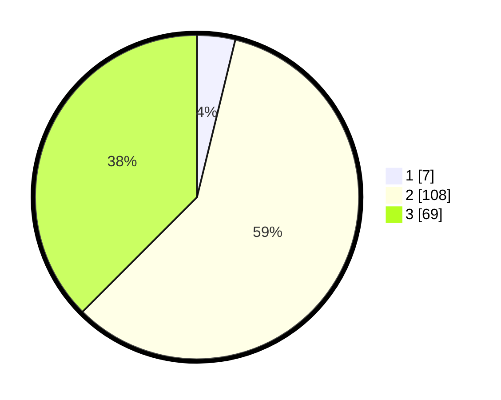

# Hasil

## Grafik

## Tabel

| No. | Nama Paslon    | Suara | Suara (raw) | Persentase |
|:--- |:-------------- | -----:| -----------:| ----------:|
| 1   | ANIES MUHAIMIN | 7     | [7][p-1]    | 3,80       |
| 2   | PRABOWO GIBRAN | 108   | [108][p-2]  | 58,70      |
| 3   | GANJAR MAHFUD  | 69    | [69][p-3]   | 37,50      |

[p-1]: https://github.com/gigit-pemilu/pemilu-2024/blob/main/pilpres/hitung-suara/sub/51-bali/sub/05-klungkung/sub/04-dawan/sub/2005-gunaksa/sub/009-tps/sub/paslon-1.txt
[p-2]: https://github.com/gigit-pemilu/pemilu-2024/blob/main/pilpres/hitung-suara/sub/51-bali/sub/05-klungkung/sub/04-dawan/sub/2005-gunaksa/sub/009-tps/sub/paslon-2.txt
[p-3]: https://github.com/gigit-pemilu/pemilu-2024/blob/main/pilpres/hitung-suara/sub/51-bali/sub/05-klungkung/sub/04-dawan/sub/2005-gunaksa/sub/009-tps/sub/paslon-3.txt

## Foto C Plano

https://sirekap-obj-formc.kpu.go.id/6533/pemilu/ppwp/51/05/04/20/05/5105042005009-20240215-163225--6793c413-5f44-4e83-b16e-2de1d2f6bde4.jpg

https://sirekap-obj-formc.kpu.go.id/6533/pemilu/ppwp/51/05/04/20/05/5105042005009-20240215-155525--173e9e5f-c314-49a5-9c5f-b50eec7d4a99.jpg

https://sirekap-obj-formc.kpu.go.id/6533/pemilu/ppwp/51/05/04/20/05/5105042005009-20240214-233756--63e1fd57-7ff8-4d31-be5e-25111188ffa7.jpg

## Metadata

| Key        | Value               |
| ---------- | ------------------- |
| Time Stamp | 2024-02-16 22:01:00 |

