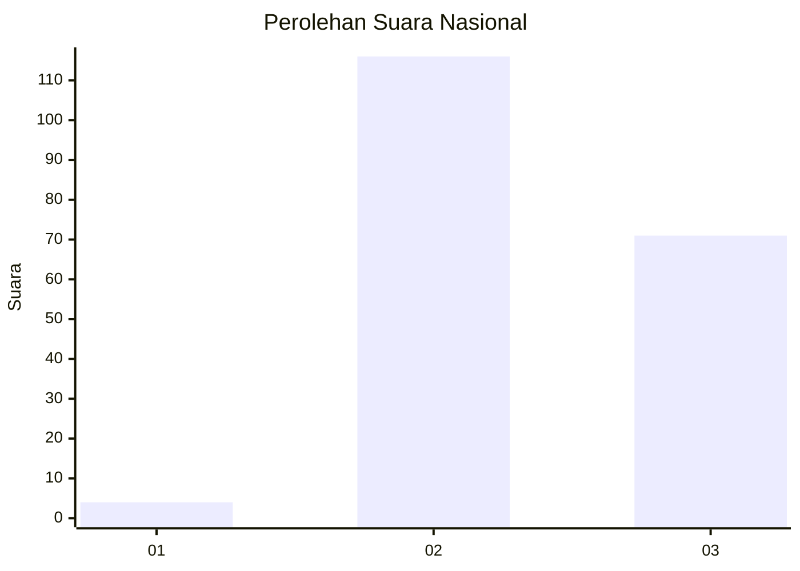
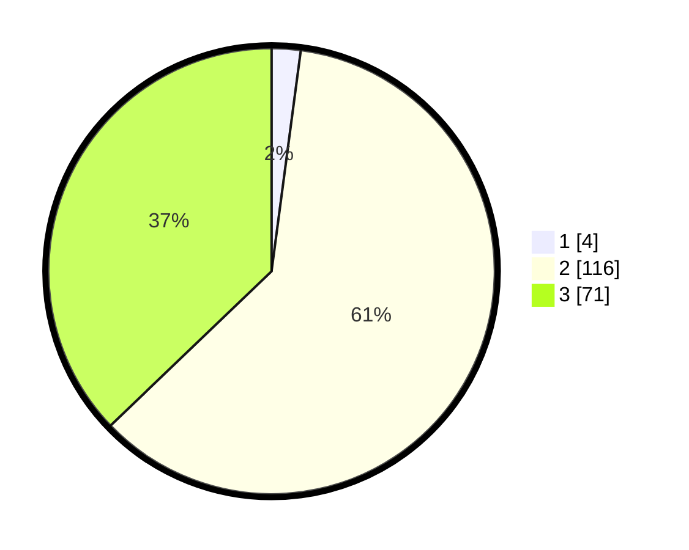

# Hasil

## Grafik

## Tabel

| No. | Nama Paslon    | Suara | Suara (raw) | Persentase |
|:--- |:-------------- | -----:| -----------:| ----------:|
| 1   | ANIES MUHAIMIN | 4     | [4][p-1]    | 2,09       |
| 2   | PRABOWO GIBRAN | 116   | [116][p-2]  | 60,73      |
| 3   | GANJAR MAHFUD  | 71    | [71][p-3]   | 37,17      |

[p-1]: https://github.com/gigit-pemilu/pemilu-2024/blob/main/pilpres/hitung-suara/sub/51-bali/sub/05-klungkung/sub/04-dawan/sub/2005-gunaksa/sub/011-tps/sub/paslon-1.txt
[p-2]: https://github.com/gigit-pemilu/pemilu-2024/blob/main/pilpres/hitung-suara/sub/51-bali/sub/05-klungkung/sub/04-dawan/sub/2005-gunaksa/sub/011-tps/sub/paslon-2.txt
[p-3]: https://github.com/gigit-pemilu/pemilu-2024/blob/main/pilpres/hitung-suara/sub/51-bali/sub/05-klungkung/sub/04-dawan/sub/2005-gunaksa/sub/011-tps/sub/paslon-3.txt

## Foto C Plano

https://sirekap-obj-formc.kpu.go.id/c6ce/pemilu/ppwp/51/05/04/20/05/5105042005011-20240214-204439--4c29a81b-f54e-4d58-ba26-ba7f12437284.jpg

https://sirekap-obj-formc.kpu.go.id/c6ce/pemilu/ppwp/51/05/04/20/05/5105042005011-20240214-205046--fa1de325-15d3-495f-a7b4-07f360ad380b.jpg

https://sirekap-obj-formc.kpu.go.id/c6ce/pemilu/ppwp/51/05/04/20/05/5105042005011-20240214-205133--9128463d-ccee-4242-8693-159602103b20.jpg

## Metadata

| Key        | Value               |
| ---------- | ------------------- |
| Time Stamp | 2024-02-15 15:00:29 |

