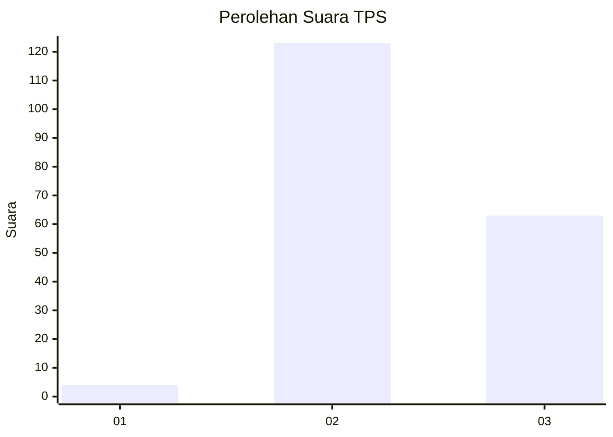
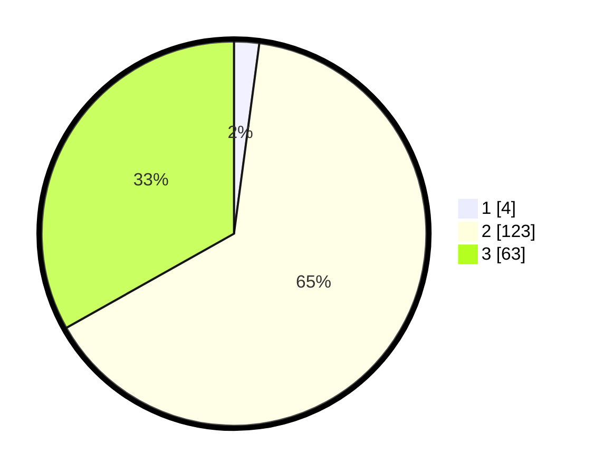

# Hasil

## Grafik

## Tabel

| No. | Nama Paslon    | Suara | Suara (raw) | Persentase |
|:--- |:-------------- | -----:| -----------:| ----------:|
| 1   | ANIES MUHAIMIN | 4     | [4][p-1]    | 2,11       |
| 2   | PRABOWO GIBRAN | 123   | [123][p-2]  | 64,74      |
| 3   | GANJAR MAHFUD  | 63    | [63][p-3]   | 33,16      |

[p-1]: https://github.com/gigit-pemilu/pemilu-2024-51-bali/blob/main/pilpres/hitung-suara/sub/51-bali/sub/05-klungkung/sub/04-dawan/sub/2005-gunaksa/sub/012-tps/sub/paslon-1.txt
[p-2]: https://github.com/gigit-pemilu/pemilu-2024-51-bali/blob/main/pilpres/hitung-suara/sub/51-bali/sub/05-klungkung/sub/04-dawan/sub/2005-gunaksa/sub/012-tps/sub/paslon-2.txt
[p-3]: https://github.com/gigit-pemilu/pemilu-2024-51-bali/blob/main/pilpres/hitung-suara/sub/51-bali/sub/05-klungkung/sub/04-dawan/sub/2005-gunaksa/sub/012-tps/sub/paslon-3.txt

## Foto C Plano

https://sirekap-obj-formc.kpu.go.id/2527/pemilu/ppwp/51/05/04/20/05/5105042005012-20240214-212200--ede7174a-07c8-40fa-8f48-6fa406f9992e.jpg

https://sirekap-obj-formc.kpu.go.id/2527/pemilu/ppwp/51/05/04/20/05/5105042005012-20240214-212508--50608e65-2696-4666-b435-1c8e8ea6f541.jpg

https://sirekap-obj-formc.kpu.go.id/2527/pemilu/ppwp/51/05/04/20/05/5105042005012-20240214-212557--b5cf6844-3aad-4981-aa0e-2338be7941e8.jpg

## Metadata

| Key        | Value               |
| ---------- | ------------------- |
| Time Stamp | 2024-02-15 12:00:28 |

