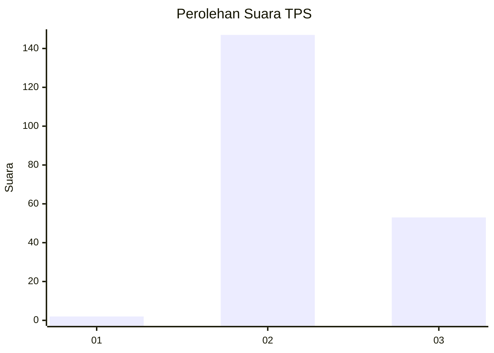
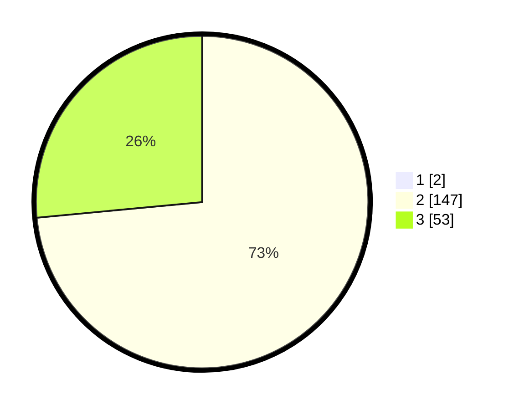

# Hasil

## Grafik

## Tabel

| No. | Nama Paslon    | Suara | Suara (raw) | Persentase |
|:--- |:-------------- | -----:| -----------:| ----------:|
| 1   | ANIES MUHAIMIN | 2     | [2][p-1]    | 0,99       |
| 2   | PRABOWO GIBRAN | 147   | [147][p-2]  | 72,77      |
| 3   | GANJAR MAHFUD  | 53    | [53][p-3]   | 26,24      |

[p-1]: https://github.com/gigit-pemilu/pemilu-2024-51-bali/blob/main/pilpres/hitung-suara/sub/51-bali/sub/05-klungkung/sub/04-dawan/sub/2005-gunaksa/sub/013-tps/sub/paslon-1.txt
[p-2]: https://github.com/gigit-pemilu/pemilu-2024-51-bali/blob/main/pilpres/hitung-suara/sub/51-bali/sub/05-klungkung/sub/04-dawan/sub/2005-gunaksa/sub/013-tps/sub/paslon-2.txt
[p-3]: https://github.com/gigit-pemilu/pemilu-2024-51-bali/blob/main/pilpres/hitung-suara/sub/51-bali/sub/05-klungkung/sub/04-dawan/sub/2005-gunaksa/sub/013-tps/sub/paslon-3.txt

## Foto C Plano

https://sirekap-obj-formc.kpu.go.id/c195/pemilu/ppwp/51/05/04/20/05/5105042005013-20240214-231419--1433b789-e3ac-4dbd-8d2f-0cdac37c1441.jpg

https://sirekap-obj-formc.kpu.go.id/c195/pemilu/ppwp/51/05/04/20/05/5105042005013-20240214-231600--921148b6-8bb2-4915-bb45-384692ccf6b6.jpg

https://sirekap-obj-formc.kpu.go.id/c195/pemilu/ppwp/51/05/04/20/05/5105042005013-20240214-231712--25a9ec9d-a317-4548-8934-4b1ed115fb6e.jpg

## Metadata

| Key        | Value               |
| ---------- | ------------------- |
| Time Stamp | 2024-02-15 12:00:28 |

