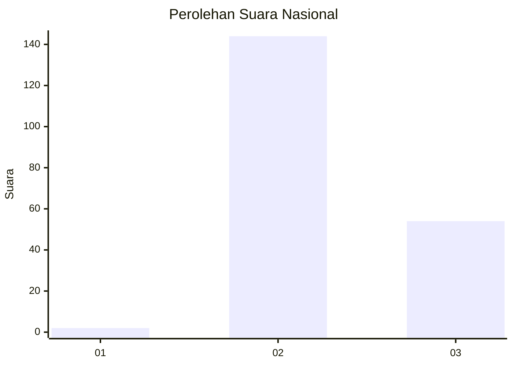
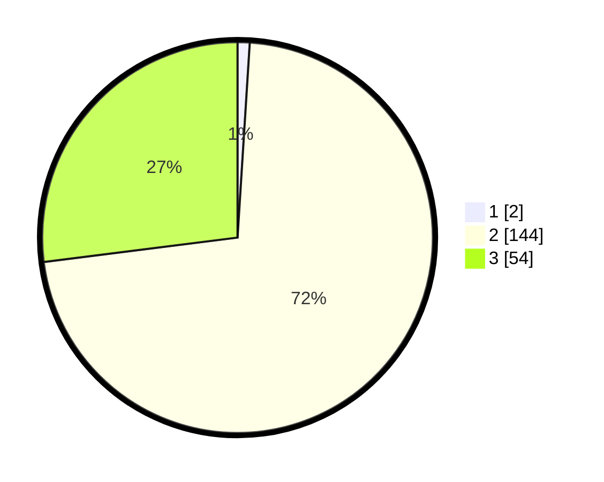

# Hasil

## Grafik

## Tabel

| No. | Nama Paslon    | Suara | Suara (raw) | Persentase |
|:--- |:-------------- | -----:| -----------:| ----------:|
| 1   | ANIES MUHAIMIN | 2     | [2][p-1]    | 1,00       |
| 2   | PRABOWO GIBRAN | 144   | [144][p-2]  | 72,00      |
| 3   | GANJAR MAHFUD  | 54    | [54][p-3]   | 27,00      |

[p-1]: https://github.com/gigit-pemilu/pemilu-2024/blob/main/pilpres/hitung-suara/sub/51-bali/sub/05-klungkung/sub/04-dawan/sub/2005-gunaksa/sub/014-tps/sub/paslon-1.txt
[p-2]: https://github.com/gigit-pemilu/pemilu-2024/blob/main/pilpres/hitung-suara/sub/51-bali/sub/05-klungkung/sub/04-dawan/sub/2005-gunaksa/sub/014-tps/sub/paslon-2.txt
[p-3]: https://github.com/gigit-pemilu/pemilu-2024/blob/main/pilpres/hitung-suara/sub/51-bali/sub/05-klungkung/sub/04-dawan/sub/2005-gunaksa/sub/014-tps/sub/paslon-3.txt

## Foto C Plano

https://sirekap-obj-formc.kpu.go.id/6cea/pemilu/ppwp/51/05/04/20/05/5105042005014-20240214-221712--8e1431de-113e-4f0c-bd60-8b29aadc199b.jpg

https://sirekap-obj-formc.kpu.go.id/6cea/pemilu/ppwp/51/05/04/20/05/5105042005014-20240214-221845--05fdb639-498c-40b8-8c64-3bdacee79522.jpg

https://sirekap-obj-formc.kpu.go.id/6cea/pemilu/ppwp/51/05/04/20/05/5105042005014-20240214-222318--85084085-c561-4b67-ac78-cac37e4c1ebc.jpg

## Metadata

| Key        | Value               |
| ---------- | ------------------- |
| Time Stamp | 2024-02-15 15:00:29 |

