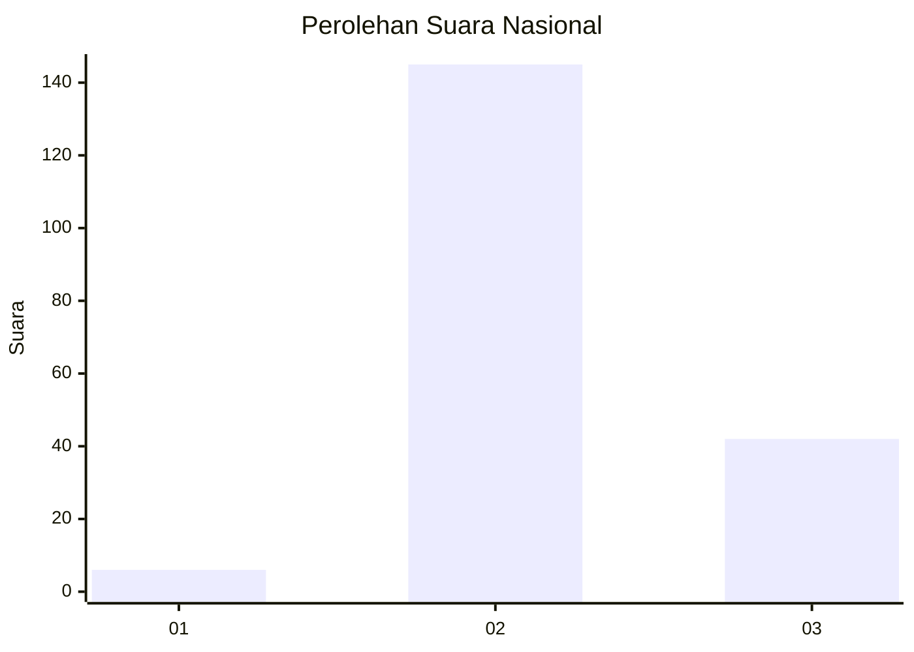

# Hasil

## Grafik

## Tabel

| No. | Nama Paslon    | Suara | Suara (raw) | Persentase |
|:--- |:-------------- | -----:| -----------:| ----------:|
| 1   | ANIES MUHAIMIN | 6     | [6][p-1]    | 3,11       |
| 2   | PRABOWO GIBRAN | 145   | [145][p-2]  | 75,13      |
| 3   | GANJAR MAHFUD  | 42    | [42][p-3]   | 21,76      |

[p-1]: https://github.com/gigit-pemilu/pemilu-2024/blob/main/pilpres/hitung-suara/sub/51-bali/sub/05-klungkung/sub/04-dawan/sub/2005-gunaksa/sub/015-tps/sub/paslon-1.txt
[p-2]: https://github.com/gigit-pemilu/pemilu-2024/blob/main/pilpres/hitung-suara/sub/51-bali/sub/05-klungkung/sub/04-dawan/sub/2005-gunaksa/sub/015-tps/sub/paslon-2.txt
[p-3]: https://github.com/gigit-pemilu/pemilu-2024/blob/main/pilpres/hitung-suara/sub/51-bali/sub/05-klungkung/sub/04-dawan/sub/2005-gunaksa/sub/015-tps/sub/paslon-3.txt

## Foto C Plano

https://sirekap-obj-formc.kpu.go.id/ac6f/pemilu/ppwp/51/05/04/20/05/5105042005015-20240214-210428--5ce82b79-7e86-4eac-8316-e12484a04dde.jpg

https://sirekap-obj-formc.kpu.go.id/ac6f/pemilu/ppwp/51/05/04/20/05/5105042005015-20240214-210501--d01fa0c2-620d-4a04-9efa-cb7aeed42ae5.jpg

https://sirekap-obj-formc.kpu.go.id/ac6f/pemilu/ppwp/51/05/04/20/05/5105042005015-20240214-210533--5731b9e9-7c3b-4b96-a097-f6464a6bd5b2.jpg

## Metadata

| Key        | Value               |
| ---------- | ------------------- |
| Time Stamp | 2024-02-15 09:00:24 |

