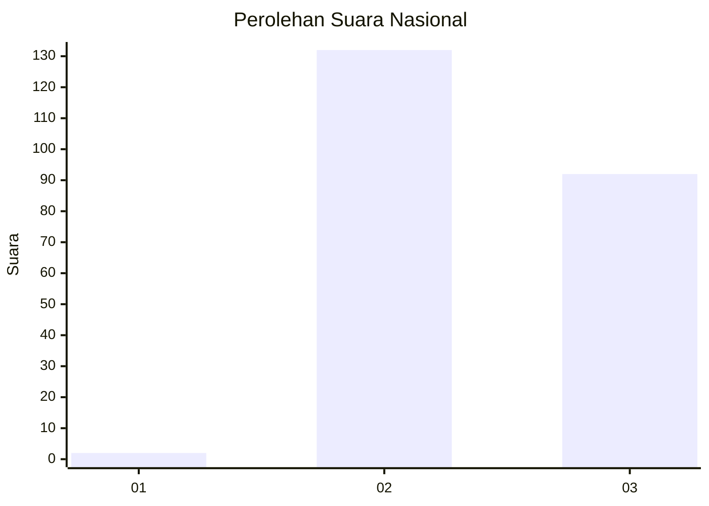
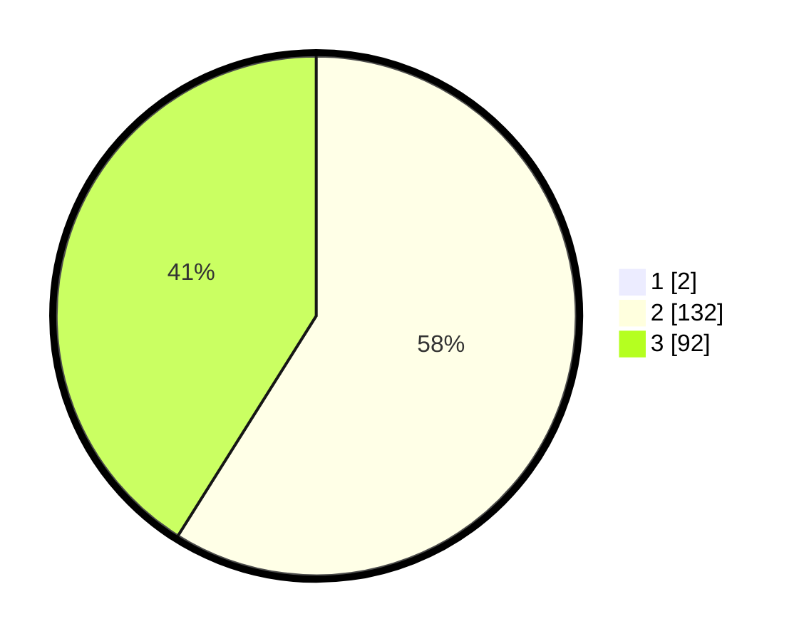

# Hasil

## Grafik

## Tabel

| No. | Nama Paslon    | Suara | Suara (raw) | Persentase |
|:--- |:-------------- | -----:| -----------:| ----------:|
| 1   | ANIES MUHAIMIN | 2     | [2][p-1]    | 0,88       |
| 2   | PRABOWO GIBRAN | 132   | [132][p-2]  | 58,41      |
| 3   | GANJAR MAHFUD  | 92    | [92][p-3]   | 40,71      |

[p-1]: https://github.com/gigit-pemilu/pemilu-2024/blob/main/pilpres/hitung-suara/sub/51-bali/sub/05-klungkung/sub/04-dawan/sub/2006-kusamba/sub/005-tps/sub/paslon-1.txt
[p-2]: https://github.com/gigit-pemilu/pemilu-2024/blob/main/pilpres/hitung-suara/sub/51-bali/sub/05-klungkung/sub/04-dawan/sub/2006-kusamba/sub/005-tps/sub/paslon-2.txt
[p-3]: https://github.com/gigit-pemilu/pemilu-2024/blob/main/pilpres/hitung-suara/sub/51-bali/sub/05-klungkung/sub/04-dawan/sub/2006-kusamba/sub/005-tps/sub/paslon-3.txt

## Foto C Plano

https://sirekap-obj-formc.kpu.go.id/2e59/pemilu/ppwp/51/05/04/20/06/5105042006005-20240223-121017--9fa61426-f012-47d0-8655-a1e2a4f39785.jpg

https://sirekap-obj-formc.kpu.go.id/2e59/pemilu/ppwp/51/05/04/20/06/5105042006005-20240223-121046--64b89662-4fed-4c00-b0ff-7749eff60fe4.jpg

https://sirekap-obj-formc.kpu.go.id/2e59/pemilu/ppwp/51/05/04/20/06/5105042006005-20240223-121107--c26c5e84-16bf-4e0e-9a19-761b84bfb4fa.jpg

## Metadata

| Key        | Value               |
| ---------- | ------------------- |
| Time Stamp | 2024-02-24 22:31:28 |

