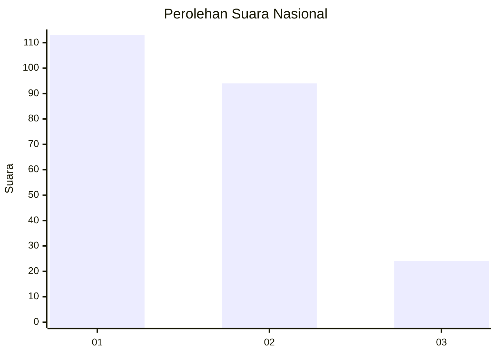
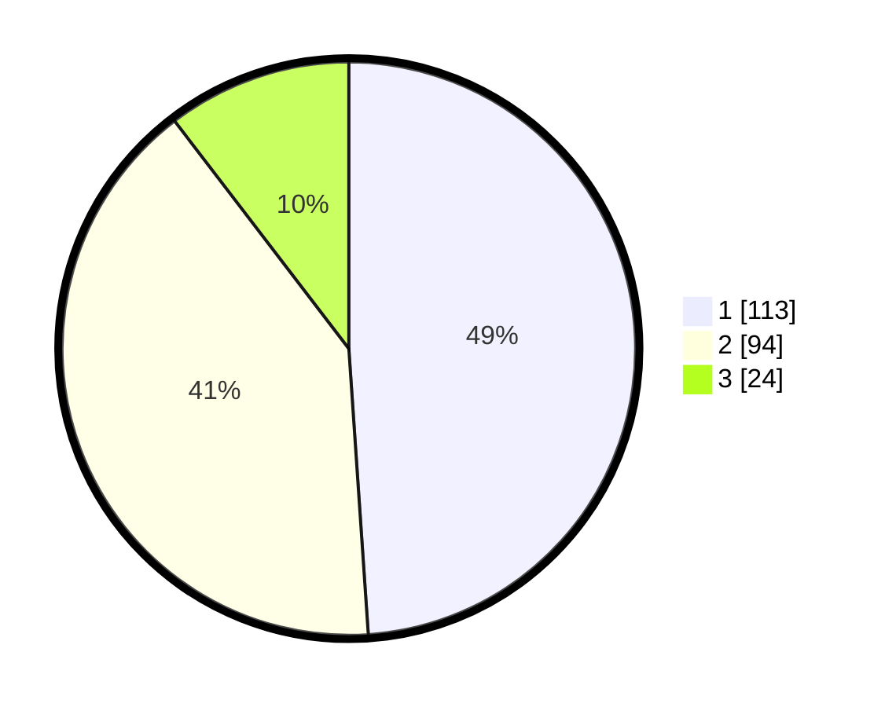

# Hasil

## Grafik

## Tabel

| No. | Nama Paslon    | Suara | Suara (raw) | Persentase |
|:--- |:-------------- | -----:| -----------:| ----------:|
| 1   | ANIES MUHAIMIN | 113   | [113][p-1]  | 48,92      |
| 2   | PRABOWO GIBRAN | 94    | [94][p-2]   | 40,69      |
| 3   | GANJAR MAHFUD  | 24    | [24][p-3]   | 10,39      |

[p-1]: https://github.com/gigit-pemilu/pemilu-2024/blob/main/pilpres/hitung-suara/sub/51-bali/sub/05-klungkung/sub/04-dawan/sub/2007-kampung-kusamba/sub/001-tps/sub/paslon-1.txt
[p-2]: https://github.com/gigit-pemilu/pemilu-2024/blob/main/pilpres/hitung-suara/sub/51-bali/sub/05-klungkung/sub/04-dawan/sub/2007-kampung-kusamba/sub/001-tps/sub/paslon-2.txt
[p-3]: https://github.com/gigit-pemilu/pemilu-2024/blob/main/pilpres/hitung-suara/sub/51-bali/sub/05-klungkung/sub/04-dawan/sub/2007-kampung-kusamba/sub/001-tps/sub/paslon-3.txt

## Foto C Plano

https://sirekap-obj-formc.kpu.go.id/ecbc/pemilu/ppwp/51/05/04/20/07/5105042007001-20240216-121932--791c0ef3-9e55-4466-a17b-6225aca1d765.jpg

https://sirekap-obj-formc.kpu.go.id/ecbc/pemilu/ppwp/51/05/04/20/07/5105042007001-20240216-121936--dfbf1f29-f75f-4c30-92de-ede8b10a731c.jpg

https://sirekap-obj-formc.kpu.go.id/ecbc/pemilu/ppwp/51/05/04/20/07/5105042007001-20240216-121934--dbdb3b57-0690-45b6-b0a5-b89cfc1e7bbf.jpg

## Metadata

| Key        | Value               |
| ---------- | ------------------- |
| Time Stamp | 2024-02-16 22:01:00 |

## DATA PEMILIH TETAP

Jumlah pemilih dalam DPT: **270**.
 * L: **118**.
 * P: **152**.

## DATA PENGGUNA HAK PILIH

Jumlah pengguna hak pilih dalam DPT: **229**.
 * L: **102**.
 * P: **127**.

Jumlah pengguna hak pilih dalam DPTb: **7**.
 * L: **1**.
 * P: **6**.

Jumlah pengguna hak pilih dalam DPK: **1**.
 * L: **0**.
 * P: **1**.

Jumlah pengguna hak pilih: **237**.
 * L: **103**.
 * P: **134**.

## JUMLAH SUARA SAH DAN TIDAK SAH

JUMLAH SELURUH SUARA SAH: **231**.

JUMLAH SUARA TIDAK SAH: **6**.

JUMLAH SELURUH SUARA SAH DAN SUARA TIDAK SAH: **237**.

